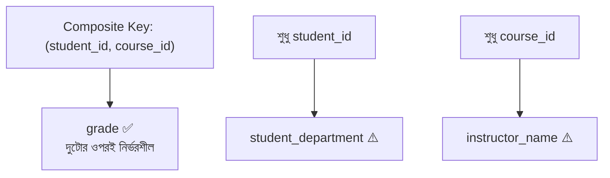
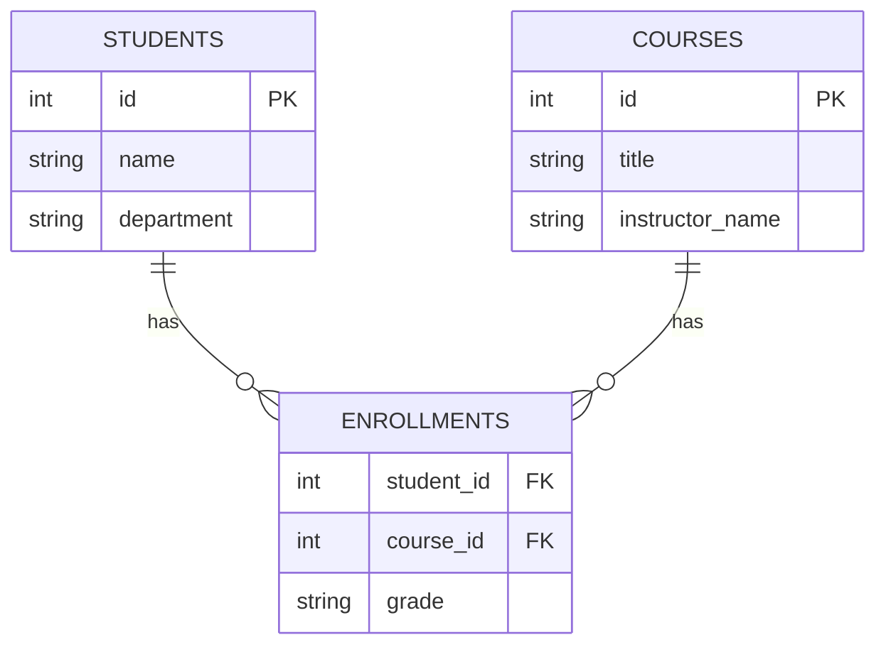

# ১৫. Second Normal Form (2NF) বিস্তারিত — পার্ট ২

আগের লেসনে আমরা `order_books` টেবিলের `book_author` কলামের partial dependency সমস্যা সমাধান করেছি। এই লেসনে আমরা আরেকটা একটু বড়, আরও বাস্তবসম্মত উদাহরণ দিয়ে পুরো প্রক্রিয়াটা আবার অনুশীলন করবো — এবার আমাদের `enrollments` (ছাত্র-কোর্স ভর্তি) টেবিল দিয়ে, যা আমরা লেসন ৯-এ বানিয়েছিলাম।

ধরো, বাস্তব প্রয়োজনে আমরা `enrollments` টেবিলে আরও কিছু কলাম যোগ করেছি — instructor-এর নাম, আর ছাত্রের বিভাগ (department):

```sql
CREATE TABLE enrollments (
    student_id INT,
    course_id INT,
    student_department VARCHAR(50),
    instructor_name VARCHAR(100),
    grade VARCHAR(2),
    PRIMARY KEY (student_id, course_id)
);
```

আগের লেসনের মতোই, চলো প্রতিটা non-key কলাম বিশ্লেষণ করি — সে কি পুরো `(student_id, course_id)` composite key-এর ওপর নির্ভরশীল, নাকি শুধু একটা অংশের ওপর?

- **`grade`** — একজন নির্দিষ্ট ছাত্র, একটা নির্দিষ্ট কোর্সে কী গ্রেড পেয়েছে, এটা জানতে `student_id` **এবং** `course_id` দুটোই লাগবে (একই ছাত্র ভিন্ন কোর্সে ভিন্ন গ্রেড পেতে পারে)। তাই এটা পুরো composite key-এর ওপর নির্ভরশীল — সঠিক জায়গায় আছে।
- **`student_department`** — এটা জানতে আসলে শুধু `student_id` লাগে। একজন ছাত্র কোন কোর্সে ভর্তি হয়েছে তার সাথে তার বিভাগের কোনো সম্পর্ক নেই। এটা partial dependency।
- **`instructor_name`** — এটা জানতে শুধু `course_id` লাগে (একটা কোর্স একজন নির্দিষ্ট শিক্ষক পড়ান, ধরে নিচ্ছি)। এটাও partial dependency।



এখানে দুইটা আলাদা partial dependency আছে — একটা `student_id`-এর ওপর, আরেকটা `course_id`-এর ওপর। সমাধানও দুই ভাগে হবে, লেসন ১৪-এর একই রেসিপি অনুসরণ করে — প্রতিটা partial dependency-কে তার নিজের "মালিক" কলামের সাথে আলাদা টেবিলে সরিয়ে ফেলা:

```sql
-- student_department চলে যাবে students টেবিলে
CREATE TABLE students (
    id INT PRIMARY KEY,
    name VARCHAR(100),
    department VARCHAR(50)
);

-- instructor_name চলে যাবে courses টেবিলে
CREATE TABLE courses (
    id INT PRIMARY KEY,
    title VARCHAR(100),
    instructor_name VARCHAR(100)
);

-- enrollments-এ থাকবে শুধু যা সত্যিকারের সম্পর্কের তথ্য
CREATE TABLE enrollments (
    student_id INT,
    course_id INT,
    grade VARCHAR(2),
    PRIMARY KEY (student_id, course_id),
    FOREIGN KEY (student_id) REFERENCES students(id),
    FOREIGN KEY (course_id) REFERENCES courses(id)
);
```



এখন schema-টা 2NF মেনে চলে — প্রতিটা non-key কলাম তার পুরো primary key-এর ওপর নির্ভরশীল। ফলাফলটা যাচাই করা যাক প্রশ্ন করে: যদি কোনো ছাত্রের বিভাগ বদলায়, এখন কতগুলো সারি বদলাতে হবে? উত্তর — মাত্র একটা, `students` টেবিলে। আগের ডিজাইনে, যদি সেই ছাত্র পাঁচটা কোর্সে ভর্তি থাকতো, পাঁচটা সারি বদলাতে হতো — আর একটা ভুলে গেলেই ডেটা অসামঞ্জস্যপূর্ণ হয়ে যেতো।

এই দুই লেসন মিলিয়ে আমরা যা শিখলাম তার সারমর্ম করা যাক একটা তুলনা-টেবিলে:

| ধাপ | কী পরীক্ষা করি | সমস্যা হলে করণীয় |
|---|---|---|
| 1NF | প্রতিটা সেলে কি একটাই মান? | Multi-value কলাম আলাদা সারি/টেবিলে ভাঙো |
| 2NF | প্রতিটা non-key কলাম কি পুরো composite key-এর ওপর নির্ভরশীল? | Partial dependency-যুক্ত কলাম আলাদা টেবিলে সরাও |

এই মডিউলে আমরা relationship-এর ধারণা থেকে শুরু করে — OOP-এর সাথে তুলনা, multiple table-এর প্রয়োজনীয়তা, One-to-Many/Many-to-Many বাস্তবায়ন, Join আর Subquery, আর সবশেষে Normalization (1NF, 2NF) — একটা সম্পূর্ণ যাত্রা শেষ করলাম। এখন আমাদের হাতে আছে এমন schema বানানোর দক্ষতা, যা redundancy-মুক্ত, নির্ভরযোগ্য, আর বাস্তব প্রশ্নের উত্তর দিতে সক্ষম।

তবে এখনো আমরা schema-কে শুধু টেবিল আর কোড আকারে দেখেছি — একটা schema-কে ভিজ্যুয়ালভাবে, ডায়াগ্রাম আকারে ডিজাইন করার একটা প্রমিত পদ্ধতি আছে, যেটা টিমে কাজ করার সময় অসম্ভব উপকারী। পরের মডিউলে আমরা ঠিক সেটাই শিখবো — **Entity-Relationship Diagram (ERD)**-এর মৌলিক নিয়মকানুন।
