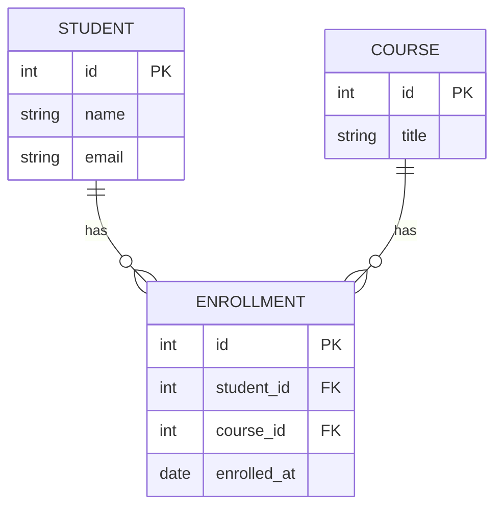

# ০১. Database Design Concepts

Module 18-এ আমরা One-to-Many, Many-to-Many, আর Normalization নিয়ে অনেক কথা বলেছি — কিন্তু সবসময় টেবিলগুলো ইংরেজি বাক্যে বর্ণনা করেছি। এখন সময় হয়েছে সেই বর্ণনাগুলোকে একটা ছবিতে রূপ দেয়ার — আর সেই ছবির নামই **ERD (Entity Relationship Diagram)**।

ভাবো তুমি একটা বাড়ির নকশা করছো। মুখে মুখে বলা যায় "একটা বেডরুম থাকবে, একটা রান্নাঘর থাকবে, রান্নাঘর থেকে ডাইনিং রুমে যাওয়া যাবে" — কিন্তু রাজমিস্ত্রিকে কাজ করাতে হলে একটা নকশা (blueprint) লাগে, যেখানে প্রতিটা রুম, তার সাইজ, আর রুমগুলোর মধ্যেকার দরজা স্পষ্টভাবে আঁকা থাকে। ERD হলো ডাটাবেজের সেই ব্লুপ্রিন্ট।

ERD-তে তিনটা মূল জিনিস থাকে:

- **Entity** — একটা জিনিস বা ধারণা, যেটা নিজে একটা টেবিল হয়ে যায়। যেমন `Student`, `Course`, `Order`।
- **Attribute** — Entity-র বৈশিষ্ট্য, যেটা টেবিলের কলাম হয়। যেমন `Student`-এর `name`, `email`।
- **Relationship** — দুটো Entity-র মধ্যে সংযোগ, যেটা মূলত Foreign Key দিয়ে বাস্তবায়িত হয় (Module 18, লেসন ৫)।

Relationship-এর **cardinality** বোঝানোর জন্য আমরা "crow's foot" নোটেশন ব্যবহার করবো — `||--o{` মানে "এক থেকে অনেক", `}o--o{` মানে "অনেক থেকে অনেক"। Mermaid-এ এভাবে লেখা হয়:

এই একটা ছবি থেকেই তুমি বুঝে ফেলছো — একজন Student অনেক Course-এ enroll করতে পারে, একটা Course-এ অনেক Student থাকতে পারে, আর মাঝখানের `ENROLLMENT` টেবিলটা হলো Module 18-তে শেখা junction table। এটাই Many-to-Many relationship-এর ছবি আঁকা রূপ (Module 18, লেসন ৯-এর students-courses উদাহরণটা মনে করো)।

ERD আঁকার সাধারণ প্রক্রিয়াটা এমন:

1. প্রথমে সিস্টেমের বড় বড় "noun" গুলো খুঁজে বের করো — এগুলোই সম্ভাব্য entity।
2. প্রতিটা entity-র জন্য দরকারি attribute লিস্ট করো।
3. কোন entity কোন entity-র সাথে সম্পর্কিত, আর সেই সম্পর্ক এক-থেকে-অনেক নাকি অনেক-থেকে-অনেক — সেটা ঠিক করো।
4. Normalization নিয়ম (Module 18) মেনে redundancy আছে কিনা চেক করো, দরকার হলে junction table বা নতুন entity যোগ করো।

এই মডিউলের বাকি লেসনগুলোতে আমরা ঠিক এই প্রক্রিয়া অনুসরণ করে ৮টা ভিন্ন ভিন্ন বাস্তব-জীবনের সিস্টেমের (E-commerce, Freelancer Platform, Ride-Sharing, CMS, Job Portal, Booking) ERD আঁকবো, স্কিমা লিখবো, আর সেই স্কিমার সাথে Transaction, Trigger, আর Index-ও যোগ করবো — যাতে শুধু ডিজাইন নয়, বাস্তবে ব্যবহারযোগ্য একটা ডাটাবেজ কেমন দেখতে হয় সেটাও শিখে ফেলো। চলো প্রথমেই যাই সবচেয়ে পরিচিত একটা ডোমেইনে — E-commerce।
