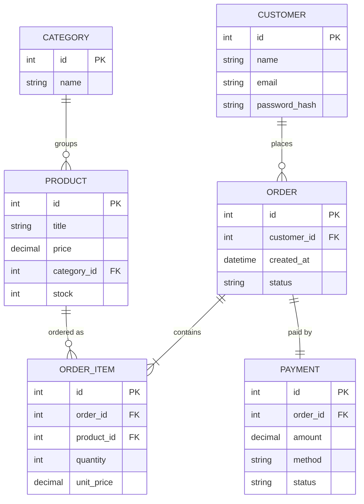

# ০২. E-commerce ERD

গত লেসনে শেখা প্রক্রিয়া দিয়ে শুরু করি — noun খুঁজে বের করা। একটা সাধারণ E-commerce সাইটের কথা ভাবলে যে শব্দগুলো বারবার আসে: Customer, Product, Category, Order, Payment। এই প্রতিটাই একটা Entity হওয়ার প্রার্থী।



লক্ষ্য করো — `ORDER_ITEM` টেবিলটা একদম Module 18-এর junction table-এর মতোই কাজ করছে, কিন্তু এখানে এটা শুধু সম্পর্ক জোড়া লাগায় না, নিজের `quantity` আর `unit_price` কলামও রাখে। এটাকে বলে **associative entity** — একটা relationship যেটার নিজেরও attribute আছে। `unit_price` এখানে `Product.price`-এর কপি না, কারণ প্রোডাক্টের দাম পরে বদলে গেলেও পুরনো অর্ডারের হিসাব ঠিক থাকা দরকার — এটা ইচ্ছাকৃত "duplication", ভুল নয়।

স্কিমাটা এবার SQL-এ (Module 16-এ শেখা CREATE TABLE সিনট্যাক্স দিয়ে):

```sql
CREATE TABLE customers (
  id SERIAL PRIMARY KEY,
  name VARCHAR(100) NOT NULL,
  email VARCHAR(150) UNIQUE NOT NULL,
  password_hash VARCHAR(255) NOT NULL
);

CREATE TABLE categories (
  id SERIAL PRIMARY KEY,
  name VARCHAR(100) NOT NULL
);

CREATE TABLE products (
  id SERIAL PRIMARY KEY,
  title VARCHAR(200) NOT NULL,
  price DECIMAL(10,2) NOT NULL,
  category_id INT REFERENCES categories(id),
  stock INT DEFAULT 0
);

CREATE TABLE orders (
  id SERIAL PRIMARY KEY,
  customer_id INT REFERENCES customers(id),
  created_at TIMESTAMP DEFAULT NOW(),
  status VARCHAR(20) DEFAULT 'pending'
);

CREATE TABLE order_items (
  id SERIAL PRIMARY KEY,
  order_id INT REFERENCES orders(id),
  product_id INT REFERENCES products(id),
  quantity INT NOT NULL,
  unit_price DECIMAL(10,2) NOT NULL
);
```

`REFERENCES` কীওয়ার্ডটাই Foreign Key তৈরি করছে — এটা ডাটাবেজকে বলে দেয় "এই কলামের ভ্যালু অন্য টেবিলের PK-এর সাথে মিলতে হবে", যেটা Module 18-তে আমরা concept হিসেবে শিখেছিলাম, এখানে সেটাই বাস্তব SQL-এ রূপ নিলো।

এই ধরনের ব্যবসায়িক অ্যাপ্লিকেশনে একটা জিনিস প্রায়ই দরকার হয় — একসাথে একাধিক টেবিলে পরিবর্তন করা, যেন হয় সবকিছু সফল হয়, নাহলে কিছুই না হয়। যেমন অর্ডার বসানোর সময় `orders`-এ নতুন সারি ঢোকাতে হবে, `order_items`-এও ঢোকাতে হবে, আর `products.stock` কমাতে হবে। এটাই **Transaction** — Module 20-তে আমরা `COMMIT`/`ROLLBACK` দিয়ে এটা বিস্তারিত শিখবো, কিন্তু এখানেই একটা ঝলক দেখে নেই:

```sql
BEGIN;
  INSERT INTO orders (customer_id, status) VALUES (1, 'pending') RETURNING id;
  -- ধরি উপরের query থেকে order_id = 501 পেলাম
  INSERT INTO order_items (order_id, product_id, quantity, unit_price)
    VALUES (501, 7, 2, 499.00);
  UPDATE products SET stock = stock - 2 WHERE id = 7;
COMMIT;
```

যদি মাঝপথে stock-এর জন্য কোনো এরর হয় (যেমন stock ঋণাত্মক হয়ে যাচ্ছে), পুরো ব্লকটা `ROLLBACK` হয়ে যাবে — অর্ডারও তৈরি হবে না, স্টকও কমবে না। এই "সব অথবা কিছুই না" আচরণটাই একটা ই-কমার্স সিস্টেমে বিশ্বাসযোগ্যতার মূল ভিত্তি।

স্টক নিয়ে আরেকটা প্রয়োজন হলো — কেউ যদি ভুলবশত stock-কে ঋণাত্মক সংখ্যায় নিয়ে যাওয়ার চেষ্টা করে, ডাটাবেজ নিজে থেকেই সেটা আটকে দিক। এর জন্য একটা **Trigger** লেখা যায়:

```sql
CREATE OR REPLACE FUNCTION check_stock() RETURNS TRIGGER AS $$
BEGIN
  IF NEW.stock < 0 THEN
    RAISE EXCEPTION 'Stock cannot be negative for product %', NEW.id;
  END IF;
  RETURN NEW;
END;
$$ LANGUAGE plpgsql;

CREATE TRIGGER trg_check_stock
BEFORE UPDATE ON products
FOR EACH ROW EXECUTE FUNCTION check_stock();
```

Trigger মানে হলো — একটা নির্দিষ্ট ঘটনা (এখানে `products` টেবিলে UPDATE) ঘটার আগে বা পরে ডাটাবেজ নিজে থেকেই একটা ফাংশন চালিয়ে দেয়, তোমার অ্যাপ্লিকেশন কোডে আলাদা করে চেক না লিখলেও।

সবশেষে **Index** নিয়ে ভাবি। `orders.customer_id` আর `order_items.order_id` কলামে বারবার `WHERE` দিয়ে খোঁজা হবে (যেমন "এই কাস্টমারের সব অর্ডার দেখাও"), তাই এখানে ইনডেক্স বসানো উচিত:

```sql
CREATE INDEX idx_orders_customer ON orders(customer_id);
CREATE INDEX idx_order_items_order ON order_items(order_id);
```

ইনডেক্স অনেকটা বইয়ের শেষের "index পাতা"র মতো — পুরো বই না উল্টে সরাসরি পাতা নম্বরে চলে যাওয়া যায়। Foreign Key কলামে ইনডেক্স না থাকলে JOIN করার সময় (Module 17, লেসন ২-এর GROUP BY-এর মতোই ভারী অপারেশন) ডাটাবেজকে পুরো টেবিল স্ক্যান করতে হয়, যেটা ডেটা বড় হলে খুব ধীর হয়ে যায়।

এই একটা লেসনেই আমরা ERD, Schema, Transaction, Trigger আর Index — পাঁচটা জিনিসই একসাথে দেখলাম। সামনের লেসনগুলোতে (৪ থেকে ৯) একই কাঠামো ধরে রেখে ভিন্ন ভিন্ন বাস্তব ডোমেইনে এই প্র্যাকটিসটা বারবার করবো, যাতে প্যাটার্নটা হাতে-কলমে গেঁথে যায়। তার আগে পরের লেসনে একটা হোমওয়ার্ক — নিজে হাতে একটা ব্লগপোস্ট সিস্টেমের ERD আঁকার চেষ্টা করবে।
