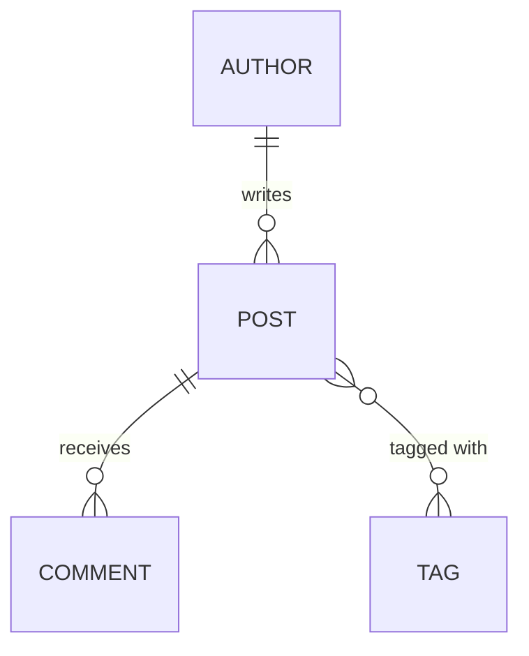

# ০৩. Homework: ERD for Blogpost

এতক্ষণ আমি এঁকে দেখালাম, এবার তোমার পালা। এটা একটা হোমওয়ার্ক লেসন — সমাধান পুরোপুরি দেয়া হবে না, বরং প্রশ্ন আর কিছু ইঙ্গিত দেয়া হবে, যাতে তুমি নিজে Module 19-এর লেসন ১-এ শেখা প্রক্রিয়াটা (noun খোঁজা → attribute বসানো → relationship ঠিক করা → normalize করা) হাতে-কলমে প্র্যাকটিস করতে পারো।

সিস্টেমের বর্ণনা এইরকম: একজন **Author** ব্লগে **Post** লিখতে পারে। প্রতিটা Post-এ একাধিক **Tag** থাকতে পারে (যেমন "javascript", "career")। পাঠকরা Post-এ **Comment** করতে পারে, আর একটা Comment-এর জবাবে আরেকটা Comment-ও (reply) আসতে পারে।

নিজেকে প্রশ্ন করো:

- Author আর Post-এর সম্পর্ক কী রকম — One-to-Many নাকি Many-to-Many? (ইঙ্গিত: একজন Author কি একাধিক Post লিখতে পারে? একটা Post কি একাধিক Author-এর হতে পারে, যেমন co-authored লেখা হলে?)
- Post আর Tag-এর সম্পর্ক কী রকম? এটা কি Module 18-এর students-courses উদাহরণের মতো লাগছে? তাহলে মাঝে কী ধরনের junction table লাগবে, আর সেটার নাম কী দিবে?
- Comment নিজেই যদি আরেকটা Comment-কে reply করে, তাহলে `comments` টেবিলের কি নিজের সাথেই একটা relationship দরকার (self-referencing foreign key)? যেমন `parent_comment_id` কলাম, যেটা `comments.id`-কেই reference করে।

উপরের ডায়াগ্রামটা ইচ্ছাকৃতভাবে অসম্পূর্ণ রাখা হয়েছে — `COMMENT`-এর self-reply সম্পর্কটা আঁকা হয়নি, আর কোনো টেবিলের attribute-ও দেখানো হয়নি। তোমার কাজ:

1. প্রতিটা entity-র জন্য অন্তত ৪-৫টা attribute লিস্ট করা (id, timestamps সহ)।
2. Post-Tag সম্পর্কের junction table-এর নাম আর কলাম ঠিক করা।
3. Comment-এর self-reply সম্পর্কটা ERD-তে যোগ করা।
4. পুরো স্কিমাটা `CREATE TABLE` স্টেটমেন্ট আকারে লেখা (Module 16, লেসন ২-এর মতো সিনট্যাক্সে)।

একটা সূক্ষ্ম ফাঁদ আছে এখানে — Post-এর "primary author" যদি single হয় কিন্তু ভবিষ্যতে co-author সাপোর্ট করতে চাও, তাহলে `posts.author_id` কলাম দিয়ে শুরু করলে পরে সেটাকে Many-to-Many-তে migrate করা কষ্টকর হবে (Module 16, লেসন ৩-এ ALTER TABLE নিয়ে যা শিখেছো, সেটা মনে করো — লাইভ টেবিলে বড় পরিবর্তন সহজ না)। তাই ডিজাইন করার সময় "আজকে দরকার" এবং "আগামীকাল লাগতে পারে" — দুটোই মাথায় রাখা ভালো অভ্যাস।

নিজের সমাধানটা লিখে ফেলার পর পরের লেসনে যাও, যেখানে আমরা আবার একটা সম্পূর্ণ সমাধান-সহ ডোমেইনে ফিরবো — এবার Freelancer Platform, যেখানে ERD-এর পাশাপাশি Transaction, Trigger, আর Index-ও পুরোপুরি লেখা থাকবে।
