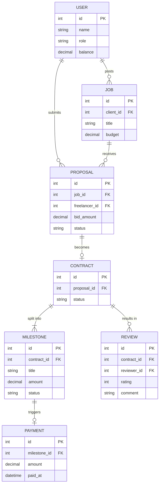

# ০৪. Freelancer Platform (Upwork/Fiverr type) ERD, Schema, Transactions, Triggers, Indexes

এবার একটা এমন সিস্টেম নিয়ে ভাবি যেখানে দুই ধরনের ইউজার থাকে — Client আর Freelancer, দুজনেই আসলে `users` টেবিলের সদস্য, কিন্তু ভূমিকা আলাদা। এই ধরনের "একই টেবিল, ভিন্ন role" ডিজাইন Module 18-এর OOP তুলনা (লেসন ২) দিয়ে বুঝলে সহজ — যেমন একটা `User` ক্লাসের `role` প্রপার্টি দিয়ে আচরণ ভাগ হয়, ঠিক তেমন।

### Entity গুলো

Freelancer একটা **Gig** পোস্ট করে (সার্ভিস অফার), অথবা Client একটা **Job** পোস্ট করে। Freelancer সেই Job-এ **Proposal** পাঠায়। Proposal গৃহীত হলে একটা **Contract** তৈরি হয়, যেটা কয়েকটা **Milestone**-এ ভাগ হয়। প্রতিটা Milestone সম্পন্ন হলে **Payment** হয়, আর কাজ শেষে দুই পক্ষ একে অপরকে **Review** দেয়।



### Schema

```sql
CREATE TABLE users (
  id SERIAL PRIMARY KEY,
  name VARCHAR(100),
  role VARCHAR(20) CHECK (role IN ('client', 'freelancer')),
  balance DECIMAL(10,2) DEFAULT 0
);

CREATE TABLE jobs (
  id SERIAL PRIMARY KEY,
  client_id INT REFERENCES users(id),
  title VARCHAR(200),
  budget DECIMAL(10,2)
);

CREATE TABLE proposals (
  id SERIAL PRIMARY KEY,
  job_id INT REFERENCES jobs(id),
  freelancer_id INT REFERENCES users(id),
  bid_amount DECIMAL(10,2),
  status VARCHAR(20) DEFAULT 'pending'
);

CREATE TABLE contracts (
  id SERIAL PRIMARY KEY,
  proposal_id INT REFERENCES proposals(id),
  status VARCHAR(20) DEFAULT 'active'
);

CREATE TABLE milestones (
  id SERIAL PRIMARY KEY,
  contract_id INT REFERENCES contracts(id),
  title VARCHAR(200),
  amount DECIMAL(10,2),
  status VARCHAR(20) DEFAULT 'pending'
);

CREATE TABLE payments (
  id SERIAL PRIMARY KEY,
  milestone_id INT REFERENCES milestones(id),
  amount DECIMAL(10,2),
  paid_at TIMESTAMP DEFAULT NOW()
);
```

### Transaction যেটা গুরুত্বপূর্ণ

একটা Milestone approve হলে একসাথে অনেকগুলো কাজ হতে হয় — Milestone-এর status বদলানো, Payment রেকর্ড করা, Client-এর balance কমানো, Freelancer-এর balance বাড়ানো। এই চারটার যেকোনো একটা ব্যর্থ হলে বাকিগুলোও বাতিল হওয়া উচিত:

```sql
BEGIN;
  UPDATE milestones SET status = 'completed' WHERE id = 12;
  INSERT INTO payments (milestone_id, amount) VALUES (12, 500.00);
  UPDATE users SET balance = balance - 500.00 WHERE id = 3;  -- client
  UPDATE users SET balance = balance + 500.00 WHERE id = 8;  -- freelancer
COMMIT;
```

এটা অনেকটা ব্যাংকের ভেতরের টাকা ট্রান্সফারের মতো — একজনের অ্যাকাউন্ট থেকে টাকা কাটা হবে, আরেকজনের অ্যাকাউন্টে যোগ হবে, কিন্তু কখনোই এমন অবস্থায় থামা যাবে না যেখানে টাকা "কাটাও হয়েছে, কিন্তু কাউকে যোগও হয়নি"।

### Trigger

Client-এর balance যেন কখনো ঋণাত্মক না হয়, সেটা নিশ্চিত করতে:

```sql
CREATE OR REPLACE FUNCTION prevent_negative_balance() RETURNS TRIGGER AS $$
BEGIN
  IF NEW.balance < 0 THEN
    RAISE EXCEPTION 'Insufficient balance for user %', NEW.id;
  END IF;
  RETURN NEW;
END;
$$ LANGUAGE plpgsql;

CREATE TRIGGER trg_balance_check
BEFORE UPDATE ON users
FOR EACH ROW EXECUTE FUNCTION prevent_negative_balance();
```

### Index

`proposals.job_id`, `proposals.freelancer_id`, আর `milestones.contract_id` — এই কলামগুলোয় খোঁজাখুঁজি (JOIN, WHERE) সবচেয়ে বেশি হবে, তাই:

```sql
CREATE INDEX idx_proposals_job ON proposals(job_id);
CREATE INDEX idx_proposals_freelancer ON proposals(freelancer_id);
CREATE INDEX idx_milestones_contract ON milestones(contract_id);
```

এই ডোমেইনে আমরা প্রথমবার দেখলাম কীভাবে একটা টেবিল (`users`) দুই ধরনের ভূমিকা ধারণ করতে পারে `role` কলাম দিয়ে — টেবিল ডুপ্লিকেট না করে। পরের লেসনে যাই Ride-Sharing সিস্টেমে, যেখানে টাইম আর লোকেশনভিত্তিক ডেটা সামলাতে হবে।
