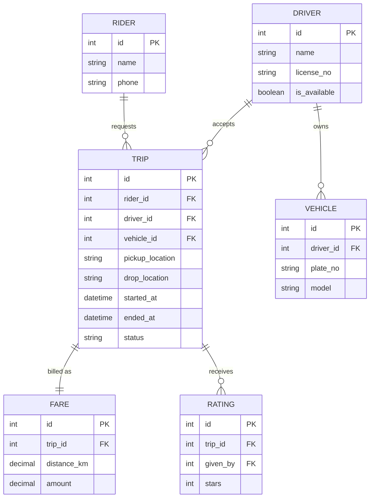

# ০৫. Ride-Sharing Database (Uber type) ERD, Schema, Transactions, Triggers, Indexes

Uber-এর মতো সিস্টেমে মূল entity গুলো হলো Rider, Driver, Vehicle, Trip, আর Fare। আগের লেসনের Freelancer উদাহরণের সাথে একটা মিল আছে — এখানেও দুই ধরনের ইউজার (Rider, Driver), কিন্তু এবার Driver-এর একটা আলাদা Entity — **Vehicle** — এর সাথে সরাসরি সম্পর্ক আছে, যেটা Freelancer সিস্টেমে ছিল না।

### Entity গুলো

একজন Driver একটা (বা একাধিক) Vehicle চালাতে পারে। একজন Rider একটা Trip রিকোয়েস্ট করে, যেটা একজন Driver গ্রহণ করে। Trip শেষ হলে একটা Fare হিসাব হয়, আর দুই পক্ষ Rating দেয়।



### Schema

```sql
CREATE TABLE drivers (
  id SERIAL PRIMARY KEY,
  name VARCHAR(100),
  license_no VARCHAR(50) UNIQUE,
  is_available BOOLEAN DEFAULT TRUE
);

CREATE TABLE vehicles (
  id SERIAL PRIMARY KEY,
  driver_id INT REFERENCES drivers(id),
  plate_no VARCHAR(20) UNIQUE,
  model VARCHAR(100)
);

CREATE TABLE riders (
  id SERIAL PRIMARY KEY,
  name VARCHAR(100),
  phone VARCHAR(20)
);

CREATE TABLE trips (
  id SERIAL PRIMARY KEY,
  rider_id INT REFERENCES riders(id),
  driver_id INT REFERENCES drivers(id),
  vehicle_id INT REFERENCES vehicles(id),
  pickup_location VARCHAR(200),
  drop_location VARCHAR(200),
  started_at TIMESTAMP,
  ended_at TIMESTAMP,
  status VARCHAR(20) DEFAULT 'requested'
);

CREATE TABLE fares (
  id SERIAL PRIMARY KEY,
  trip_id INT REFERENCES trips(id),
  distance_km DECIMAL(6,2),
  amount DECIMAL(10,2)
);
```

লক্ষ্য করো — `trips.status` কলামের সম্ভাব্য মান হতে পারে `requested`, `accepted`, `ongoing`, `completed`, `cancelled`। এই ধরনের "state machine" ডিজাইন Module 6-এ শেখা status code-এর ধারণার সাথে মিলে যায় — যেমন HTTP status code দিয়ে একটা request-এর "অবস্থা" বোঝানো হয়, এখানে একটা কলাম দিয়ে একটা Trip-এর জীবনচক্রের "অবস্থা" বোঝানো হচ্ছে।

### Transaction যেটা গুরুত্বপূর্ণ

একজন Driver একটা Trip Accept করলে তাকে "unavailable" করে দিতে হবে, নাহলে একই সময়ে দুইজন Rider তাকে বুক করে ফেলতে পারে:

```sql
BEGIN;
  UPDATE trips SET driver_id = 5, vehicle_id = 9, status = 'accepted' WHERE id = 101;
  UPDATE drivers SET is_available = FALSE WHERE id = 5;
COMMIT;
```

### Trigger

Trip সম্পন্ন (`completed`) হলে Driver যেন স্বয়ংক্রিয়ভাবে আবার "available" হয়ে যায় — এটা অ্যাপ্লিকেশন কোডে ভুলে যাওয়ার সুযোগ থাকে, তাই ডাটাবেজ-লেভেলেই নিশ্চিত করা ভালো:

```sql
CREATE OR REPLACE FUNCTION free_driver_after_trip() RETURNS TRIGGER AS $$
BEGIN
  IF NEW.status = 'completed' THEN
    UPDATE drivers SET is_available = TRUE WHERE id = NEW.driver_id;
  END IF;
  RETURN NEW;
END;
$$ LANGUAGE plpgsql;

CREATE TRIGGER trg_free_driver
AFTER UPDATE ON trips
FOR EACH ROW EXECUTE FUNCTION free_driver_after_trip();
```

### Index

Rider-অ্যাপ থেকে সবচেয়ে ঘন ঘন যে প্রশ্নটা আসবে তা হলো "কাছাকাছি কোন Driver available আছে" আর "কোনো নির্দিষ্ট Driver-এর সব Trip দেখাও":

```sql
CREATE INDEX idx_drivers_available ON drivers(is_available);
CREATE INDEX idx_trips_driver ON trips(driver_id);
CREATE INDEX idx_trips_rider ON trips(rider_id);
```

`is_available`-এর মতো low-cardinality (মাত্র true/false) কলামে ইনডেক্স সবসময় কাজে লাগে না, কিন্তু যখন টেবিলে লক্ষ লক্ষ Driver থাকে আর মাত্র কয়েকশো available থাকে, তখন এটা কার্যকর হতে পারে — এটা মনে রাখার মতো একটা সূক্ষ্মতা।

এই লেসনে আমরা প্রথমবার state machine স্টাইলের status কলাম, আর Trigger দিয়ে "অন্য টেবিল আপডেট করা" দেখলাম। পরের লেসনে যাই Content Management System-এ, যেখানে টেবিলগুলোর মধ্যে ভূমিকা-ভিত্তিক Access Control আর ভার্সন হিস্টোরি সামলাতে হবে।
