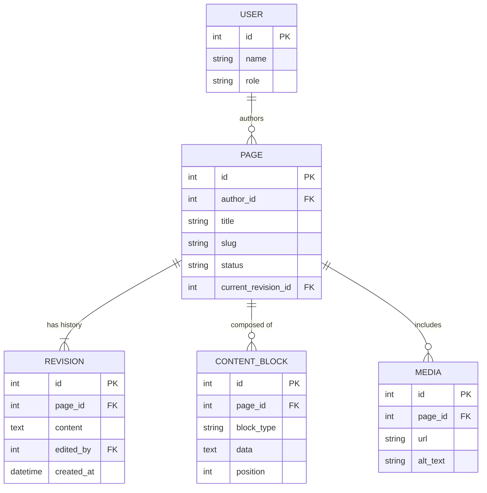

# ০৬. Content Management (CMS) Database ERD, Schema, Transactions, Triggers, Indexes

একটা CMS-এর (যেমন WordPress-ধাঁচের সিস্টেম) মূল চ্যালেঞ্জ হলো — একটা Page বারবার এডিট হয়, আর পুরনো ভার্সন হারিয়ে ফেলা যাবে না। এটা আগের ডোমেইনগুলো থেকে আলাদা একটা সমস্যা — এখানে "সময়ের সাথে বদলানো ডেটা"-র ইতিহাস রাখা লাগে।

### Entity গুলো

একজন User (role: admin/editor/author) একটা Page লেখে। প্রতিটা Page-এর একাধিক **Revision** (ভার্সন হিস্টোরি) থাকে। Page-এ Media (ছবি) যুক্ত করা যায়। Page-গুলো Content Block দিয়ে গঠিত হতে পারে (একটা flexible page builder-এর মতো)।



### Schema

```sql
CREATE TABLE users (
  id SERIAL PRIMARY KEY,
  name VARCHAR(100),
  role VARCHAR(20) CHECK (role IN ('admin', 'editor', 'author'))
);

CREATE TABLE pages (
  id SERIAL PRIMARY KEY,
  author_id INT REFERENCES users(id),
  title VARCHAR(200),
  slug VARCHAR(200) UNIQUE,
  status VARCHAR(20) DEFAULT 'draft',
  current_revision_id INT
);

CREATE TABLE revisions (
  id SERIAL PRIMARY KEY,
  page_id INT REFERENCES pages(id),
  content TEXT,
  edited_by INT REFERENCES users(id),
  created_at TIMESTAMP DEFAULT NOW()
);

CREATE TABLE content_blocks (
  id SERIAL PRIMARY KEY,
  page_id INT REFERENCES pages(id),
  block_type VARCHAR(50),
  data TEXT,
  position INT
);
```

`pages.current_revision_id` কলামটা একটা মজার সিদ্ধান্ত — `revisions` টেবিলের দিকে ফিরে তাকাচ্ছে, আবার `revisions.page_id`ও `pages`-এর দিকে ফিরে তাকাচ্ছে। এটাকে বলে circular reference, আর এই কারণেই `current_revision_id`-এর FK constraint টা টেবিল তৈরির পরে আলাদা `ALTER TABLE` দিয়ে যোগ করা লাগে (Module 16, লেসন ৩-এ শেখা ALTER TABLE-এর ব্যবহারিক প্রয়োগ এখানে):

```sql
ALTER TABLE pages
  ADD CONSTRAINT fk_current_revision
  FOREIGN KEY (current_revision_id) REFERENCES revisions(id);
```

### Transaction যেটা গুরুত্বপূর্ণ

একজন Editor একটা Page সেভ করলে — নতুন Revision তৈরি হয়, আর Page-এর `current_revision_id` আপডেট হয়। দুটো একসাথে না হলে Page পুরনো Revision-এ "আটকে" থাকবে অথবা একটা "এতিম" Revision তৈরি হবে যেটার দিকে কেউ পয়েন্ট করছে না:

```sql
BEGIN;
  INSERT INTO revisions (page_id, content, edited_by)
    VALUES (10, '<h1>Updated content</h1>', 4)
    RETURNING id;
  -- ধরি নতুন revision id = 77
  UPDATE pages SET current_revision_id = 77 WHERE id = 10;
COMMIT;
```

### Trigger

Page যখনই `published` স্ট্যাটাসে যায়, একটা audit log রাখা দরকার (Module 7-এর Audit Logger প্রজেক্ট মনে আছে? এখানে একই ধারণা ডাটাবেজ লেভেলে):

```sql
CREATE TABLE publish_log (
  id SERIAL PRIMARY KEY,
  page_id INT,
  published_at TIMESTAMP DEFAULT NOW()
);

CREATE OR REPLACE FUNCTION log_publish() RETURNS TRIGGER AS $$
BEGIN
  IF NEW.status = 'published' AND OLD.status != 'published' THEN
    INSERT INTO publish_log (page_id) VALUES (NEW.id);
  END IF;
  RETURN NEW;
END;
$$ LANGUAGE plpgsql;

CREATE TRIGGER trg_log_publish
AFTER UPDATE ON pages
FOR EACH ROW EXECUTE FUNCTION log_publish();
```

### Index

Slug দিয়ে পেজ খোঁজা (URL রাউটিং-এর জন্য, Module 4-এর route parameter-এর কথা মনে করো) সবচেয়ে ঘন ঘন হবে, আর Revision হিস্টোরি সময় অনুযায়ী sort করা লাগবে:

```sql
CREATE UNIQUE INDEX idx_pages_slug ON pages(slug);
CREATE INDEX idx_revisions_page_created ON revisions(page_id, created_at DESC);
```

দ্বিতীয় ইনডেক্সটা দুটো কলাম নিয়ে (composite index) — কারণ কোয়েরি সবসময় "এই page-এর revision গুলো, নতুন থেকে পুরনো" এই প্যাটার্নে আসবে।

এই লেসনে আমরা প্রথমবার "ইতিহাস রাখা" (revision) আর circular FK-এর সমস্যা দেখলাম। পরের লেসনে যাই Job Portal-এ, যেখানে দুই ভিন্ন entity (Candidate আর Company) নিজেদের মধ্যে network/connection তৈরি করে।
