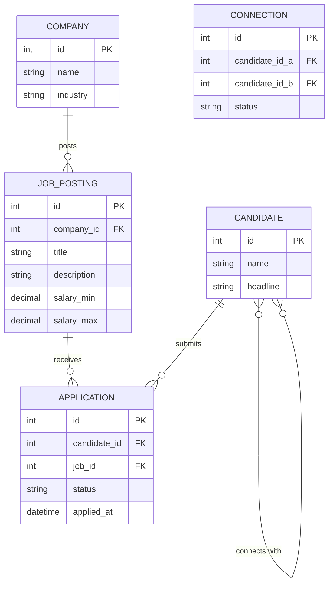

# ০৭. Job Portal (LinkedIn type) ERD, Schema, Transactions, Triggers, Indexes

LinkedIn-ধাঁচের সিস্টেমে একটা নতুন ধরনের সম্পর্ক আসে, যেটা আগের কোনো ডোমেইনে দেখিনি — **একই entity নিজের সাথেই Many-to-Many সম্পর্কে** যুক্ত হয় (Candidate-Candidate connection)। মডিউল 19-এর লেসন ৩-এ Comment-এর self-reply নিয়ে যে ইঙ্গিত দেয়া হয়েছিল, এখানে সেই একই কৌশল আরেকটু বড় পরিসরে দরকার হবে।

### Entity গুলো

Company একটা Job Posting দেয়। Candidate সেই Job-এ Application পাঠায়। দুইজন Candidate একে অপরের সাথে Connection তৈরি করতে পারে।



### Schema

`CANDIDATE }o--o{ CANDIDATE` সম্পর্কটা বাস্তবায়ন করতে আমাদের একটা junction table লাগবে যেটা নিজের টেবিলকেই দুইবার reference করে (Module 18, লেসন ৯-এর students-courses junction table-এর মতোই কৌশল, শুধু দুই পাশেই একই টেবিল):

```sql
CREATE TABLE companies (
  id SERIAL PRIMARY KEY,
  name VARCHAR(150),
  industry VARCHAR(100)
);

CREATE TABLE candidates (
  id SERIAL PRIMARY KEY,
  name VARCHAR(100),
  headline VARCHAR(200)
);

CREATE TABLE job_postings (
  id SERIAL PRIMARY KEY,
  company_id INT REFERENCES companies(id),
  title VARCHAR(200),
  description TEXT,
  salary_min DECIMAL(10,2),
  salary_max DECIMAL(10,2)
);

CREATE TABLE applications (
  id SERIAL PRIMARY KEY,
  candidate_id INT REFERENCES candidates(id),
  job_id INT REFERENCES job_postings(id),
  status VARCHAR(20) DEFAULT 'submitted',
  applied_at TIMESTAMP DEFAULT NOW(),
  UNIQUE (candidate_id, job_id)
);

CREATE TABLE connections (
  id SERIAL PRIMARY KEY,
  candidate_id_a INT REFERENCES candidates(id),
  candidate_id_b INT REFERENCES candidates(id),
  status VARCHAR(20) DEFAULT 'pending',
  CHECK (candidate_id_a < candidate_id_b)
);
```

লক্ষ্য করো `applications`-এর `UNIQUE (candidate_id, job_id)` — এটা নিশ্চিত করে একই Candidate একই Job-এ দুইবার আবেদন করতে না পারে। আর `connections`-এর `CHECK (candidate_id_a < candidate_id_b)` একটা চালাকি — এটা নিশ্চিত করে (A কানেক্টস B) আর (B কানেক্টস A) যেন দুটো আলাদা সারি হিসেবে ডুপ্লিকেট না হয়ে যায়, কারণ ছোট id-টাই সবসময় `_a` কলামে থাকতে বাধ্য থাকবে।

### Transaction যেটা গুরুত্বপূর্ণ

Connection request accept হলে দুই পক্ষের জন্যই status আপডেট হওয়া দরকার, আর candidate-দের একটা নোটিফিকেশনও যেতে পারে:

```sql
BEGIN;
  UPDATE connections SET status = 'accepted'
    WHERE candidate_id_a = 3 AND candidate_id_b = 9;
  INSERT INTO notifications (candidate_id, message)
    VALUES (3, 'আপনার কানেকশন রিকোয়েস্ট গৃহীত হয়েছে');
COMMIT;
```

### Trigger

Candidate যখন Application জমা দেয়, Company-কে জানানোর জন্য একটা নোটিফিকেশন সারি তৈরি করা:

```sql
CREATE OR REPLACE FUNCTION notify_company_on_application() RETURNS TRIGGER AS $$
DECLARE
  target_company_id INT;
BEGIN
  SELECT company_id INTO target_company_id FROM job_postings WHERE id = NEW.job_id;
  INSERT INTO notifications (company_id, message)
    VALUES (target_company_id, 'নতুন Application এসেছে');
  RETURN NEW;
END;
$$ LANGUAGE plpgsql;

CREATE TRIGGER trg_notify_application
AFTER INSERT ON applications
FOR EACH ROW EXECUTE FUNCTION notify_company_on_application();
```

এখানে trigger-এর ভেতরে আরেকটা SELECT চালিয়ে (subquery-র মতো, Module 18-এর লেসন ৭-এ যেটার গুরুত্ব শিখেছি) সংশ্লিষ্ট company খুঁজে বের করা হচ্ছে — কারণ `applications` টেবিলে সরাসরি `company_id` নেই, সেটা `job_postings` হয়ে ঘুরে আসতে হয়।

### Index

Job সার্চ, আর কোনো candidate-এর connection লিস্ট বের করা সবচেয়ে ঘন ঘন কাজ:

```sql
CREATE INDEX idx_applications_job ON applications(job_id);
CREATE INDEX idx_connections_a ON connections(candidate_id_a);
CREATE INDEX idx_connections_b ON connections(candidate_id_b);
CREATE INDEX idx_job_postings_company ON job_postings(company_id);
```

এই লেসনে আমরা প্রথমবার self-referencing Many-to-Many সম্পর্ক আর `CHECK` কনস্ট্রেইন্ট দিয়ে ডুপ্লিকেট আটকানো দেখলাম। পরের লেসনে যাই Booking সিস্টেমে, যেখানে সময়ের ওভারল্যাপ (একই রুম দুইবার বুক না হওয়া) সামলানো নতুন একটা চ্যালেঞ্জ হয়ে দাঁড়াবে।
