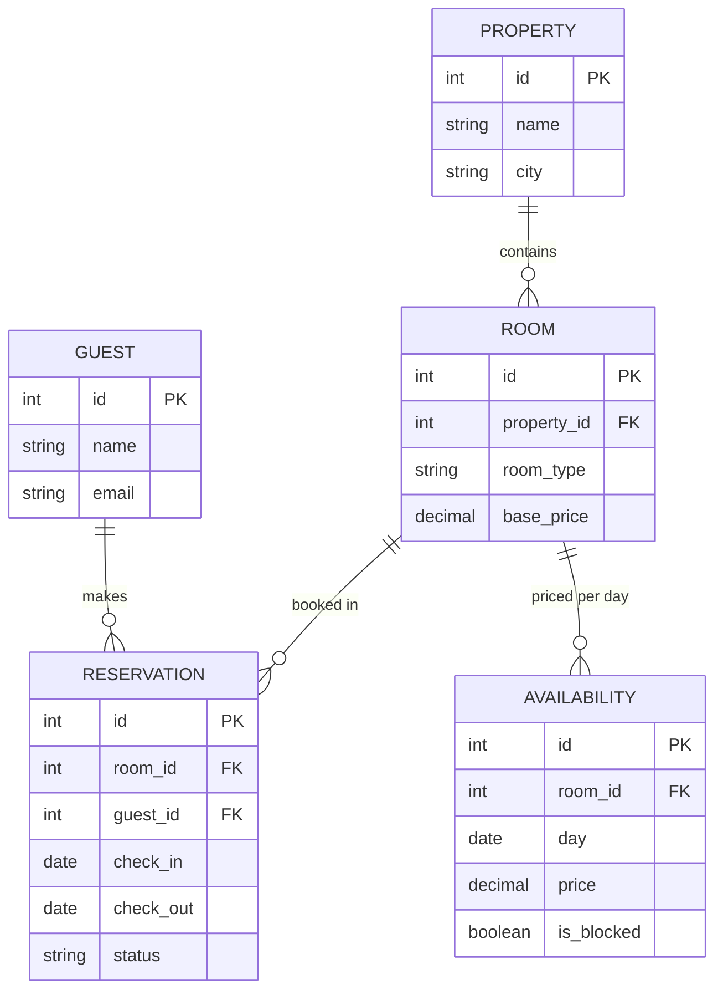

# ০৮. Booking (booking.com type) ERD, Schema, Transactions, Triggers, Indexes

Booking সিস্টেমের মূল চ্যালেঞ্জটা আগের কোনোটার মতো না — এখানে সমস্যাটা "একই রুম, একই সময়ে দুইজনকে বুক করা যাবে না"। এটা একটা concurrency সমস্যা, যেটা সমাধান করতে Transaction-এর গুরুত্ব সবচেয়ে বেশি বোঝা যাবে এই লেসনে।

### Entity গুলো

একটা Property-তে (হোটেল/বাসা) একাধিক Room থাকে। একজন Guest একটা Room-এর জন্য একটা Reservation করে, নির্দিষ্ট তারিখের রেঞ্জে। প্রতিটা Room-এর তারিখভিত্তিক Pricing/Availability থাকতে পারে।



### Schema

```sql
CREATE TABLE properties (
  id SERIAL PRIMARY KEY,
  name VARCHAR(150),
  city VARCHAR(100)
);

CREATE TABLE rooms (
  id SERIAL PRIMARY KEY,
  property_id INT REFERENCES properties(id),
  room_type VARCHAR(50),
  base_price DECIMAL(10,2)
);

CREATE TABLE guests (
  id SERIAL PRIMARY KEY,
  name VARCHAR(100),
  email VARCHAR(150) UNIQUE
);

CREATE TABLE reservations (
  id SERIAL PRIMARY KEY,
  room_id INT REFERENCES rooms(id),
  guest_id INT REFERENCES guests(id),
  check_in DATE NOT NULL,
  check_out DATE NOT NULL,
  status VARCHAR(20) DEFAULT 'confirmed',
  CHECK (check_out > check_in)
);
```

`CHECK (check_out > check_in)` একটা সহজ কিন্তু গুরুত্বপূর্ণ নিয়ম — কেউ যেন এমন রিজার্ভেশন তৈরি করতে না পারে যেখানে চেক-আউট তারিখ চেক-ইনের আগে। কিন্তু আসল সমস্যাটা এখনো বাকি — দুইটা ভিন্ন Reservation-এর তারিখ যেন **overlap** না করে, একই Room-এর জন্য। এটা সাধারণ `CHECK` দিয়ে করা যায় না, কারণ এটা একটা সারির সাথে অন্য সারির তুলনা করতে হয় (cross-row validation), তাই এর জন্য Transaction আর সতর্ক Query দুটোই লাগে।

### Transaction যেটা গুরুত্বপূর্ণ

বুকিং করার আগে একই রুমে ওভারল্যাপিং তারিখে অন্য কোনো Reservation আছে কিনা চেক করে, তারপর ইনসার্ট করা — এবং পুরো কাজটা একটা লকের ভেতরে করা, যাতে দুইজন গেস্ট একই মুহূর্তে বুক করার চেষ্টা করলেও একজনই সফল হয়:

```sql
BEGIN;
  SELECT * FROM reservations
    WHERE room_id = 15
      AND status = 'confirmed'
      AND check_in < '2026-09-10'
      AND check_out > '2026-09-05'
    FOR UPDATE;
  -- যদি উপরের কোয়েরিতে কোনো সারি না পাওয়া যায়, তাহলেই নিচেরটা চালাও
  INSERT INTO reservations (room_id, guest_id, check_in, check_out)
    VALUES (15, 22, '2026-09-05', '2026-09-10');
COMMIT;
```

`FOR UPDATE` অংশটা ডাটাবেজকে বলে দেয় — এই সারিগুলোতে সাময়িকভাবে লক বসাও, যতক্ষণ না এই Transaction শেষ হচ্ছে, অন্য কোনো Transaction একই রুমের ওভারল্যাপ চেক করতে পারবে না। `BEGIN`/`COMMIT`/`ROLLBACK`-এর এই মেকানিজমটাই Module 20-এ আমরা বিস্তারিত শিখবো TCL (Transaction Control Language)-এর প্রসঙ্গে।

### Trigger

Reservation cancel হলে সংশ্লিষ্ট তারিখগুলোর `AVAILABILITY`-কে আবার খোলা (`is_blocked = false`) করে দেয়া:

```sql
CREATE OR REPLACE FUNCTION reopen_availability() RETURNS TRIGGER AS $$
BEGIN
  IF NEW.status = 'cancelled' THEN
    UPDATE availability
      SET is_blocked = FALSE
      WHERE room_id = NEW.room_id
        AND day >= NEW.check_in AND day < NEW.check_out;
  END IF;
  RETURN NEW;
END;
$$ LANGUAGE plpgsql;

CREATE TRIGGER trg_reopen_availability
AFTER UPDATE ON reservations
FOR EACH ROW EXECUTE FUNCTION reopen_availability();
```

### Index

তারিখ-রেঞ্জ ওভারল্যাপ খোঁজা সবচেয়ে ঘন ঘন আর সবচেয়ে ভারী কোয়েরি, তাই:

```sql
CREATE INDEX idx_reservations_room_dates ON reservations(room_id, check_in, check_out);
CREATE INDEX idx_availability_room_day ON availability(room_id, day);
```

এই লেসনে আমরা প্রথমবার দেখলাম কেন শুধু ভালো ERD/Schema যথেষ্ট না — সঠিক Transaction আর Locking ছাড়া বাস্তব-জীবনের race condition (দুইজন একই সময়ে বুক করার চেষ্টা) সামলানো যায় না। পরের এবং শেষ ERD লেসনে যাই একটা আরও বড় পরিসরের E-commerce সিস্টেমে — Warehouse, Marketplace Seller, আর Shipping সহ।
