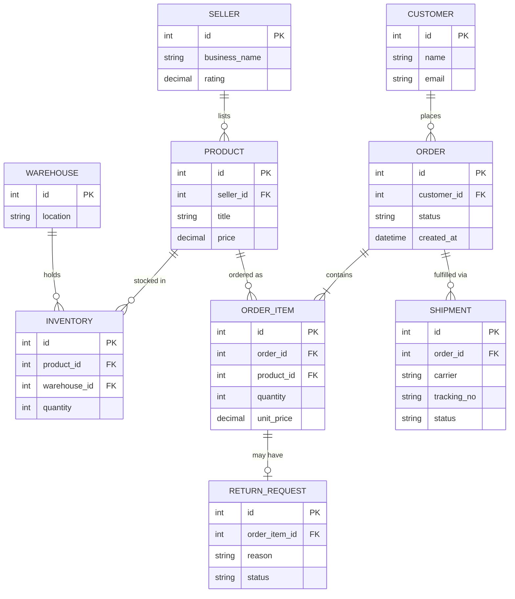

# ০৯. E-commerce Database (Amazon type) ERD, Schema, Transactions, Triggers, Indexes — Advanced

লেসন ২-এ আমরা একটা সহজ E-commerce ERD দেখেছিলাম — Customer, Product, Order, Payment। সেটা একটা ছোট দোকানের জন্য যথেষ্ট, কিন্তু Amazon-এর মতো **marketplace** সিস্টেমে অতিরিক্ত তিনটা বাস্তবতা যোগ হয়: একাধিক **Seller** নিজেদের প্রোডাক্ট বিক্রি করে (শুধু এক মালিকের দোকান না), প্রতিটা প্রোডাক্টের **Inventory** একাধিক **Warehouse**-এ ছড়ানো থাকে, আর অর্ডার হওয়ার পর **Shipment** আর **Return** সামলাতে হয়।

### Entity গুলো



লক্ষ্য করো — লেসন ২-এর সহজ ভার্সনে `products` টেবিলে সরাসরি একটা `stock` কলাম ছিল। এখানে সেটা সরিয়ে একটা আলাদা `INVENTORY` টেবিলে নেয়া হয়েছে, কারণ একই Product এখন একাধিক Warehouse-এ ভিন্ন ভিন্ন পরিমাণে থাকতে পারে — এটা Module 18-এর নরমালাইজেশন নীতিরই বাস্তব প্রয়োগ, একটা কলামকে (stock) নতুন সম্পর্কে (Product-Warehouse Many-to-Many, with quantity attribute) রূপান্তর।

### Schema

```sql
CREATE TABLE sellers (
  id SERIAL PRIMARY KEY,
  business_name VARCHAR(150),
  rating DECIMAL(2,1) DEFAULT 0
);

CREATE TABLE products (
  id SERIAL PRIMARY KEY,
  seller_id INT REFERENCES sellers(id),
  title VARCHAR(200),
  price DECIMAL(10,2)
);

CREATE TABLE warehouses (
  id SERIAL PRIMARY KEY,
  location VARCHAR(150)
);

CREATE TABLE inventory (
  id SERIAL PRIMARY KEY,
  product_id INT REFERENCES products(id),
  warehouse_id INT REFERENCES warehouses(id),
  quantity INT DEFAULT 0,
  UNIQUE (product_id, warehouse_id)
);

CREATE TABLE shipments (
  id SERIAL PRIMARY KEY,
  order_id INT,
  carrier VARCHAR(50),
  tracking_no VARCHAR(100),
  status VARCHAR(20) DEFAULT 'preparing'
);

CREATE TABLE return_requests (
  id SERIAL PRIMARY KEY,
  order_item_id INT,
  reason TEXT,
  status VARCHAR(20) DEFAULT 'requested'
);
```

### Transaction যেটা গুরুত্বপূর্ণ

অর্ডার বসানোর সময় এবার সঠিক Warehouse থেকে স্টক কমানো লাগে, যেটা কাছের/সবচেয়ে বেশি স্টক থাকা warehouse বেছে নিয়ে করা যায়:

```sql
BEGIN;
  INSERT INTO orders (customer_id, status) VALUES (11, 'pending') RETURNING id;
  -- ধরি order_id = 900
  INSERT INTO order_items (order_id, product_id, quantity, unit_price)
    VALUES (900, 55, 3, 799.00);
  UPDATE inventory
    SET quantity = quantity - 3
    WHERE product_id = 55 AND warehouse_id = 2 AND quantity >= 3;
  -- উপরের UPDATE যদি ০ সারি বদলায় (পর্যাপ্ত স্টক নেই), অ্যাপ্লিকেশন কোড ROLLBACK করবে
COMMIT;
```

এখানে `WHERE quantity >= 3` শর্তটা একটা গুরুত্বপূর্ণ কৌশল — এটা নিশ্চিত করে স্টক কখনো ঋণাত্মক না হয়ে যায়, `UPDATE` স্টেটমেন্টের ভেতরেই।

### Trigger

কোনো Return গৃহীত হলে সংশ্লিষ্ট Warehouse-এর Inventory-তে quantity ফেরত যোগ করা:

```sql
CREATE OR REPLACE FUNCTION restock_on_return() RETURNS TRIGGER AS $$
DECLARE
  target_product INT;
BEGIN
  IF NEW.status = 'approved' THEN
    SELECT product_id INTO target_product FROM order_items WHERE id = NEW.order_item_id;
    UPDATE inventory SET quantity = quantity + 1
      WHERE product_id = target_product
      ORDER BY warehouse_id LIMIT 1;
  END IF;
  RETURN NEW;
END;
$$ LANGUAGE plpgsql;

CREATE TRIGGER trg_restock
AFTER UPDATE ON return_requests
FOR EACH ROW EXECUTE FUNCTION restock_on_return();
```

### Index

Marketplace স্কেলে সবচেয়ে গুরুত্বপূর্ণ কোয়েরিগুলো — "এই Seller-এর সব Product", "এই Product-এর কোন Warehouse-এ কত স্টক":

```sql
CREATE INDEX idx_products_seller ON products(seller_id);
CREATE INDEX idx_inventory_product ON inventory(product_id);
CREATE UNIQUE INDEX idx_inventory_product_warehouse ON inventory(product_id, warehouse_id);
```

এই মডিউলে আমরা মোট ৬টা ভিন্ন ভিন্ন বাস্তব ডোমেইনে (E-commerce ×২, Freelancer, Ride-Sharing, CMS, Job Portal, Booking) সম্পূর্ণ ERD, Schema, Transaction, Trigger, আর Index দেখলাম — প্রতিটাতেই একটু ভিন্ন সমস্যা (self-reference, circular FK, overlap checking, marketplace inventory) সমাধান করেছি। এখন সময় হয়েছে এই টুকরো টুকরো SQL কৌশলগুলোকে (GRANT, Transaction Control, JOIN, Subquery, CTE, Window Function) একটা গোছানো মডিউলে সিস্টেমেটিকভাবে শেখার — চলো যাই Module 20-এ, Structured Query Language-এর গভীরে।
