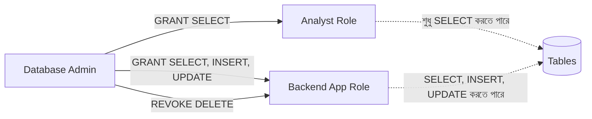

# ০১. DCL: GRANT and REVOKE Commands

এতদিন আমরা যা যা SQL লিখেছি — `CREATE TABLE`, `SELECT`, `INSERT`, `UPDATE` — এগুলোর প্রতিটাই ধরে নিয়েছি তুমি ডাটাবেজের "সুপার ইউজার", যার সব ক্ষমতা আছে। কিন্তু বাস্তব প্রজেক্টে (Module 19-এর প্রতিটা সিস্টেমের কথা ভাবো) একটা টিমে অনেকে কাজ করে — একজন Analyst শুধু ডেটা দেখতে পারবে, কিন্তু ডিলিট করতে পারবে না; একজন Backend Developer রিড-রাইট দুটোই করতে পারবে, কিন্তু টেবিল ড্রপ করতে পারবে না। এই "কে কী করতে পারবে" নিয়ন্ত্রণ করাই SQL-এর **DCL (Data Control Language)**।

DCL-এর দুটো মূল কমান্ড — `GRANT` (অনুমতি দেয়া) আর `REVOKE` (অনুমতি কেড়ে নেয়া)। এটাকে একটা অফিসের চাবির ব্যবস্থার মতো ভাবতে পারো — সবাইকে মাস্টার-কী দেয়া হয় না, প্রত্যেক কর্মচারীকে ঠিক ততটুকু চাবি দেয়া হয় যতটুকু তার কাজের জন্য দরকার। এটাই "principle of least privilege"।

```sql
-- একজন analyst role তৈরি করে, শুধু SELECT-এর অনুমতি দেয়া
CREATE ROLE analyst;
GRANT SELECT ON products, orders, order_items TO analyst;

-- একজন backend_app role, রিড আর রাইট দুটোই লাগবে
CREATE ROLE backend_app;
GRANT SELECT, INSERT, UPDATE ON products, orders, order_items TO backend_app;

-- নির্দিষ্ট ইউজারকে role অ্যাসাইন করা
GRANT analyst TO arman;
```

`REVOKE` ঠিক তার উল্টো — কারো ক্ষমতা কমাতে বা বাতিল করতে:

```sql
REVOKE INSERT ON orders FROM backend_app;
REVOKE analyst FROM arman;
```

Module 19-এর Booking সিস্টেমের কথা ভাবো — সেখানে `reservations` টেবিলের `FOR UPDATE` লক ব্যবহার করা হয়েছিল। যদি একজন Read-only Analyst-এর `UPDATE` অনুমতিই না থাকে, তাহলে ভুলবশতও সে কখনো একটা রিজার্ভেশন এডিট করে ফেলতে পারবে না — এটা শুধু নিরাপত্তা না, ভুল প্রতিরোধেরও একটা স্তর।



লক্ষ্য করার মতো একটা জিনিস — Python অ্যাপ্লিকেশন যখন ডাটাবেজে কানেক্ট করে (Module 15-তে যেমন দেখিয়েছিলাম), সেই কানেকশন স্ট্রিং-এর ইউজারনেমটাই আসলে একটা DCL role — তাই প্রোডাকশন অ্যাপকে কখনোই "root" বা "superuser" দিয়ে কানেক্ট করানো উচিত না, বরং ঠিক যতটুকু অনুমতি লাগে ততটুকু দেয়া role ব্যবহার করা উচিত।

এখন পর্যন্ত আমরা যা করেছি তার সবই "কে করতে পারবে" নিয়ে। পরের লেসনে দেখবো "কীভাবে একাধিক অপারেশনকে একটা নিরাপদ ইউনিটে বাঁধা যায়" — Transaction Control Language।
