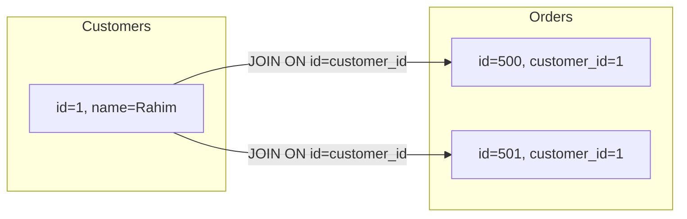

# ০৩. Understanding JOIN Operations

Module 17-এ আমরা একটামাত্র টেবিল থেকে `SELECT` করে ডেটা বের করা শিখেছিলাম। কিন্তু Module 18-19-এর প্রতিটা ERD-তে দেখেছি — ডেটা কখনোই একটা টেবিলে থাকে না, বরং Normalization-এর কারণে (Module 18) ছড়িয়ে থাকে Customer, Order, Product-এর মতো একাধিক টেবিলে। তাহলে প্রশ্ন হলো — "আমি জানতে চাই কোন কাস্টমার কী কী প্রোডাক্ট অর্ডার করেছে" — এই তথ্যটা একটামাত্র `SELECT`-এ কীভাবে বের করবো, যখন সেটা তিনটা আলাদা টেবিলে ছড়ানো?

উত্তর হলো **JOIN**। JOIN একটা টেবিলের সারিকে আরেকটা টেবিলের সারির সাথে, একটা মিলে যাওয়া কলাম (সাধারণত Foreign Key আর Primary Key) দিয়ে পাশাপাশি বসিয়ে দেয় — অনেকটা দুইটা এক্সেল শিটকে একটা কমন কলাম (যেমন `customer_id`) দিয়ে মিলিয়ে একটা শিট বানানোর মতো।

Module 19-এর লেসন ২-এর E-commerce স্কিমা ব্যবহার করেই দেখি:

```sql
SELECT customers.name, orders.id AS order_id, orders.status
FROM customers
JOIN orders ON customers.id = orders.customer_id;
```

এখানে `ON customers.id = orders.customer_id` অংশটাই বলে দিচ্ছে দুই টেবিল কীভাবে মিলবে — এটাই ঠিক সেই Foreign Key সম্পর্ক যেটা Module 18-এ আমরা ERD-তে এঁকেছিলাম।



তিনটা টেবিল একসাথে জয়েন করাও সম্ভব — একের পর এক `JOIN` চেইন করে:

```sql
SELECT customers.name, products.title, order_items.quantity
FROM customers
JOIN orders ON customers.id = orders.customer_id
JOIN order_items ON orders.id = order_items.order_id
JOIN products ON products.id = order_items.product_id;
```

এই একটা কোয়েরিই চারটা টেবিল (customers, orders, order_items, products) থেকে ডেটা টেনে একটা "মানুষের পড়ার মতো" রেজাল্ট তৈরি করে দিচ্ছে — "রহিম-এর অর্ডারে ২টা ল্যাপটপ ছিল" ধরনের বাক্য।

একটা গুরুত্বপূর্ণ কথা মনে রাখা দরকার — JOIN যত বেশি টেবিল নিয়ে করা হয়, তত বেশি কাজ ডাটাবেজকে করতে হয়। এই কারণেই Module 19-এর প্রতিটা লেসনে আমরা Foreign Key কলামে Index বসিয়েছিলাম — Index ছাড়া JOIN করলে ডাটাবেজকে প্রতিটা সারির জন্য অন্য টেবিলের পুরোটা স্ক্যান করতে হয়, যেটা ডেটা বড় হলে খুবই ধীর হয়ে যায়।

এখানে আমরা যে সাধারণ JOIN দেখলাম, তার একটা লুকানো অনুমান আছে — দুই পাশেই মিল থাকা সারি লাগবে, নাহলে সেই সারি ফলাফলে আসবে না। কিন্তু বাস্তবে অনেক সময় "যাদের কোনো অর্ডার নেই এমন কাস্টমারও দেখাও" বলতে হয় — এর জন্য দরকার ভিন্ন ভিন্ন ধরনের JOIN, যেটাই পরের লেসনের বিষয়।
