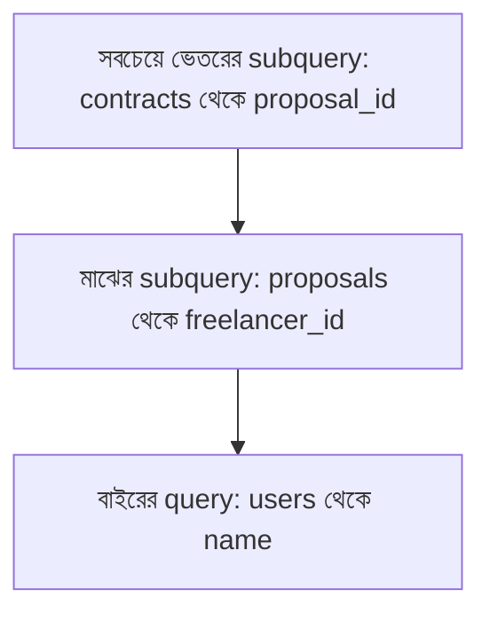

# ০৫. Writing Subqueries

Module 18-এর লেসন ৭-এ আমরা প্রথম শুনেছিলাম "Subquery" শব্দটা — একটা কোয়েরির ভেতরে আরেকটা কোয়েরি। এখন সময় হয়েছে সেটা হাতে-কলমে লেখার।

Subquery মানে হলো — একটা প্রশ্নের উত্তর দিতে হলে আগে আরেকটা ছোট প্রশ্নের উত্তর জানা লাগে। ভাবো তুমি জিজ্ঞেস করছো "গড় দামের চেয়ে বেশি দামের প্রোডাক্টগুলো কী কী?" — এই প্রশ্নের উত্তর দিতে হলে প্রথমে জানতে হবে "গড় দাম আসলে কত", তারপর সেই সংখ্যার সাথে তুলনা করতে হবে। এই দুই ধাপকে এক কোয়েরিতে লিখলেই Subquery তৈরি হয়:

```sql
SELECT title, price
FROM products
WHERE price > (SELECT AVG(price) FROM products);
```

এখানে ভেতরের `(SELECT AVG(price) FROM products)` অংশটা প্রথমে চলে, একটা একক সংখ্যা রিটার্ন করে (ধরি ৫০০), তারপর বাইরের কোয়েরি সেই সংখ্যা দিয়ে `WHERE price > 500` এর মতো আচরণ করে। এই ধরনের Subquery যেটা একটামাত্র মান রিটার্ন করে, তাকে বলে **scalar subquery**।

আরেকটা ধরন আছে যেখানে Subquery একাধিক মানের একটা তালিকা রিটার্ন করে, আর বাইরের কোয়েরি `IN` দিয়ে সেই তালিকার সাথে তুলনা করে। Module 19-এর Freelancer Platform উদাহরণ দিয়ে দেখি — "যেসব Freelancer-এর কমপক্ষে একটা Contract আছে, তাদের নাম দেখাও":

```sql
SELECT name
FROM users
WHERE id IN (
  SELECT freelancer_id FROM proposals
  WHERE id IN (SELECT proposal_id FROM contracts)
);
```

এখানে দুই স্তরের Subquery একসাথে ব্যবহার হচ্ছে — ভেতরেরটা `contracts`-এর সাথে যুক্ত `proposal_id` খুঁজছে, তারপর বাইরেরটা সেই proposal থেকে `freelancer_id` খুঁজছে, সবশেষে সবচেয়ে বাইরেরটা সেই freelancer-দের নাম বের করছে।



একটা গুরুত্বপূর্ণ প্রশ্ন হলো — এই কাজটা কি JOIN দিয়েও করা যেত? উত্তর হলো, প্রায়ই হ্যাঁ:

```sql
SELECT DISTINCT users.name
FROM users
JOIN proposals ON proposals.freelancer_id = users.id
JOIN contracts ON contracts.proposal_id = proposals.id;
```

দুটোই সঠিক উত্তর দেয়, কিন্তু Subquery সাধারণত পড়তে বেশি "মানুষের ভাষার মতো" (স্তরে স্তরে চিন্তা), আর JOIN সাধারণত পারফরম্যান্সে একটু এগিয়ে থাকে কারণ ডাটাবেজ ইঞ্জিন এটাকে আরও ভালোভাবে অপ্টিমাইজ করতে পারে। এই সিদ্ধান্তটা — কখন কোনটা ব্যবহার করবো — অভিজ্ঞতার সাথে সহজাত হয়ে যায়।

Subquery `WHERE`-এর বাইরেও ব্যবহার করা যায় — `SELECT`-এর ভেতরে, এমনকি `FROM`-এর ভেতরেও (তখন তাকে বলে "derived table")। এই "একটার ভেতরে আরেকটা কোয়েরি বসানো"-র ধারণাটাকে আরও গভীরে নিয়ে গেলে যা পাওয়া যায়, সেটাই পরের লেসনের বিষয় — Nested Queries।
