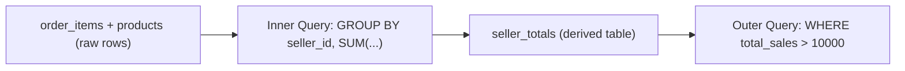

# ০৬. Working with Nested Queries

আগের লেসনে আমরা Subquery `WHERE`-এর ভেতরে ব্যবহার করেছি। কিন্তু Subquery-কে `FROM`-এর ভেতরেও বসানো যায় — তখন সেটা একটা "অস্থায়ী টেবিল"-এর মতো আচরণ করে, যাকে বলে **derived table** বা **nested query**। এটা অনেকটা পাইথনে একটা ফাংশনের রিটার্ন ভ্যালুকে সাথে সাথে আরেকটা ফাংশনে পাস করে দেয়ার (function composition) মতো — `outer(inner())`।

Module 19-এর E-commerce (Advanced) উদাহরণ দিয়ে ভাবি — "প্রতিটা Seller-এর মোট বিক্রির পরিমাণ বের করো, শুধু যাদের মোট বিক্রি ১০,০০০ টাকার বেশি তাদের দেখাও।" প্রথমে ভেতরের কোয়েরি প্রতিটা Seller-এর টোটাল হিসাব করবে, তারপর বাইরের কোয়েরি সেই ফলাফলের ওপর ফিল্টার করবে:

```sql
SELECT seller_totals.seller_id, seller_totals.total_sales
FROM (
  SELECT products.seller_id, SUM(order_items.quantity * order_items.unit_price) AS total_sales
  FROM order_items
  JOIN products ON products.id = order_items.product_id
  GROUP BY products.seller_id
) AS seller_totals
WHERE seller_totals.total_sales > 10000;
```

এখানে `(SELECT ... GROUP BY products.seller_id) AS seller_totals` অংশটাই একটা "ভার্চুয়াল টেবিল" তৈরি করছে, যেটার নাম দিয়ে দিলাম `seller_totals`। এটা এমন আচরণ করছে যেন এটা সত্যিকারের একটা টেবিল, যেটা থেকে `SELECT` আর `WHERE` করা যাচ্ছে।

এই টেকনিকটা কেন দরকার? কারণ SQL-এর একটা নিয়ম আছে — `WHERE` ক্লজ `GROUP BY`-এর ফলাফলের ওপর সরাসরি কাজ করতে পারে না (Module 17-এর লেসন ২-এ শেখা `HAVING` এই সমস্যারই একটা সমাধান)। Nested Query আরেকটা বিকল্প সমাধান — আগে `GROUP BY` চালিয়ে একটা টেবিল বানিয়ে ফেলা, তারপর সেই টেবিলের ওপর সাধারণ `WHERE` চালানো। আসলে `HAVING` দিয়েও এই একই কাজ করা যেত:

```sql
SELECT products.seller_id, SUM(order_items.quantity * order_items.unit_price) AS total_sales
FROM order_items
JOIN products ON products.id = order_items.product_id
GROUP BY products.seller_id
HAVING SUM(order_items.quantity * order_items.unit_price) > 10000;
```

দুটো কোয়েরিই একই ফলাফল দেয় — কিন্তু Nested Query-র সুবিধা হলো, ভেতরের কোয়েরির ফলাফলকে একটা নাম (`seller_totals`) দিয়ে বারবার পুনর্ব্যবহার করা যায়, বিশেষ করে যখন হিসাবটা জটিল হয় আর বারবার লেখার দরকার পড়ে।



Nested Query একাধিক স্তরে বসানো যায় — একটা derived table-এর ওপর আরেকটা derived table, তার ওপর আরেকটা। কিন্তু এটা যত গভীর হয়, কোয়েরি পড়া তত কঠিন হয়ে যায় — উপর থেকে নিচে না পড়ে ভেতর থেকে বাইরে পড়তে হয়, যেটা মানুষের চিন্তার স্বাভাবিক দিকের উল্টো। এই সমস্যার একটা সুন্দর সমাধান আছে, যেটা কোয়েরিকে ওপর থেকে নিচে, ধাপে ধাপে পড়ার মতো করে সাজায় — Common Table Expression, বা CTE, যেটাই পরের লেসনের বিষয়।
