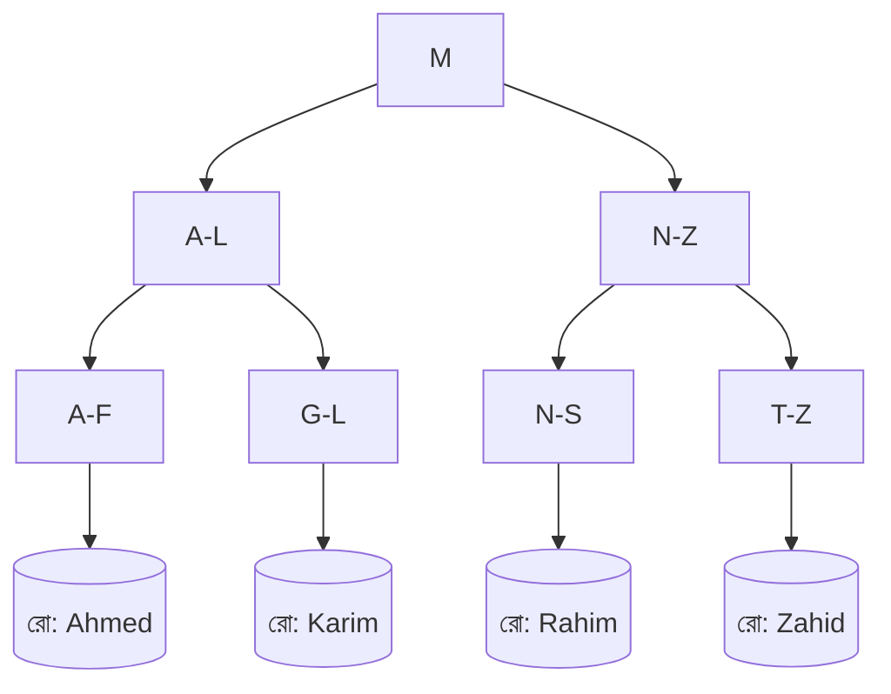
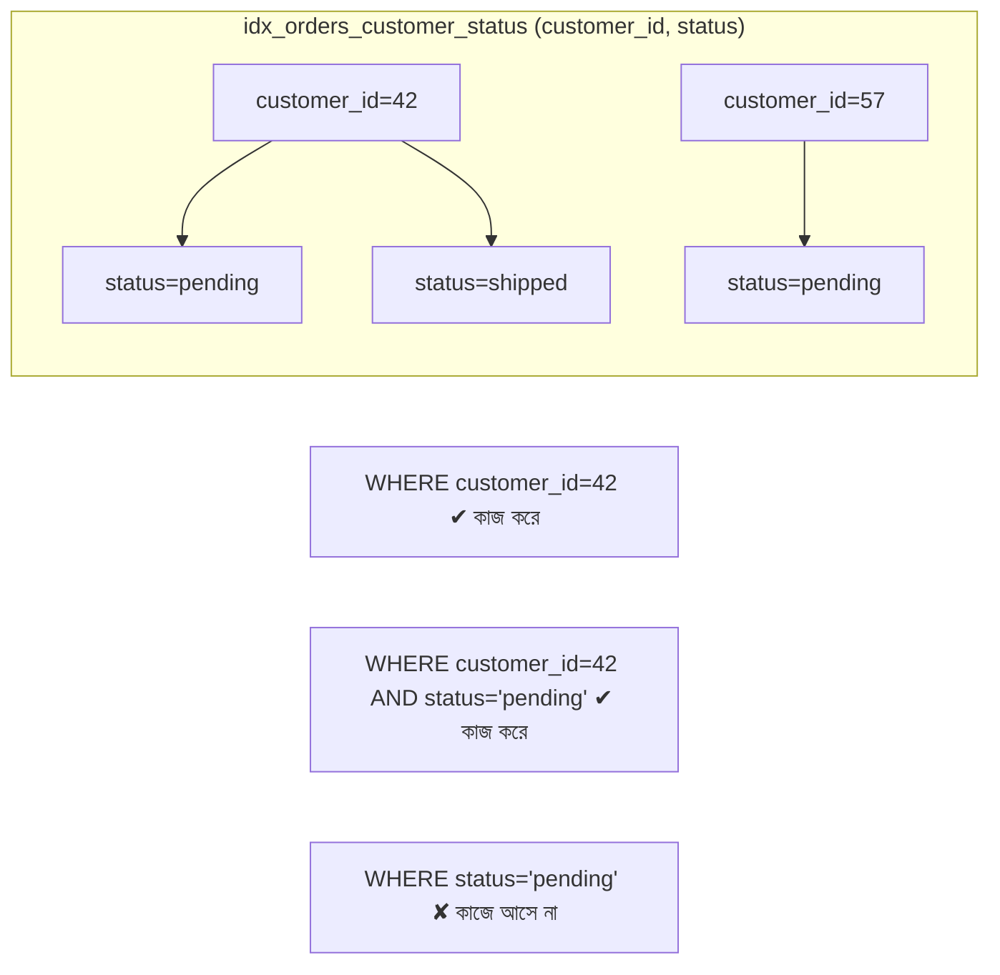

# ২১.০২. Types of Indexes: B-Tree, Hash, and Composite

আগের লেসনে (২১.০১) আমরা বুঝেছি ইনডেক্স কেন দরকার — বইয়ের বিষয়সূচির মতো, যাতে পুরো টেবিল না ঘেঁটে সরাসরি সঠিক জায়গায় পৌঁছানো যায়। কিন্তু "সাজানো তালিকা" কথাটা একটু অস্পষ্ট রয়ে গিয়েছিল — আসলে এই তালিকাটা ভেতরে ভেতরে কীভাবে সংরক্ষিত থাকে? এই লেসনে আমরা সবচেয়ে বহুল ব্যবহৃত তিনটা ইনডেক্স গঠন নিয়ে কথা বলবো: B-Tree, Hash, আর Composite।

**B-Tree Index** হলো ডিফল্ট এবং সবচেয়ে বেশি ব্যবহৃত ইনডেক্স টাইপ (PostgreSQL, MySQL — দুটোতেই `CREATE INDEX` করলে ডিফল্ট এটাই বসে)। B-Tree মানে "Balanced Tree" — একটা গাছের মতো গঠন, যেখানে মানগুলো সাজানো অবস্থায় থাকে বিভিন্ন স্তরে (level), আর প্রতিটা স্তর থেকে পরের স্তরে যাওয়ার পথ নির্ধারিত হয় মানের তুলনা করে। এটা অনেকটা একটা ডিকশনারিতে শব্দ খোঁজার মতো — তুমি সরাসরি মাঝের কোনো পাতা খুলে দেখো, তোমার শব্দটা তার আগে না পরে, তারপর সেই অনুযায়ী বাম বা ডান দিকে এগোও। প্রতিবার তুলনা করার সাথে সাথে খোঁজার পরিসর অর্ধেক হয়ে যায়।



এই গঠনের সবচেয়ে বড় সুবিধা হলো এটা **রেঞ্জ কুয়েরির (range query)** জন্য দারুণ কাজ করে — যেমন `WHERE age > 25 AND age < 40`, বা `WHERE created_at BETWEEN '2026-01-01' AND '2026-06-30'`। যেহেতু B-Tree-তে মানগুলো সাজানো অবস্থায় থাকে (leaf নোডগুলো একে অপরের সাথে লিংকড থাকে), ডাটাবেস সহজেই একটা নির্দিষ্ট শুরুর বিন্দু খুঁজে সেখান থেকে পরপর মান পড়তে থাকে যতক্ষণ না সীমা শেষ হয়।

```sql
-- B-Tree ইনডেক্স (ডিফল্ট) — রেঞ্জ কুয়েরির জন্য চমৎকার
CREATE INDEX idx_orders_created_at ON orders(created_at);

SELECT * FROM orders
WHERE created_at BETWEEN '2026-01-01' AND '2026-06-30';
```

**Hash Index** ভিন্ন দর্শনে কাজ করে। এখানে প্রতিটা মানকে একটা **হ্যাশ ফাংশন** দিয়ে একটা নির্দিষ্ট সংখ্যায় (hash value) রূপান্তর করা হয়, আর সেই সংখ্যাটাই নির্ধারণ করে মানটা কোন "বাকেটে (bucket)" থাকবে। এটা অনেকটা অফিসে কর্মীদের ফাইল রাখার মতো — যদি প্রতিটা কর্মীর ID নম্বরের শেষ ডিজিট অনুযায়ী ১০টা আলাদা ড্রয়ারে ফাইল ভাগ করে রাখো, তাহলে একজনের ফাইল খুঁজতে শুধু তার ID-র শেষ ডিজিট দেখেই সরাসরি সঠিক ড্রয়ারে যাওয়া যায় — একদম নির্দিষ্ট সমতা মিলের (equality match) জন্য এটা অসম্ভব দ্রুত, প্রায় O(1) সময়ে। কিন্তু এখানেই এর সীমাবদ্ধতা — হ্যাশ ভ্যালু থেকে "এর চেয়ে বড় সব মান" বের করার কোনো উপায় নেই, কারণ হ্যাশিং মানের ক্রম (order) নষ্ট করে দেয়। তাই Hash Index শুধু `=` (সমতা) অপারেশনে কাজ করে, `>`, `<`, `BETWEEN`-এ না।

```sql
-- PostgreSQL-এ Hash ইনডেক্স — শুধু সমতা (=) চেকের জন্য উপযুক্ত
CREATE INDEX idx_sessions_token ON sessions USING HASH (session_token);

SELECT * FROM sessions WHERE session_token = 'abc123xyz';
```

সবশেষে **Composite Index** (একে Multi-Column Index-ও বলা হয়) — যখন একটা ইনডেক্স একটা কলামে না বসিয়ে একাধিক কলাম একসাথে নিয়ে বানানো হয়। ধরো তোমার একটা `orders` টেবিলে প্রায়ই এমন কুয়েরি চলে — "একটা নির্দিষ্ট customer-এর একটা নির্দিষ্ট status-এর অর্ডারগুলো দেখাও":

```sql
CREATE INDEX idx_orders_customer_status ON orders(customer_id, status);

SELECT * FROM orders WHERE customer_id = 42 AND status = 'pending';
```

এখানে গুরুত্বপূর্ণ একটা ব্যাপার হলো **কলামের ক্রম (column order)**। Composite Index-কে কল্পনা করো একটা ফোন বইয়ের মতো, যেখানে মানুষ প্রথমে পদবি (surname) দিয়ে, তারপর নামের দিয়ে সাজানো থাকে। এই বইয়ে "Rahman" পদবির সবাইকে খুঁজে বের করা সহজ। কিন্তু শুধু "Karim" নাম দিয়ে (পদবি ছাড়া) কাউকে খুঁজতে চাইলে — পুরো বই ঘাঁটতে হবে, কারণ বইটা নাম দিয়ে সাজানো না, পদবি দিয়ে সাজানো। ঠিক একইভাবে, `(customer_id, status)` অর্ডারে বানানো ইনডেক্স `WHERE customer_id = 42` কুয়েরিতে কাজ করবে, এমনকি `WHERE customer_id = 42 AND status = 'pending'`-এও কাজ করবে, কিন্তু শুধু `WHERE status = 'pending'` কুয়েরিতে এই ইনডেক্স তেমন কাজে আসবে না — কারণ status কলামটা ইনডেক্সের দ্বিতীয় স্তরে, প্রথমে না।



সংক্ষেপে — B-Tree হলো সাধারণ, বহুমুখী পছন্দ (রেঞ্জ আর সমতা দুটোতেই ভালো), Hash হলো শুধুমাত্র সমতার জন্য অতি-দ্রুত কিন্তু সীমাবদ্ধ, আর Composite হলো একাধিক কলামের সমন্বয়ে বাস্তব-জগতের জটিল কুয়েরি অপটিমাইজ করার হাতিয়ার — তবে কলামের ক্রম নিয়ে সতর্ক থাকতে হয়। পরের লেসনে আমরা দেখবো ইনডেক্সের আরেকটা গুরুত্বপূর্ণ ভাগ — Clustered বনাম Non-Clustered ইনডেক্স, যা ঠিক করে দেয় ইনডেক্স আর আসল ডেটা কীভাবে ডিস্কে একসাথে বা আলাদা থাকে।
