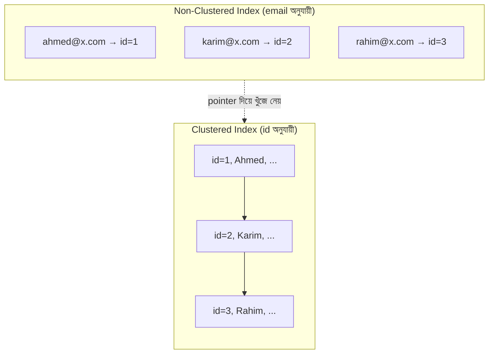

# ২১.০৩. Clustered vs Non-Clustered Indexes

আগের লেসনে আমরা দেখেছি ইনডেক্স ভেতরে ভেতরে কীভাবে সাজানো থাকে (B-Tree, Hash, Composite)। কিন্তু একটা প্রশ্ন এখনো অনুত্তরিত — ইনডেক্স আর আসল ডেটা, এই দুটো কি ডিস্কে একই জায়গায় থাকে, নাকি আলাদা? এই প্রশ্নের উত্তরই আমাদের নিয়ে যায় **Clustered** আর **Non-Clustered** ইনডেক্সের পার্থক্যে।

আবার বইয়ের উপমায় ফিরি। কল্পনা করো একটা এনসাইক্লোপিডিয়া, যার ভলিউমগুলো সাজানো আছে বর্ণানুক্রমে — "A" দিয়ে শুরু হওয়া বিষয়গুলো ভলিউম ১-এ, "B" দিয়ে শুরু হওয়াগুলো ভলিউম ২-এ, এভাবে। এখানে বইয়ের **আসল বিষয়বস্তুই** বর্ণানুক্রমে সাজানো — আলাদা কোনো ইনডেক্স পাতা দরকার নেই "Biology" শব্দটা খুঁজতে, কারণ তুমি জানো এটা "B" ভলিউমে থাকবে। এটাই **Clustered Index**-এর ধারণা — এখানে টেবিলের আসল ডেটাই ইনডেক্সের ক্রম অনুযায়ী ডিস্কে সাজানো থাকে। যেহেতু ডেটা শুধু একভাবেই ফিজিক্যালি সাজানো যায়, তাই **একটা টেবিলে সর্বোচ্চ একটাই Clustered Index থাকতে পারে**।

এর বিপরীতে কল্পনা করো একটা সাধারণ উপন্যাসের বই, যেখানে বিষয়বস্তু ক্রম অনুযায়ী (চ্যাপ্টার ১, ২, ৩...) সাজানো, কিন্তু বইয়ের শেষে একটা আলাদা **Index পাতা** আছে যেখানে চরিত্রের নাম বর্ণানুক্রমে সাজানো, আর পাশে লেখা কোন পাতায় তাদের কথা আছে। এখানে Index পাতাটা বইয়ের মূল বিষয়বস্তুর ক্রম পাল্টায় না — এটা শুধু একটা আলাদা "লুকআপ টেবিল" যা মূল বিষয়বস্তুর দিকে নির্দেশ করে। এটাই **Non-Clustered Index** — মূল টেবিলের ডেটা যেভাবেই সাজানো থাকুক (সাধারণত primary key অনুযায়ী), Non-Clustered Index আলাদা একটা কাঠামো তৈরি করে যা প্রতিটা মানকে আসল রো-র ঠিকানার (pointer/row-id) সাথে যুক্ত করে রাখে। **একটা টেবিলে অনেকগুলো Non-Clustered Index থাকতে পারে।**



বাস্তবে, MySQL-এর InnoDB ইঞ্জিনে **Primary Key স্বয়ংক্রিয়ভাবে Clustered Index হিসেবে কাজ করে** — অর্থাৎ টেবিলের আসল ডেটা ডিস্কে Primary Key-র ক্রম অনুযায়ী সংরক্ষিত থাকে। এই কারণেই আমরা Module 16-17-এ যখন `AUTO_INCREMENT` দিয়ে primary key বানাতাম, তখন প্রতিটা নতুন রো ডিস্কের শেষে যোগ হতো — সাজানো ক্রম বজায় রেখে। PostgreSQL একটু ভিন্নভাবে কাজ করে — এখানে ডিফল্টভাবে সব ইনডেক্স Non-Clustered (heap table), তবে চাইলে `CLUSTER` কমান্ড দিয়ে টেবিলকে একটা নির্দিষ্ট ইনডেক্সের ক্রমে পুনর্বিন্যস্ত করা যায়।

```sql
-- MySQL: primary key নিজেই clustered index
CREATE TABLE orders (
    id INT AUTO_INCREMENT PRIMARY KEY,   -- এটাই clustered index
    customer_id INT,
    status VARCHAR(20),
    created_at DATETIME
);

-- অতিরিক্ত non-clustered index — email দিয়ে দ্রুত খোঁজার জন্য
CREATE INDEX idx_orders_status ON orders(status);
```

এখানে একটা গুরুত্বপূর্ণ ফলাফল বোঝা দরকার — যখন তুমি Clustered Index (সাধারণত Primary Key) দিয়ে খোঁজো, ডাটাবেসকে শুধু একটাই কাঠামো দেখতে হয়, কারণ ইনডেক্স আর ডেটা একই জায়গায়। কিন্তু যখন তুমি Non-Clustered Index দিয়ে খোঁজো (যেমন `WHERE email = ...`), ডাটাবেসকে দুই ধাপে কাজ করতে হয় — প্রথমে Non-Clustered Index-এ গিয়ে সঠিক pointer খুঁজে বের করা, তারপর সেই pointer ধরে আসল রো-তে গিয়ে বাকি কলামের ডেটা (যেমন `name`, `address`) আনা। এই দ্বিতীয় ধাপটাকে বলে **Key Lookup** বা **Bookmark Lookup**, এবং অনেক রো-র ক্ষেত্রে এই লুকআপ পারফরম্যান্সের উপর প্রভাব ফেলতে পারে — যা আমরা Query Optimization লেসনে (২১.০৫) আরও বিস্তারিত দেখবো।

সংক্ষেপে — Clustered Index টেবিলের ফিজিক্যাল অর্ডার নির্ধারণ করে (একটাই থাকতে পারে, সাধারণত Primary Key), আর Non-Clustered Index একটা আলাদা লুকআপ কাঠামো তৈরি করে যা মূল ডেটার দিকে নির্দেশ করে (একাধিক থাকতে পারে)। পরের লেসনে আমরা এই সব জ্ঞান একত্র করে দেখবো — বাস্তব প্রজেক্টে ইনডেক্স বসানোর সময় কোন কোন নিয়ম মেনে চলা উচিত, যাকে বলা হয় Indexing Best Practices।
