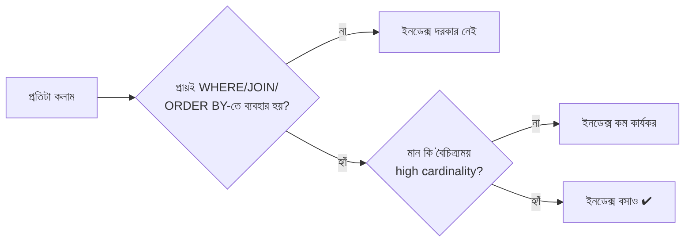

# ২১.০৪. Indexing Best Practices

এতক্ষণ আমরা ইনডেক্স কী, কীভাবে কাজ করে, আর কত ধরনের হতে পারে তা শিখেছি (২১.০১ - ২১.০৩)। কিন্তু তত্ত্ব জানা আর বাস্তবে সঠিক সিদ্ধান্ত নেওয়া — দুটো ভিন্ন জিনিস। এই লেসনে আমরা কিছু বাস্তব নিয়ম দেখবো, যেগুলো অভিজ্ঞ ডেভেলপাররা মেনে চলে ইনডেক্স বসানোর সময়।

প্রথম এবং সবচেয়ে গুরুত্বপূর্ণ নিয়ম: **যে কলামে তুমি প্রায়ই `WHERE`, `JOIN`, বা `ORDER BY`-তে ব্যবহার করো, সেখানেই ইনডেক্স বসাও — অন্য কোথাও না।** মনে করো তুমি একটা লাইব্রেরিয়ান, আর তোমার কাছে সীমিত সংখ্যক "শর্টকাট কার্ড" আছে বিভিন্ন বইয়ের তাক চিহ্নিত করার জন্য। তুমি নিশ্চয়ই সেই বইগুলোর জন্য শর্টকাট বানাবে যেগুলো মানুষ বারবার চায়, কালেভদ্রে চাওয়া বইয়ের জন্য না। একইভাবে, `users` টেবিলে যদি `email` দিয়ে লগইন চেক করা হয় প্রতিটা রিকোয়েস্টে, সেখানে ইনডেক্স জরুরি। কিন্তু `bio` কলাম (যেটা কখনো `WHERE`-এ ব্যবহৃত হয় না) — সেখানে ইনডেক্স শুধু অপ্রয়োজনীয় খরচ।

```sql
-- ভালো: প্রায়ই ব্যবহৃত হওয়া কলামে ইনডেক্স
CREATE INDEX idx_users_email ON users(email);          -- লগইনে ব্যবহৃত
CREATE INDEX idx_orders_customer_id ON orders(customer_id); -- JOIN-এ ব্যবহৃত

-- খারাপ: কখনো ফিল্টার/জয়েনে ব্যবহার হয় না এমন কলামে ইনডেক্স
CREATE INDEX idx_users_bio ON users(bio); -- অপ্রয়োজনীয়
```

দ্বিতীয় নিয়ম: **যে কলামের মান অনেক বৈচিত্র্যময় (high cardinality), সেখানে ইনডেক্স বেশি কার্যকর।** `email` কলামে প্রতিটা মান প্রায় ইউনিক — এখানে ইনডেক্স চমৎকার কাজ করে, কারণ প্রতিবার খুঁজলে খুব অল্প রো ম্যাচ করে। কিন্তু `gender` কলামে হয়তো মাত্র দুই-তিনটা সম্ভাব্য মান আছে (low cardinality) — এখানে ইনডেক্স বসালেও ডাটাবেস প্রায়ই সেটা উপেক্ষা করে পুরো টেবিল স্ক্যান করবে, কারণ ইনডেক্স ব্যবহার করেও তো অর্ধেক টেবিল ফিরিয়ে আনতে হচ্ছে — তাহলে সরাসরি স্ক্যান করাই দ্রুত।

তৃতীয় নিয়ম, যেটা Composite Index লেসনে (২১.০২) আমরা ইঙ্গিত দিয়েছিলাম: **Composite Index-এ কলামের ক্রম গুরুত্বপূর্ণ — সবচেয়ে বেশি সিলেক্টিভ (selective) বা সবচেয়ে বেশি ব্যবহৃত কলামকে সামনে রাখো।**

চতুর্থ নিয়ম: **অতিরিক্ত ইনডেক্স এড়াও।** আগেই বলেছি প্রতিটা ইনডেক্স রাইট অপারেশনকে ধীর করে। একটা টেবিলে যদি ১৫টা ইনডেক্স থাকে, প্রতিটা `INSERT`-এ ডাটাবেসকে ১৫টা আলাদা কাঠামো আপডেট করতে হবে। এই ট্রেড-অফটা মাথায় রেখে, শুধু সেই ইনডেক্সগুলো রাখা উচিত যেগুলো বাস্তব কুয়েরি প্যাটার্নে কাজে লাগে।



পঞ্চম নিয়ম: **ব্যবহার না হওয়া ইনডেক্স খুঁজে বের করে মুছে ফেলো।** সময়ের সাথে সাথে অ্যাপ্লিকেশনের কুয়েরি প্যাটার্ন পাল্টায়, আর পুরনো ইনডেক্স অপ্রয়োজনীয় হয়ে পড়ে থাকে। PostgreSQL-এ `pg_stat_user_indexes` ভিউ দেখে বোঝা যায় কোন ইনডেক্স কতবার ব্যবহৃত হয়েছে:

```sql
-- কোন ইনডেক্স কতবার ব্যবহৃত হয়েছে তা দেখা (PostgreSQL)
SELECT relname AS table_name,
       indexrelname AS index_name,
       idx_scan AS times_used
FROM pg_stat_user_indexes
ORDER BY idx_scan ASC;
-- idx_scan = 0 হলে বোঝা যায় এই ইনডেক্সটা কখনো ব্যবহৃত হয়নি, মুছে ফেলা যেতে পারে
```

শেষ নিয়ম, আর সবচেয়ে ব্যবহারিক দিক থেকে গুরুত্বপূর্ণ: **অনুমান নয়, পরিমাপ করো (measure, don't guess)।** ইনডেক্স বসানোর আগে-পরে বাস্তব কুয়েরির গতি পরীক্ষা করে দেখা উচিত, যাতে ধারণা না করে বাস্তব তথ্যের ভিত্তিতে সিদ্ধান্ত নেওয়া যায়। এই "পরিমাপ করা"-র হাতিয়ারটাই আমরা আরও গভীরভাবে দেখবো Execution Plan-এর লেসনে (২১.০৭)।

সংক্ষেপে — ইনডেক্স বসানো একটা ইঞ্জিনিয়ারিং সিদ্ধান্ত, শখের ব্যাপার না। প্রতিটা ইনডেক্সের একটা খরচ আছে (স্টোরেজ, রাইট স্পিড), আর একটা লাভ আছে (রিড স্পিড) — ভালো ডেভেলপার সবসময় এই দুটোর ভারসাম্য বিবেচনা করে সিদ্ধান্ত নেয়। পরের লেসনে আমরা ইনডেক্সের বাইরেও কুয়েরি অপটিমাইজেশনের আরও মৌলিক নীতিগুলো নিয়ে কথা বলবো — Query Optimization Fundamentals।
