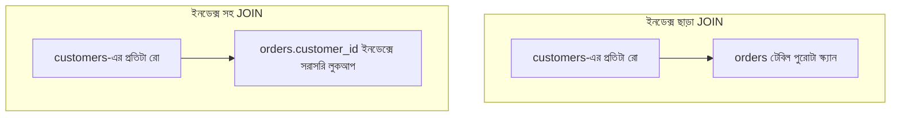

# ২১.০৫. Query Optimization Fundamentals

গত চারটা লেসন জুড়ে আমরা ইনডেক্সের উপর মনোযোগ দিয়েছি, কারণ এটা পারফরম্যান্সের সবচেয়ে বড় লিভার। কিন্তু ইনডেক্স একাই যথেষ্ট না — একটা খারাপভাবে লেখা SQL কুয়েরি, ইনডেক্স থাকা সত্ত্বেও, ধীর হতে পারে। এই লেসনে আমরা দেখবো কুয়েরি অপটিমাইজেশনের কিছু মৌলিক নীতি, যেগুলো Module 16-17-এ শেখা SQL সিনট্যাক্সের উপর ভিত্তি করে গড়ে উঠবে।

প্রথম নীতি: **`SELECT *` এড়িয়ে চলো, শুধু দরকারি কলাম আনো।** কল্পনা করো তুমি বাজারে গিয়েছো শুধু চাল কিনতে, কিন্তু দোকানদার পুরো দোকানের সব জিনিস তোমার ব্যাগে ভরে দিলো "যদি লাগে" ভেবে। এটা অপ্রয়োজনীয় বোঝা। `SELECT *` করলে ডাটাবেসকে প্রতিটা কলামের ডেটা ডিস্ক থেকে পড়তে হয়, নেটওয়ার্কে পাঠাতে হয় — যদি টেবিলে ৩০টা কলাম থাকে কিন্তু তোমার দরকার মাত্র ৩টা, তাহলে বাকি ২৭টা কলাম আনা শুধুই অপচয়।

```sql
-- অপ্রয়োজনীয়ভাবে ভারী
SELECT * FROM products WHERE category = 'electronics';

-- অপ্টিমাইজড — শুধু দরকারি কলাম
SELECT id, name, price FROM products WHERE category = 'electronics';
```

দ্বিতীয় নীতি: **ইনডেক্স করা কলামের উপর ফাংশন প্রয়োগ করলে ইনডেক্স নিষ্ক্রিয় হয়ে যায়।** এটা একটা সূক্ষ্ম কিন্তু খুবই সাধারণ ভুল। ধরো `email` কলামে ইনডেক্স আছে, কিন্তু তুমি লিখলে:

```sql
-- ইনডেক্স কাজ করবে না, কারণ LOWER() প্রতিটা রো-তে গণনা করতে হয়
SELECT * FROM users WHERE LOWER(email) = 'x@example.com';

-- এর বদলে ডেটা ইনসার্টের সময়ই lowercase করে রাখা,
-- অথবা functional index তৈরি করা ভালো সমাধান (PostgreSQL)
CREATE INDEX idx_users_email_lower ON users(LOWER(email));
```

যখন তুমি `LOWER(email)` লেখো, ডাটাবেস ইনডেক্সে থাকা আসল মান (`X@Example.com`) দিয়ে তুলনা করতে পারে না, কারণ তোমার শর্তটা হলো "রূপান্তরিত মান"-এর সাথে তুলনা। তাই ইঞ্জিন বাধ্য হয় প্রতিটা রো-র জন্য `LOWER()` চালিয়ে তারপর তুলনা করতে — যা কার্যত পুরো টেবিল স্ক্যান করার মতোই ধীর।

তৃতীয় নীতি: **JOIN করার সময় জয়েন-কলামে ইনডেক্স আছে কিনা নিশ্চিত করো।** Module 20-এ আমরা JOIN শিখেছি — দুটো টেবিল সংযুক্ত করা একটা কমন কলামের ভিত্তিতে। যদি `orders.customer_id` আর `customers.id`-এর মধ্যে JOIN হয়, আর `orders.customer_id`-এ কোনো ইনডেক্স না থাকে, তাহলে প্রতিটা কাস্টমারের জন্য পুরো `orders` টেবিল স্ক্যান করতে হবে — যা N × M জটিলতার দিকে নিয়ে যায়।



চতুর্থ নীতি: **`LIMIT` ব্যবহার করো যখন সব রো দরকার নেই।** যদি তুমি শুধু সাম্প্রতিক ১০টা অর্ডার দেখাতে চাও, `LIMIT 10` লেখা মানে ডাটাবেসকে বলা "১০টা পেলেই থামো" — বাকি লাখ লাখ রো নিয়ে মাথা ঘামানোর দরকার নেই, বিশেষ করে যদি `ORDER BY`-র কলামে ইনডেক্স থাকে।

```sql
SELECT id, customer_id, status, created_at
FROM orders
ORDER BY created_at DESC
LIMIT 10;
```

পঞ্চম নীতি: **N+1 কুয়েরি সমস্যা এড়িয়ে চলো।** এটা ব্যাকএন্ড ডেভেলপমেন্টে (Module 4-5-এ Python/FastAPI শেখার সময় হয়তো অজান্তেই করে ফেলেছো) একটা অতি সাধারণ ফাঁদ। ধরো তুমি ১০০টা অর্ডার লুপ করে, প্রতিটার জন্য আলাদা কুয়েরি চালিয়ে কাস্টমারের তথ্য আনছো — তার মানে ১টা কুয়েরি (অর্ডার আনতে) + ১০০টা কুয়েরি (প্রতিটা অর্ডারের কাস্টমার আনতে) = ১০১টা কুয়েরি! এর বদলে একটা JOIN দিয়ে একবারেই সব ডেটা আনা যায়:

```python
# খারাপ: N+1 সমস্যা
orders = await db.fetch_all("SELECT * FROM orders LIMIT 100")
for order in orders:
    order["customer"] = await db.fetch_one(
        "SELECT * FROM customers WHERE id = :id",
        {"id": order["customer_id"]},
    )  # এই লাইন ১০০ বার চলবে!

# ভালো: একটা JOIN দিয়ে একবারেই সব ডেটা
orders = await db.fetch_all("""
    SELECT o.id, o.status, c.name AS customer_name
    FROM orders o
    JOIN customers c ON c.id = o.customer_id
    LIMIT 100
""")
```

এই পাঁচটা নীতি — শুধু দরকারি কলাম আনা, ইনডেক্সের উপর ফাংশন এড়ানো, জয়েন-কলামে ইনডেক্স নিশ্চিত করা, LIMIT ব্যবহার করা, আর N+1 এড়ানো — একসাথে একটা কুয়েরিকে সেকেন্ড থেকে মিলিসেকেন্ডে নামিয়ে আনতে পারে। কিন্তু এই সবকিছুর সবচেয়ে ভালো বন্ধু হলো ক্যাশিং — একই কুয়েরি বারবার না চালিয়ে ফলাফল মনে রাখা। পরের লেসনে আমরা সেই বিষয়েই কথা বলবো — Database Caching Strategies।
