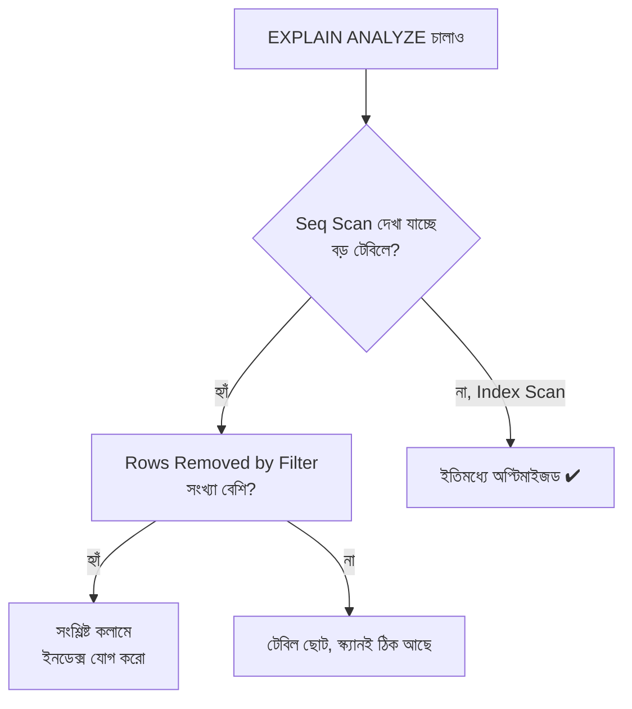

# ২১.০৭. Analyzing Query Execution Plans

গত কয়েকটা লেসনে আমরা বারবার বলেছি — "এই কুয়েরি ইনডেক্স ব্যবহার করবে," "এটা ধীর হবে কারণ ফুল টেবিল স্ক্যান হবে।" কিন্তু এতক্ষণ আমরা এসব দাবি করেছি তত্ত্বের ভিত্তিতে। বাস্তব জগতে, একজন প্রফেশনাল ডেভেলপার অনুমান করে না — সে ডাটাবেসকেই জিজ্ঞেস করে, "তুমি আসলে এই কুয়েরিটা কীভাবে চালাবে, প্ল্যানটা দেখাও।" এই প্রশ্নের উত্তর দেয় **`EXPLAIN`** কমান্ড।

`EXPLAIN`-কে কল্পনা করো একটা গাড়ির GPS-এর মতো — তুমি জিজ্ঞেস করলে "A থেকে B যেতে কোন রাস্তা নেবে?" GPS তোমাকে পুরো রুটটা দেখায়: কোন হাইওয়ে দিয়ে যাবে, কোথায় মোড় নেবে, আনুমানিক কত সময় লাগবে। ঠিক তেমনি, `EXPLAIN` তোমাকে দেখায় ডাটাবেস ইঞ্জিন তোমার SQL কুয়েরিটা চালানোর জন্য কী পরিকল্পনা করেছে — কোন ইনডেক্স ব্যবহার করবে (যদি করে), কোন টেবিল আগে স্ক্যান করবে, JOIN কীভাবে সম্পন্ন হবে, আর আনুমানিক কতগুলো রো প্রসেস হবে।

```sql
EXPLAIN SELECT * FROM orders WHERE customer_id = 42;
```

এই কমান্ডের ফলাফলে সবচেয়ে গুরুত্বপূর্ণ যে শব্দটা খুঁজতে হয় তা হলো **"Scan" টাইপ**। PostgreSQL-এ যদি দেখো `Seq Scan on orders` — তার মানে ডাটাবেস পুরো টেবিল একে একে পড়ছে (ফুল টেবিল স্ক্যান, ২১.০১-এ যা আমরা শিখেছি)। কিন্তু যদি দেখো `Index Scan using idx_orders_customer_id` — তার মানে ডাটাবেস সরাসরি ইনডেক্স ব্যবহার করে দ্রুত সঠিক রো-তে পৌঁছাচ্ছে।

শুধু প্ল্যান দেখাই যথেষ্ট না — আসল সময় আর আসল রো সংখ্যা জানতে ব্যবহার করা হয় **`EXPLAIN ANALYZE`**, যেটা কুয়েরিটা সত্যিই চালিয়ে (একবার সত্যিই এক্সিকিউট করে) প্রকৃত পরিসংখ্যান ফিরিয়ে দেয়:

```sql
EXPLAIN ANALYZE
SELECT o.id, o.status, c.name
FROM orders o
JOIN customers c ON c.id = o.customer_id
WHERE o.status = 'pending';
```

একটা সম্ভাব্য আউটপুট এরকম হতে পারে:

```
Hash Join  (cost=15.50..245.30 rows=120 width=64) (actual time=0.45..3.21 rows=118 loops=1)
  Hash Cond: (o.customer_id = c.id)
  ->  Seq Scan on orders o  (cost=0.00..220.00 rows=120 width=40) (actual time=0.02..2.50 rows=118 loops=1)
        Filter: (status = 'pending')
        Rows Removed by Filter: 4882
  ->  Hash  (cost=10.00..10.00 rows=440 width=32) (actual time=0.35..0.35 rows=440 loops=1)
        ->  Seq Scan on customers c  (cost=0.00..10.00 rows=440 width=32)
Planning Time: 0.31 ms
Execution Time: 3.55 ms
```

এই আউটপুট পড়ার মতো একটা দক্ষতা তৈরি করা দরকার। এখানে **`cost=15.50..245.30`** একটা আনুমানিক (estimated) খরচের সংখ্যা — প্রথম সংখ্যা প্রথম রো পেতে কত খরচ, দ্বিতীয়টা সব রো পেতে কত খরচ। **`actual time`** হলো বাস্তবে মিলিসেকেন্ডে কত সময় লেগেছে। সবচেয়ে গুরুত্বপূর্ণ লাইনটা হলো `Rows Removed by Filter: 4882` — এর মানে ডাটাবেস ৪৮৮২টা রো পড়েছে, কিন্তু ফিল্টার করে বাদ দিয়েছে, মাত্র ১১৮টা রেখেছে। এটাই একটা লাল পতাকা (red flag) — এত রো "পড়ে তারপর বাদ দেওয়া" মানে `status` কলামে একটা ইনডেক্স নেই, তাই পুরো টেবিল স্ক্যান করে ফিল্টার করতে হচ্ছে।



এই সমস্যার সমাধান খুবই সহজ — একটা ইনডেক্স যোগ করা:

```sql
CREATE INDEX idx_orders_status ON orders(status);

-- আবার EXPLAIN ANALYZE চালিয়ে দেখো — এবার "Index Scan" দেখা উচিত,
-- আর Execution Time অনেক কমে যাওয়া উচিত।
```

এখানে একটা গুরুত্বপূর্ণ শিক্ষা লুকিয়ে আছে — `EXPLAIN`-কে ব্যবহার করা উচিত ইনডেক্স বসানোর **আগে এবং পরে**, দুইবার। শুধু ইনডেক্স বসিয়ে দিলেই যে কাজ হবে, এমনটা ভাবা ঠিক না — কিছু ক্ষেত্রে ডাটাবেস অপ্টিমাইজার নিজেই সিদ্ধান্ত নেয় ইনডেক্স ব্যবহার করা লাভজনক কিনা (যেমন ছোট টেবিলে, বা low-cardinality কলামে, ২১.০৪-এ যা আমরা শিখেছি, ইনডেক্স উপেক্ষা করাই স্বাভাবিক)। তাই `EXPLAIN ANALYZE` হলো সেই যাচাইয়ের হাতিয়ার যা অনুমানের বদলে প্রমাণ দেয়।

এই লেসনে আমরা শিখলাম কীভাবে একটা কুয়েরির ভেতরের পরিকল্পনা পড়তে হয়, আর কোথায় সমস্যা লুকিয়ে আছে তা চিহ্নিত করতে হয়। পরের লেসনে আমরা এই জ্ঞানকে আরও বড় পরিসরে নিয়ে যাবো — সামগ্রিক Performance Tuning Techniques, যেখানে শুধু একটা কুয়েরি না, পুরো সিস্টেমকে কীভাবে দ্রুত রাখা যায় তা দেখবো।
