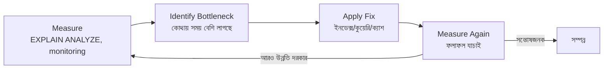

# ২১.০৮. Performance Tuning Techniques

এতক্ষণ আমরা মাইক্রোস্কোপ দিয়ে একটা একটা কুয়েরি দেখেছি — ইনডেক্স, এক্সিকিউশন প্ল্যান, ক্যাশিং। এই লেসনে আমরা একটু জুম-আউট করে দেখবো, পুরো সিস্টেমের দৃষ্টিকোণ থেকে পারফরম্যান্স টিউনিং বলতে কী বোঝায় — যেন আমরা এই মডিউলের প্রথম আট লেসনের একটা সারসংক্ষেপ পাই বাস্তব প্রয়োগের ভাষায়।

পারফরম্যান্স টিউনিংকে কল্পনা করা যায় একটা গাড়ির সার্ভিসিং-এর মতো। গাড়ি ধীরে চলার অনেক কারণ থাকতে পারে — টায়ারে হাওয়া কম, ইঞ্জিন অয়েল পুরনো, ব্রেক আটকে আছে। একজন ভালো মেকানিক প্রথমে **রোগ নির্ণয় (diagnosis)** করে, তারপর নির্দিষ্ট সমস্যার সমাধান করে — পুরো গাড়ি পাল্টে ফেলে না। ডাটাবেস পারফরম্যান্স টিউনিংও একই দর্শন অনুসরণ করে: প্রথমে **measure**, তারপর **identify bottleneck**, তারপর **fix**, তারপর আবার **measure** করে যাচাই করা।



সিস্টেম পর্যায়ে পারফরম্যান্স টিউনিং-এর কয়েকটা মূল কৌশল আছে। প্রথমত, **Connection Pooling** — প্রতিটা ডাটাবেস কানেকশন তৈরি করা একটা ব্যয়বহুল কাজ (নেটওয়ার্ক হ্যান্ডশেক, অথেন্টিকেশন)। যদি প্রতিটা রিকোয়েস্টে নতুন কানেকশন খোলা হয়, এটা সার্ভারকে ধীর করে দেয়। এর বদলে একটা **connection pool** তৈরি রাখা হয় — আগে থেকে খোলা কয়েকটা কানেকশন, যেগুলো বিভিন্ন রিকোয়েস্টের মধ্যে পুনরায় ব্যবহার করা হয়।

```ts
import { Pool } from "pg";

// একবার তৈরি করা কানেকশন পুল, পুরো অ্যাপ জুড়ে পুনর্ব্যবহৃত হয়
const pool = new Pool({
  host: "localhost",
  database: "shop_db",
  max: 20, // সর্বোচ্চ ২০টা কানেকশন একসাথে খোলা থাকবে
  idleTimeoutMillis: 30000,
});

app.get("/orders", async (req, res) => {
  const result = await pool.query("SELECT * FROM orders LIMIT 20");
  res.json(result.rows);
});
```

দ্বিতীয়ত, **Denormalization** — এটা কিছুটা বিতর্কিত কৌশল, কারণ এটা Module 18-19-এ শেখা নরমালাইজেশনের নীতির উল্টো দিকে যায়। কখনো কখনো, খুব বেশি JOIN-এর প্রয়োজন হওয়া একটা রিপোর্ট বা ড্যাশবোর্ডের জন্য, ইচ্ছাকৃতভাবে কিছু ডেটা পুনরাবৃত্তি করে রাখা হয় (যেমন `orders` টেবিলে `customer_name` কলামও রেখে দেওয়া, শুধু `customer_id` না রেখে), যাতে প্রতিবার JOIN করে আনতে না হয়। এটা একটা trade-off — ডেটা কিছুটা ডুপ্লিকেট হয়, কিন্তু রিড স্পিড বাড়ে।

তৃতীয়ত, **Batching** — একাধিক ছোট অপারেশনকে একটা বড় অপারেশনে একত্র করা। যেমন ১০০টা রো আলাদা আলাদা `INSERT` না করে একবারে ইনসার্ট করা:

```sql
-- ধীর: ১০০টা আলাদা INSERT, প্রতিটাতে নেটওয়ার্ক রাউন্ড-ট্রিপ
INSERT INTO logs (message) VALUES ('log 1');
INSERT INTO logs (message) VALUES ('log 2');
-- ... আরও ৯৮ বার

-- দ্রুত: একটা ব্যাচে সব ইনসার্ট
INSERT INTO logs (message) VALUES
  ('log 1'), ('log 2'), ('log 3'); -- ... একসাথে সব
```

চতুর্থত, **Pagination** — বড় রেজাল্ট সেট একবারে না ফিরিয়ে ছোট ছোট অংশে ভাগ করে দেওয়া, `LIMIT` আর `OFFSET` ব্যবহার করে (২১.০৫-এ `LIMIT`-এর কথা বলেছিলাম):

```sql
-- পেজ ৩ (প্রতি পেজে ২০টা রো)
SELECT id, name FROM products
ORDER BY id
LIMIT 20 OFFSET 40;
```

তবে বড় ডেটাসেটে `OFFSET` নিজেও ধীর হতে পারে, কারণ ডাটাবেসকে প্রথম ৪০টা রো "গণনা করে বাদ দিতে" হয়। আরও উন্নত সমাধান হলো **Keyset Pagination** — শেষ দেখা আইটেমের ID মনে রেখে সেখান থেকে পরের অংশ আনা, যা বড় স্কেলে অনেক বেশি কার্যকর।

সবশেষে, এই সব কৌশল প্রয়োগের সময় মনে রাখা জরুরি — টিউনিং একটা চলমান প্রক্রিয়া, একবারের কাজ না। অ্যাপ্লিকেশন যত বড় হয়, ইউজার যত বাড়ে, নতুন বটলনেক তৈরি হয়। তাই মনিটরিং আর পরিমাপ (measure) সবসময় চলমান রাখতে হয়।

এই লেসন পর্যন্ত আমরা মূলত "কীভাবে ডাটাবেসকে দ্রুত করা যায়" এই প্রশ্নের উত্তর খুঁজেছি। পরের কয়েকটা লেসনে আমরা একটু ভিন্ন দিকে যাবো — কীভাবে ডাটাবেস-নির্ভর লজিককে আরও স্মার্টভাবে সংগঠিত করা যায়, শুরু হবে Stored Procedures দিয়ে, যা পারফরম্যান্স আর কোড অর্গানাইজেশন দুই দিকেই সাহায্য করে।
