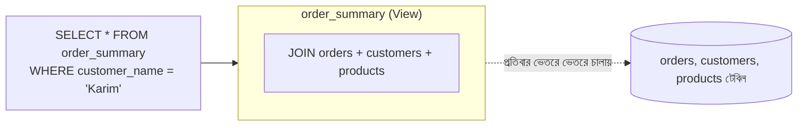

# ২১.১০. Creating and Using Views

আগের লেসনে (২১.০৯) আমরা দেখেছি কীভাবে বহু-ধাপের **অ্যাকশন** (INSERT, UPDATE একসাথে) ডাটাবেসের ভেতরে সংরক্ষণ করা যায় Stored Procedure দিয়ে। এবার আমরা দেখবো একই দর্শন কীভাবে **পড়ার (read/SELECT)** ক্ষেত্রে প্রয়োগ করা যায় — এর নাম **View**।

কল্পনা করো তোমার একটা ই-কমার্স অ্যাপ্লিকেশনে বারবার এই জটিল কুয়েরিটা লিখতে হয় — "প্রতিটা অর্ডারের সাথে কাস্টমারের নাম, প্রোডাক্টের নাম, আর মোট দাম দেখাও" (Module 20-এ শেখা JOIN ব্যবহার করে):

```sql
SELECT
    o.id AS order_id,
    c.name AS customer_name,
    p.name AS product_name,
    o.quantity * p.price AS total_price,
    o.created_at
FROM orders o
JOIN customers c ON c.id = o.customer_id
JOIN products p ON p.id = o.product_id;
```

যদি এই একই জটিল কুয়েরিটা তোমার অ্যাপ্লিকেশনের দশটা জায়গায় লাগে — ড্যাশবোর্ডে, রিপোর্টে, অ্যাডমিন প্যানেলে — তাহলে প্রতিবার এই লম্বা JOIN লেখা বিরক্তিকর, আর যদি কখনো লজিক পাল্টাতে হয় (যেমন `discount` কলাম যোগ করা), তোমাকে দশ জায়গায় গিয়ে আপডেট করতে হবে। এই সমস্যার সমাধান হলো একটা **View** তৈরি করা — এই জটিল কুয়েরিটাকে একটা নাম দিয়ে "সংরক্ষণ" করে রাখা, যাতে সেটাকে একটা সাধারণ টেবিলের মতোই ব্যবহার করা যায়।

একটা View-কে সবচেয়ে ভালো বোঝা যায় এভাবে — এটা একটা **"সেভ করা কুয়েরি"**, যাকে দেখতে টেবিলের মতো লাগে, কিন্তু আসলে এর নিজস্ব কোনো ডেটা সংরক্ষিত থাকে না। প্রতিবার যখন তুমি একটা View থেকে `SELECT` করো, ডাটাবেস আসলে ভেতরে ভেতরে সেই মূল জটিল কুয়েরিটাই চালায়, শুধু তোমার কাছে এটা একটা সাধারণ টেবিলের মতো প্রকাশ পায়। এটা অনেকটা একটা রেস্টুরেন্টের "কম্বো মেনু"-র মতো — মেনুতে লেখা "Combo A", কিন্তু ভেতরে ভেতরে এটা তিনটা আলাদা আইটেম (ভাত + মাংস + সালাদ) একসাথে করা একটা "শর্টকাট নাম"।



View তৈরি করা হয় এভাবে:

```sql
CREATE VIEW order_summary AS
SELECT
    o.id AS order_id,
    c.name AS customer_name,
    p.name AS product_name,
    o.quantity * p.price AS total_price,
    o.created_at
FROM orders o
JOIN customers c ON c.id = o.customer_id
JOIN products p ON p.id = o.product_id;
```

আর এরপর থেকে এটাকে একদম সাধারণ টেবিলের মতোই ব্যবহার করা যায়:

```sql
-- এখন আর জটিল JOIN লেখার দরকার নেই
SELECT * FROM order_summary WHERE customer_name = 'Karim' ORDER BY created_at DESC;
```

View-এর সবচেয়ে বড় সুবিধা হলো **সরলীকরণ আর পুনর্ব্যবহারযোগ্যতা** — জটিল লজিক এক জায়গায় লেখা, বহু জায়গায় ব্যবহার করা। এছাড়া View একটা **নিরাপত্তা স্তর (security layer)** হিসেবেও কাজ করতে পারে — ধরো তুমি চাও না অ্যাডমিন প্যানেলের বাইরে কেউ কাস্টমারের ফোন নম্বর বা ঠিকানা দেখুক। তুমি একটা View তৈরি করতে পারো যেখানে শুধু নির্দিষ্ট কলামগুলো (নাম, অর্ডারের তথ্য) অন্তর্ভুক্ত, সংবেদনশীল কলাম বাদ দিয়ে — আর ব্যবহারকারীদের সরাসরি টেবিলের বদলে শুধু এই View অ্যাক্সেস দেওয়া হয়। এটা Role-Based Access Control-এর (RBAC, যা আমরা ২১.১৫-এ দেখবো) সাথে সরাসরি সম্পর্কিত একটা ধারণা।

একটা গুরুত্বপূর্ণ বিষয় স্পষ্ট করে নেওয়া দরকার — সাধারণ View পারফরম্যান্স বাড়ায় না, এটা শুধু **কোড সংগঠন আর নিরাপত্তার** সুবিধা দেয়, কারণ ভেতরে ভেতরে এটা প্রতিবারই মূল কুয়েরিটা চালায়। তবে PostgreSQL-এ একটা বিশেষ ধরনের View আছে — **Materialized View** — যেখানে ফলাফল আসলেই ডিস্কে সংরক্ষণ করা হয়, ঠিক ক্যাশের (২১.০৬) মতো:

```sql
CREATE MATERIALIZED VIEW order_summary_cached AS
SELECT
    o.id AS order_id,
    c.name AS customer_name,
    o.quantity * p.price AS total_price
FROM orders o
JOIN customers c ON c.id = o.customer_id
JOIN products p ON p.id = o.product_id;

-- সময়ে সময়ে রিফ্রেশ করতে হয়, কারণ ডেটা "বাসি" হতে পারে
REFRESH MATERIALIZED VIEW order_summary_cached;
```

Materialized View আসলে ক্যাশিং আর View-এর মাঝামাঝি একটা সমাধান — জটিল, ভারী রিপোর্টিং কুয়েরির জন্য দারুণ কার্যকর, যেখানে প্রতিবার লাইভ ডেটা লাগবেই এমন কড়াকড়ি নেই (যেমন "গতকালের বিক্রয় রিপোর্ট")।

এই লেসনে আমরা দেখলাম কীভাবে জটিল SELECT লজিককে সংগঠিত আর পুনর্ব্যবহারযোগ্য করা যায়। পরের লেসনে আমরা দেখবো আরেকটা ডাটাবেস-সাইড ফিচার — Triggers, যা ডেটা পরিবর্তনের সাথে সাথেই স্বয়ংক্রিয়ভাবে কিছু কাজ ঘটায়, কোনো অ্যাপ্লিকেশন কোড না ডেকেই।
