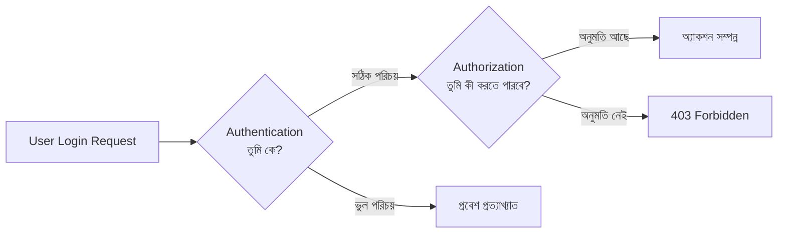

# ২১.১২. User Authentication & Authorization

এতক্ষণ এই মডিউলে আমরা ডাটাবেসকে **দ্রুত** করার কৌশল নিয়ে কথা বলেছি — ইনডেক্স, ক্যাশ, কুয়েরি অপটিমাইজেশন। এখন আমরা মোড় নিচ্ছি একটা সমান গুরুত্বপূর্ণ দিকে — ডাটাবেসকে **নিরাপদ** রাখা। এই বিষয়টা Module 11-12-এ (Cookies, Sessions, JWT) আমরা অ্যাপ্লিকেশন স্তরে দেখেছিলাম, কিন্তু এখানে আমরা দেখবো একদম ডাটাবেস স্তরে নিরাপত্তা কীভাবে কাজ করে।

প্রথমেই দুটো শব্দের পার্থক্য স্পষ্ট করে নেওয়া দরকার, কারণ এই দুটো প্রায়ই গুলিয়ে ফেলা হয় — **Authentication** আর **Authorization**। একটা অফিস ভবনের উপমা দিয়ে বোঝা যাক। যখন তুমি ভবনের গেটে গিয়ে তোমার ID কার্ড দেখাও, আর সিকিউরিটি গার্ড যাচাই করে "তুমি সত্যিই যে বলছো সেই ব্যক্তি কিনা" — এটা হলো **Authentication (পরিচয় যাচাই)**, প্রশ্নটা হলো "তুমি কে?" কিন্তু ভেতরে ঢোকার পর, তুমি কোন কোন রুমে ঢুকতে পারবে — শুধু নিজের ডেস্কে, নাকি ম্যানেজারের রুমেও, নাকি সার্ভার রুমেও — এটা নির্ধারণ করে **Authorization (অনুমতি নিয়ন্ত্রণ)**, প্রশ্নটা হলো "তুমি কী করতে পারবে?"



ডাটাবেস স্তরে, প্রতিটা প্রধান RDBMS (PostgreSQL, MySQL, Azure SQL — যা আমরা এই মডিউলের শেষ দিকে দেখবো) নিজস্ব ইউজার সিস্টেম রাখে, যা তোমার অ্যাপ্লিকেশনের `users` টেবিলের ইউজারদের থেকে সম্পূর্ণ আলাদা একটা স্তর। এটা হলো "কোন প্রোগ্রাম বা কোন ডেভেলপার এই ডাটাবেসের সাথে সরাসরি সংযোগ করতে পারবে" তার নিয়ন্ত্রণ:

```sql
-- একটা নতুন ডাটাবেস ইউজার তৈরি করা (Authentication স্তর)
CREATE USER app_backend WITH PASSWORD 'a-very-strong-password';

-- এই ইউজারকে নির্দিষ্ট টেবিলে নির্দিষ্ট অনুমতি দেওয়া (Authorization স্তর)
GRANT SELECT, INSERT, UPDATE ON orders TO app_backend;
GRANT SELECT ON products TO app_backend;

-- কিন্তু DELETE অনুমতি ইচ্ছাকৃতভাবে না দেওয়া —
-- এই ইউজার প্রোডাক্ট মুছতে পারবে না, এমনকি চাইলেও না
```

এখানে `GRANT` কমান্ডটাই মূল হাতিয়ার — এটা নির্দিষ্ট করে দেয় কোন ইউজার কোন টেবিলে ঠিক কোন অপারেশন (SELECT, INSERT, UPDATE, DELETE) চালাতে পারবে। উল্টো কাজ করে `REVOKE`:

```sql
-- ভুলবশত দেওয়া অনুমতি প্রত্যাহার করা
REVOKE UPDATE ON products FROM app_backend;
```

এই নীতিটাকে বলা হয় **Principle of Least Privilege (সর্বনিম্ন প্রয়োজনীয় অনুমতির নীতি)** — একটা ইউজারকে (বা প্রোগ্রামকে) ঠিক ততটুকু অনুমতি দেওয়া উচিত যতটুকু তার কাজের জন্য সত্যিই দরকার, এক বিন্দুও বেশি না। কেন এটা গুরুত্বপূর্ণ? কল্পনা করো তোমার অ্যাপ্লিকেশনের কোডে একটা বাগ আছে, বা কেউ SQL Injection (যা আমরা পরের লেসনে দেখবো) করে ফেলেছে। যদি তোমার অ্যাপ্লিকেশনের ডাটাবেস ইউজারের `DROP TABLE` করার অনুমতি না থাকে, তাহলে সেই বাগ বা আক্রমণ যত খারাপই হোক, পুরো টেবিল মুছে ফেলতে পারবে না — ক্ষতির পরিধি (blast radius) সীমাবদ্ধ থাকে।

একটা বাস্তব অ্যাপ্লিকেশন সাধারণত একাধিক ডাটাবেস ইউজার ব্যবহার করে বিভিন্ন উদ্দেশ্যে — যেমন একটা `read_only_reporting` ইউজার যেটা শুধু `SELECT` করতে পারে (অ্যানালিটিক্স ড্যাশবোর্ডের জন্য), একটা `app_backend` ইউজার যেটা সাধারণ CRUD করতে পারে, আর একটা `admin_migration` ইউজার যেটার সব অনুমতি আছে (শুধু ডেভেলপার নিজে ব্যবহার করে, স্কিমা পরিবর্তনের সময়)।

```ts
// অ্যাপ্লিকেশনের সাধারণ কানেকশন — সীমিত অনুমতির ইউজার দিয়ে
const pool = new Pool({
  user: "app_backend",       // শুধু নির্দিষ্ট অনুমতি আছে এমন ইউজার
  password: process.env.DB_PASSWORD,
  database: "shop_db",
});
```

লক্ষ্য করো `password: process.env.DB_PASSWORD` লাইনটা — পাসওয়ার্ড কখনো সরাসরি কোডে লেখা উচিত না, এনভায়রনমেন্ট ভেরিয়েবল থেকে আনা উচিত, যাতে এটা Git-এ কমিট না হয়ে যায়।

এই লেসনে আমরা ডাটাবেস-স্তরের Authentication আর Authorization-এর মূল ধারণা বুঝলাম — কে সংযোগ করতে পারবে, আর সংযোগের পর কী করতে পারবে। পরের লেসনে আমরা দেখবো এমন একটা আক্রমণ, যা এই সব নিরাপত্তা ব্যবস্থাকে পাশ কাটিয়ে যাওয়ার চেষ্টা করে — SQL Injection, আর কীভাবে সেটা প্রতিরোধ করা যায়।
