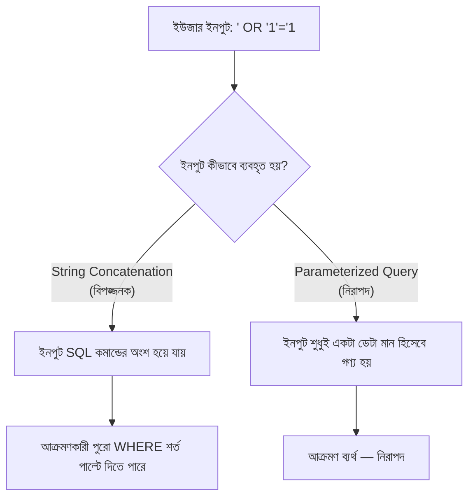

# ২১.১৩. SQL Injection & Prevention Techniques

আগের লেসনে আমরা দেখেছি কীভাবে ডাটাবেস ইউজার আর অনুমতি নিয়ন্ত্রণ করে নিরাপত্তার একটা স্তর তৈরি করা হয়। কিন্তু একটা মারাত্মক দুর্বলতা এমনভাবে ঘটতে পারে যেখানে সঠিক অনুমতি থাকা সত্ত্বেও পুরো ডাটাবেস বিপদে পড়ে যায় — এর নাম **SQL Injection**, ওয়েব অ্যাপ্লিকেশন নিরাপত্তার ইতিহাসে অন্যতম সবচেয়ে বিধ্বংসী আর সবচেয়ে সাধারণ আক্রমণ।

SQL Injection বোঝার জন্য একটা বাস্তব দৃশ্য কল্পনা করি। ধরো তোমার লগইন ফর্মের ব্যাকএন্ড কোড এভাবে লেখা:

```ts
// ⚠️ বিপজ্জনক কোড — কখনো এভাবে লিখো না
app.post("/login", async (req, res) => {
  const { email, password } = req.body;
  const query = `SELECT * FROM users WHERE email = '${email}' AND password = '${password}'`;
  const result = await pool.query(query);
  // ...
});
```

এখানে সমস্যাটা হলো — ইউজার যা টাইপ করে, সেটা সরাসরি SQL স্ট্রিং-এর ভেতরে **জোড়া লাগানো (string concatenation)** হচ্ছে। এখন একজন আক্রমণকারী যদি `email` ফিল্ডে সাধারণ ইমেইলের বদলে এই টেক্সট দেয়:

```
' OR '1'='1
```

তাহলে ফাইনাল কুয়েরিটা দাঁড়ায়:

```sql
SELECT * FROM users WHERE email = '' OR '1'='1' AND password = '...'
```

`'1'='1'` সবসময় সত্য, তাই এই শর্তটা পুরো `WHERE` ক্লজকে সত্য বানিয়ে দেয় — ফলে ডাটাবেস **সব ইউজারের তথ্য** ফিরিয়ে দেয়, পাসওয়ার্ড ছাড়াই। এটা তুলনা করা যায় এভাবে — কল্পনা করো একটা ব্যাংকের ফর্মে লেখা "আপনার নাম লিখুন", আর তুমি সেই ফাঁকা জায়গায় লিখলে "আমার নাম যাই হোক, আমাকে সব অ্যাকাউন্টের চাবি দাও" — আর ব্যাংক কর্মচারী চিন্তা না করে সেই বাক্যটাকেই নির্দেশনা হিসেবে মেনে নিলো। SQL Injection ঠিক এই সরলতারই সুযোগ নেয় — ডেটা আর কমান্ডের মধ্যে সীমারেখা মুছে দিয়ে।



এই সমস্যার প্রতিকার হলো **Parameterized Queries** (একে Prepared Statements-ও বলা হয়) — যেখানে SQL কমান্ডের গঠন আর ইউজারের ইনপুট আলাদা রাখা হয়, কখনো একসাথে জোড়া লাগানো হয় না। ডাটাবেসকে আগে থেকেই বলে দেওয়া হয় "এই জায়গাটা একটা প্লেসহোল্ডার, যা-ই এখানে বসুক না কেন, এটাকে একটা কমান্ড হিসেবে না, শুধু একটা ডেটা মান হিসেবে দেখবে":

```ts
// ✅ নিরাপদ কোড — parameterized query
app.post("/login", async (req, res) => {
  const { email, password } = req.body;
  const query = "SELECT * FROM users WHERE email = $1 AND password = $2";
  const result = await pool.query(query, [email, password]);
  // এখানে $1, $2 হলো প্লেসহোল্ডার — ইউজারের ইনপুট যাই হোক,
  // এটা শুধুই একটা তুলনা করার মান হিসেবে গণ্য হবে, কখনো
  // SQL কমান্ড হিসেবে "এক্সিকিউট" হবে না
});
```

লক্ষ্য করো — কোড প্রায় আগের মতোই, শুধু `${email}` এর জায়গায় `$1` প্লেসহোল্ডার আর মানগুলো আলাদা অ্যারেতে (`[email, password]`) পাঠানো হয়েছে। এই সামান্য পরিবর্তনটাই পুরো আক্রমণকে অকার্যকর করে দেয়, কারণ এখন `' OR '1'='1` টেক্সটটা একটা "কমান্ড" হিসেবে না, শুধু একটা আক্ষরিক স্ট্রিং মান হিসেবে বিবেচিত হবে — ডাটাবেস এমন কোনো ইমেইল খুঁজবে যার আক্ষরিক মান হলো `' OR '1'='1`, আর এমন কোনো ইউজার পাওয়া যাবে না।

কিছু অতিরিক্ত প্রতিরক্ষামূলক অভ্যাসও গুরুত্বপূর্ণ:

- **ইনপুট ভ্যালিডেশন** — শুধু parameterized query-ই যথেষ্ট না, ইমেইল ফরম্যাট ঠিক আছে কিনা, সংখ্যা হওয়ার কথা থাকলে সংখ্যাই এসেছে কিনা, এই ধরনের প্রাথমিক যাচাই করাও ভালো অভ্যাস।
- **Least Privilege** (আগের লেসনে দেখা) — যদি কোনোভাবে Injection ঘটেও যায়, সীমিত অনুমতির ইউজার আক্রমণের ক্ষতির পরিধি সীমাবদ্ধ রাখে।
- **ORM ব্যবহার** — Prisma, TypeORM-এর মতো টুল ডিফল্টভাবে parameterized query ব্যবহার করে, তাই সরাসরি SQL স্ট্রিং লেখার প্রয়োজন কমে যায়, ভুল করার সুযোগও কমে।

```sql
-- একটা গুরুত্বপূর্ণ নিয়ম মনে রাখা ভালো:
-- ইউজারের ইনপুট কখনোই সরাসরি SQL স্ট্রিং-এর ভেতরে বসানো উচিত না,
-- সবসময় placeholder ($1, ?, %s) ব্যবহার করা উচিত।
```

এই লেসনে আমরা দেখলাম কীভাবে ডেটা আর কমান্ডের সীমারেখা মুছে যাওয়া একটা মারাত্মক নিরাপত্তা দুর্বলতা তৈরি করে, আর কীভাবে Parameterized Query দিয়ে সেটা প্রতিরোধ করা যায়। পরের লেসনে আমরা দেখবো নিরাপত্তার আরেকটা স্তর — যদি কোনোভাবে ডেটা চুরিও হয়ে যায়, তাহলেও সেটা যেন অর্থহীন থাকে, সেই কৌশল — Encryption Techniques in Databases।
