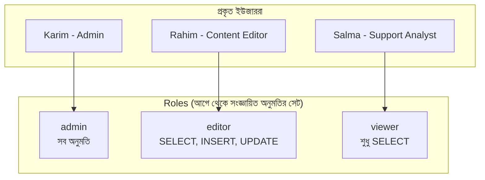

# ২১.১৫. Role-Based Access Control (RBAC)

লেসন ২১.১২-এ আমরা দেখেছি কীভাবে `GRANT` আর `REVOKE` দিয়ে একজন নির্দিষ্ট ডাটাবেস ইউজারকে অনুমতি দেওয়া বা কেড়ে নেওয়া যায়। কিন্তু বাস্তব একটা প্রতিষ্ঠানে, ইউজার তো একজন-দুজন না — হয়তো ৫০ জন ডেভেলপার, ২০ জন সাপোর্ট স্টাফ, ১০ জন অ্যানালিস্ট, সবাই একই ডাটাবেসের সাথে কাজ করছে, কিন্তু সবার প্রয়োজন আলাদা। প্রতিটা ইউজারের জন্য আলাদা আলাদা করে `GRANT` লেখা শুধু ক্লান্তিকরই না, ভুল হওয়ার সম্ভাবনাও অনেক বেশি। এই সমস্যার সংগঠিত সমাধান হলো **Role-Based Access Control (RBAC)**।

RBAC-এর মূল ধারণাটা খুবই স্বজ্ঞাত, কারণ আমরা বাস্তব জীবনে এটা প্রতিনিয়ত দেখি। একটা হাসপাতালের কথা চিন্তা করো — একজন নতুন নার্স যোগ দিলে, হাসপাতাল প্রশাসন প্রতিটা দরজা, প্রতিটা সিস্টেম আলাদা আলাদা করে চিন্তা করে না "এই নার্সকে ঠিক কোন কোন রুমে ঢুকতে দেবো।" এর বদলে, তারা বলে "এই ব্যক্তি একজন **নার্স**" — আর "নার্স" পদবির জন্য আগে থেকেই নির্ধারিত অনুমতির একটা সেট আছে (ওয়ার্ডে ঢোকা যাবে, রোগীর ফাইল দেখা যাবে, কিন্তু ওষুধের স্টোররুমে ঢোকা যাবে না, প্রশাসনিক সিদ্ধান্ত নেওয়া যাবে না)। RBAC ঠিক এই একই দর্শন ডাটাবেসে প্রয়োগ করে — ব্যক্তি বিশেষকে না, বরং একটা **Role (ভূমিকা)**-কে অনুমতি দেওয়া হয়, তারপর ব্যক্তিদের সেই Role-এ যুক্ত করা হয়।



PostgreSQL-এ এটা বাস্তবায়ন করা যায় এভাবে — প্রথমে Role তৈরি করে তাতে অনুমতি বসানো, তারপর প্রকৃত ইউজারদের সেই Role-এ যুক্ত করা:

```sql
-- ধাপ ১: Role তৈরি করা (নিজেই কোনো ইউজার না, শুধু অনুমতির একটা টেমপ্লেট)
CREATE ROLE editor;
CREATE ROLE viewer;

-- ধাপ ২: প্রতিটা Role-কে নির্দিষ্ট অনুমতি দেওয়া
GRANT SELECT, INSERT, UPDATE ON products, orders TO editor;
GRANT SELECT ON products, orders TO viewer;

-- ধাপ ৩: প্রকৃত ইউজার তৈরি করা এবং Role-এ যুক্ত করা
CREATE USER rahim WITH PASSWORD 'secure_pass_1';
GRANT editor TO rahim;

CREATE USER salma WITH PASSWORD 'secure_pass_2';
GRANT viewer TO salma;
```

এখানে সবচেয়ে বড় সুবিধাটা হলো **রক্ষণাবেক্ষণের সহজতা**। যদি ভবিষ্যতে "editor" Role-এর সবাইকে `DELETE` অনুমতিও দিতে হয়, তাহলে একটামাত্র লাইন যথেষ্ট:

```sql
GRANT DELETE ON products, orders TO editor;
-- এই একটা কমান্ডেই editor Role-এর সব ইউজার (রহিম সহ ভবিষ্যতের সবাই)
-- স্বয়ংক্রিয়ভাবে নতুন অনুমতি পেয়ে যায়, প্রতিটা ইউজারকে আলাদা করে ছুঁতে হয় না
```

RBAC-এর ধারণাটা শুধু ডাটাবেস-স্তরের ইউজারদের জন্যই সীমাবদ্ধ না — এটা প্রায়ই অ্যাপ্লিকেশন স্তরেও প্রয়োগ করা হয়, যেখানে তোমার নিজের `users` টেবিলে একটা `role` কলাম রেখে অ্যাপ্লিকেশন কোডেই এই যুক্তি বাস্তবায়ন করা হয় — এটাই Module 12-এ শেখা JWT-এর সাথে মিলিয়ে করলে আরও শক্তিশালী হয়:

```ts
// JWT টোকেনে role এনকোড করা থাকে (Module 12-এ শেখা টেকনিক)
function requireRole(allowedRoles: string[]) {
  return (req, res, next) => {
    const userRole = req.user.role; // JWT থেকে ডিকোড হওয়া তথ্য
    if (!allowedRoles.includes(userRole)) {
      return res.status(403).json({ message: "Forbidden: অনুমতি নেই" });
    }
    next();
  };
}

// শুধু "admin" আর "editor" Role-এর ইউজার প্রোডাক্ট মুছতে পারবে
app.delete("/products/:id", requireRole(["admin", "editor"]), async (req, res) => {
  await pool.query("DELETE FROM products WHERE id = $1", [req.params.id]);
  res.json({ message: "Deleted" });
});
```

লক্ষণীয় যে RBAC আসলে ২১.১০-এ শেখা View আর ২১.১২-এ শেখা GRANT/REVOKE-এর ধারণাগুলোকেই আরও সংগঠিত, স্কেলযোগ্য কাঠামোতে একত্র করে — Role হলো এক ধরনের "টেমপ্লেট", যা একাধিক ইউজারের মধ্যে অনুমতি সঙ্গতিপূর্ণভাবে ভাগ করে দেয়, ভুল বা অসামঞ্জস্যতার সুযোগ কমিয়ে আনে।

এই লেসনে আমরা দেখলাম কীভাবে বহু ইউজারের অনুমতি নিয়ন্ত্রণ সংগঠিতভাবে পরিচালনা করা যায়। এখন পর্যন্ত আমরা ধরে নিয়েছি ডেটা সবসময় নিরাপদে থাকবে — কিন্তু বাস্তবে হার্ডওয়্যার নষ্ট হয়, ভুল করে ডেটা মুছে যায়, দুর্যোগ ঘটে। পরের লেসনে আমরা দেখবো এই পরিস্থিতির জন্য প্রস্তুতি — Backup & Disaster Recovery Strategies।
