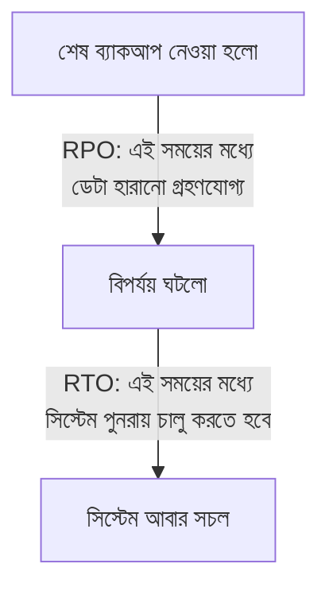

# ২১.১৬. Backup & Disaster Recovery Strategies

আগের চার লেসনে আমরা ডাটাবেস নিরাপত্তার নানা দিক দেখেছি — কে অ্যাক্সেস পাবে, কীভাবে আক্রমণ ঠেকানো যায়, কীভাবে ডেটা এনক্রিপ্ট রাখা যায়, কীভাবে অনুমতি সংগঠিত করা যায়। কিন্তু একটা প্রশ্ন এখনো অনুত্তরিত — যদি সব সুরক্ষা সত্ত্বেও কিছু ভুল হয়ে যায়? যদি একজন ডেভেলপার ভুল করে `DELETE FROM orders;` চালিয়ে ফেলে (কোনো `WHERE` ছাড়া), অথবা সার্ভারের হার্ড ডিস্ক হঠাৎ নষ্ট হয়ে যায়? এই প্রশ্নের প্রস্তুতিই হলো **Backup & Disaster Recovery**।

একটা বাড়িতে আগুন লাগার বিমা করানোর সাথে এই ধারণাটার তুলনা করা যায়। তুমি প্রতিদিন আশা করো না যে আগুন লাগবে, কিন্তু তুমি জানো ঝুঁকিটা শূন্য না — তাই তুমি গুরুত্বপূর্ণ কাগজপত্রের ফটোকপি আলাদা জায়গায় রাখো, একটা বিমা করাও। ডাটাবেস ব্যাকআপও ঠিক এই একই দর্শন — "আমরা আশা করি না বিপর্যয় ঘটবে, কিন্তু আমরা প্রস্তুত থাকি যদি ঘটে।"

ব্যাকআপ সাধারণত তিন ধরনের হয়। **Full Backup** — পুরো ডাটাবেসের একটা সম্পূর্ণ কপি, একটা নির্দিষ্ট মুহূর্তে। **Incremental Backup** — শুধু শেষ ব্যাকআপের পর থেকে যা যা পরিবর্তন হয়েছে, শুধু সেটুকুর কপি (পুরো ডেটা আবার কপি না করে, তাই দ্রুত আর কম জায়গা লাগে)। **Differential Backup** — শেষ *full* ব্যাকআপের পর থেকে যা যা পরিবর্তন হয়েছে তার কপি (incremental-এর থেকে একটু ভিন্ন হিসাব)।


PostgreSQL-এ একটা সাধারণ ব্যাকআপ কমান্ড:

```bash
# পুরো ডাটাবেসের একটা ব্যাকআপ ফাইল তৈরি করা
pg_dump -U app_backend -d shop_db -F c -f shop_db_backup_2026_08_08.dump

# পুনরুদ্ধার (restore) করা প্রয়োজন হলে
pg_restore -U app_backend -d shop_db shop_db_backup_2026_08_08.dump
```

এখানে দুটো গুরুত্বপূর্ণ পরিমাপক (metric) বোঝা দরকার, যা প্রতিটা প্রফেশনাল ডাটাবেস দলকে আগে থেকে ঠিক করে রাখতে হয়। **RPO (Recovery Point Objective)** — সর্বোচ্চ কতটুকু ডেটা হারানো "গ্রহণযোগ্য" যদি বিপর্যয় ঘটে। যদি তুমি প্রতি ২৪ ঘণ্টায় একবার ব্যাকআপ নাও, আর বিপর্যয় ঘটে ব্যাকআপের ঠিক আগ মুহূর্তে, তাহলে তুমি সর্বোচ্চ ২৪ ঘণ্টার ডেটা হারাতে পারো — এটাই তোমার RPO। **RTO (Recovery Time Objective)** — বিপর্যয়ের পর সিস্টেমকে আবার সচল করতে কতক্ষণ সময় লাগবে, সেটার লক্ষ্যমাত্রা।



একটা ব্যবসার জন্য RPO আর RTO যত কম হবে, খরচ তত বেশি — কারণ প্রতি ৫ মিনিটে ব্যাকআপ নেওয়া, বা তাৎক্ষণিকভাবে আরেকটা সার্ভারে সব ডেটা রিয়েল-টাইমে কপি রাখা (একে বলে **replication**), এই সবকিছুর জন্যই অতিরিক্ত অবকাঠামো আর প্রকৌশল দরকার। তাই প্রতিটা প্রতিষ্ঠান তাদের ডেটার গুরুত্ব বুঝে RPO/RTO ঠিক করে — একটা ব্যাংকিং সিস্টেমের RPO প্রায় শূন্য হওয়া উচিত, কিন্তু একটা ব্লগ সাইটের জন্য দিনে একবার ব্যাকআপই যথেষ্ট হতে পারে।

Disaster Recovery পরিকল্পনার আরেকটা গুরুত্বপূর্ণ অংশ হলো **ব্যাকআপ পরীক্ষা করা**। অনেক প্রতিষ্ঠান নিয়মিত ব্যাকআপ নেয়, কিন্তু কখনো সেই ব্যাকআপ থেকে আসলেই পুনরুদ্ধার করে দেখে না — আর যখন সত্যিকারের বিপর্যয় ঘটে, তখন বোঝা যায় ব্যাকআপ ফাইলটা করাপ্টেড ছিলো, বা প্রক্রিয়া কাজ করছিলো না। তাই একটা নিয়ম মনে রাখা জরুরি — **"একটা ব্যাকআপ, যেটা কখনো পুনরুদ্ধার করে পরীক্ষা করা হয়নি, সেটা আসলে কোনো ব্যাকআপই না।"**

আধুনিক ক্লাউড ডাটাবেস সেবা (Azure SQL, যা আমরা এই মডিউলের শেষ কয়েকটা লেসনে দেখবো) এই পুরো প্রক্রিয়াটাকে স্বয়ংক্রিয় করে দেয় — নিয়মিত স্বয়ংক্রিয় ব্যাকআপ, point-in-time restore (নির্দিষ্ট একটা মুহূর্তে ডাটাবেসকে ফিরিয়ে নেওয়া), আর জিও-রিডানডেন্সি (একাধিক ভৌগোলিক অবস্থানে ডেটা কপি রাখা) — যা নিজে হাতে বানানো অনেক জটিল হতো।

এই লেসনে আমরা দেখলাম কীভাবে বিপর্যয়ের জন্য প্রস্তুতি নিতে হয়। এখন আমরা এই মডিউলের একটা নতুন অধ্যায়ে প্রবেশ করবো, যেখানে দেখবো কীভাবে ডাটাবেস চালানো, ব্যাকআপ নেওয়া, স্কেল করা — এই সবকিছুর দায়িত্ব ক্লাউড প্রোভাইডারদের হাতে তুলে দেওয়া যায়। পরের লেসনে শুরু হবে — Introduction to Cloud Databases।
