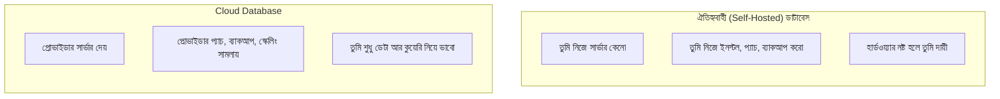
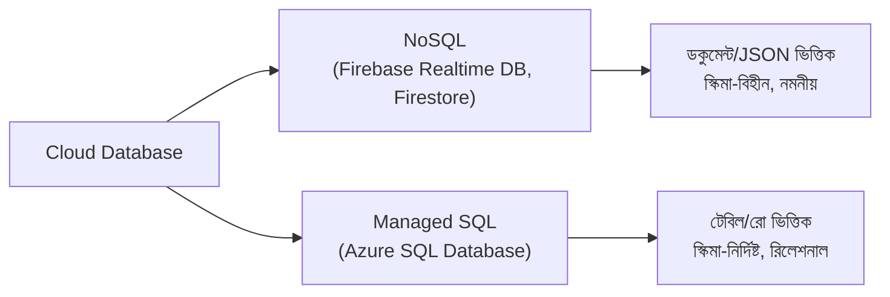

# ২১.১৭. Introduction to Cloud Databases

আগের লেসনে (২১.১৬) আমরা দেখলাম ব্যাকআপ নেওয়া, রেপ্লিকেশন করা, RPO/RTO ঠিক করা — এই সবকিছু কতটা জটিল আর দায়িত্বপূর্ণ কাজ। আর এটা তো শুধু একটা অংশ — এর বাইরেও একজন ডেভেলপারকে ভাবতে হয় সার্ভার কেনা, তার নিরাপত্তা প্যাচ আপডেট রাখা, হার্ডওয়্যার নষ্ট হলে বদলানো, ট্রাফিক বাড়লে আরও শক্তিশালী মেশিনে সরানো। Module 2-এ আমরা "Cloud Systems" নিয়ে প্রাথমিক পরিচয় পেয়েছিলাম ওয়েব সার্ভারের প্রসঙ্গে — এখন আমরা সেই একই দর্শন প্রয়োগ করবো ডাটাবেসের ক্ষেত্রে।

**Cloud Database** মানে হলো — একটা ডাটাবেস সার্ভার নিজে কিনে, নিজে সেটআপ করে, নিজে রক্ষণাবেক্ষণ করার বদলে, একটা ক্লাউড প্রোভাইডারের (Microsoft Azure, Amazon AWS, Google Cloud, Firebase) কাছ থেকে "সার্ভিস হিসেবে" ডাটাবেস ভাড়া নেওয়া। এই মডেলটা বোঝার জন্য একটা চমৎকার উপমা হলো বিদ্যুৎ সংযোগ — তুমি নিজের বাড়িতে বিদ্যুৎ উৎপাদনের জেনারেটর বানাও না, নিজে তেল কিনে জ্বালাও না। এর বদলে তুমি বিদ্যুৎ কোম্পানির লাইনে সংযুক্ত হও, প্রতি মাসে যতটুকু ব্যবহার করো ততটুকুর বিল দাও, আর বাকি সব দায়িত্ব (উৎপাদন, রক্ষণাবেক্ষণ, নিরাপত্তা) কোম্পানির।

ক্লাউড ডাটাবেসের সবচেয়ে বড় সুবিধাগুলো একটা একটা করে দেখা যাক। প্রথমত, **Managed Maintenance** — সিকিউরিটি প্যাচ, ভার্সন আপডেট, ডিস্ক ব্যাকআপ, এসব প্রোভাইডার নিজেই সামলায়, তোমাকে ৩টার সময় ঘুম থেকে উঠে সার্ভার রিস্টার্ট করতে হয় না। দ্বিতীয়ত, **Elastic Scaling** — যদি হঠাৎ তোমার ওয়েবসাইটে ট্রাফিক দশগুণ বেড়ে যায় (ধরো একটা ভাইরাল পোস্টের কারণে), তুমি কয়েক ক্লিকে ডাটাবেসের রিসোর্স (CPU, RAM) বাড়িয়ে নিতে পারো, নতুন হার্ডওয়্যার কেনার জন্য সপ্তাহ অপেক্ষা করতে হয় না। তৃতীয়ত, **Built-in High Availability** — আগের লেসনে যে জিও-রিডানডেন্সি আর স্বয়ংক্রিয় ফেইলওভারের কথা বলেছিলাম, সেটা ক্লাউড প্রোভাইডাররা ডিফল্টভাবেই দিয়ে থাকে।

তবে এই সুবিধার একটা মূল্যও আছে — **Vendor Lock-in** (একটা নির্দিষ্ট প্রোভাইডারের সাথে আটকে যাওয়া), আর দীর্ঘমেয়াদে খরচের হিসাব কখনো কখনো নিজে হোস্ট করার চেয়ে বেশি হতে পারে বড় স্কেলে।

ক্লাউড ডাটাবেসের জগতে মূলত দুই ধরনের অপশন পাওয়া যায়, আর এই মডিউলের বাকি অংশে আমরা দুটোই দেখবো। একদিকে আছে **NoSQL ক্লাউড ডাটাবেস**, যেমন Firebase-এর Realtime Database আর Firestore — যেগুলো Module 15-20-এ শেখা রিলেশনাল (SQL) মডেলের থেকে ভিন্ন একটা দর্শনে কাজ করে, ডেটাকে টেবিল-রো-কলামের বদলে ডকুমেন্ট বা JSON-এর মতো কাঠামোয় সংরক্ষণ করে। অন্যদিকে আছে **Managed SQL ক্লাউড ডাটাবেস**, যেমন Azure SQL Database — যেখানে তুমি আমাদের এতদিন শেখা সেই একই SQL ভাষা, টেবিল, রিলেশনশিপ ব্যবহার করতে পারবে, শুধু সার্ভারটা নিজের কম্পিউটারে না, ক্লাউডে চলবে।

কোনটা বেছে নেওয়া উচিত — এই প্রশ্নের উত্তর নির্ভর করে অ্যাপ্লিকেশনের প্রকৃতির উপর। যদি ডেটার মধ্যে জটিল সম্পর্ক থাকে (যেমন কাস্টমার-অর্ডার-প্রোডাক্ট, যা আমরা Module 18-19-এ ERD দিয়ে ডিজাইন করেছি), আর কড়াকড়ি নিয়ম মানা জরুরি (যেমন একটা অর্ডার অবশ্যই একজন বৈধ কাস্টমারের হতে হবে), তাহলে SQL-ভিত্তিক সমাধান স্বাভাবিক পছন্দ। কিন্তু যদি ডেটার গঠন প্রায়ই পাল্টায়, আর রিয়েল-টাইম সিঙ্ক্রোনাইজেশন (যেমন একটা চ্যাট অ্যাপ, যেখানে বার্তা তাৎক্ষণিকভাবে সব ডিভাইসে দেখাতে হয়) গুরুত্বপূর্ণ, তাহলে NoSQL-ভিত্তিক সমাধান বেশি মানানসই।

এই লেসনে আমরা ক্লাউড ডাটাবেসের বড় ছবিটা দেখলাম। পরের লেসনে আমরা প্রথম NoSQL ক্লাউড সমাধান হিসেবে গভীরে যাবো — Firebase Realtime Database Overview।
