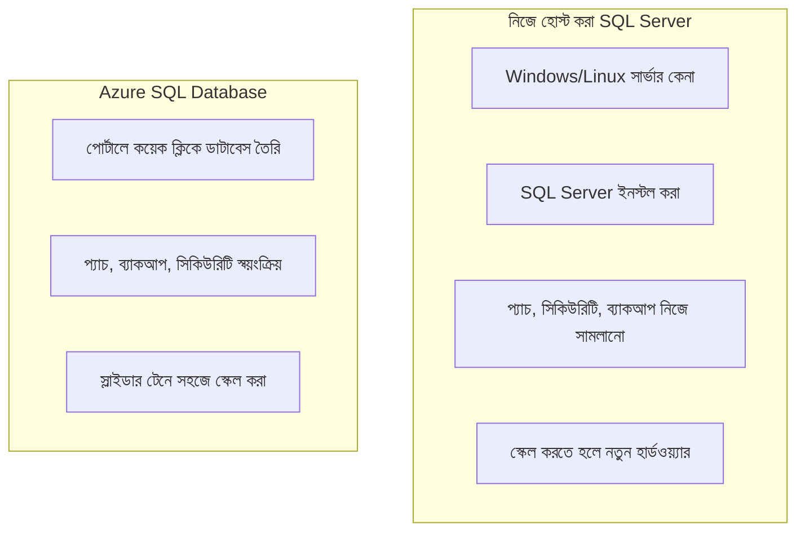
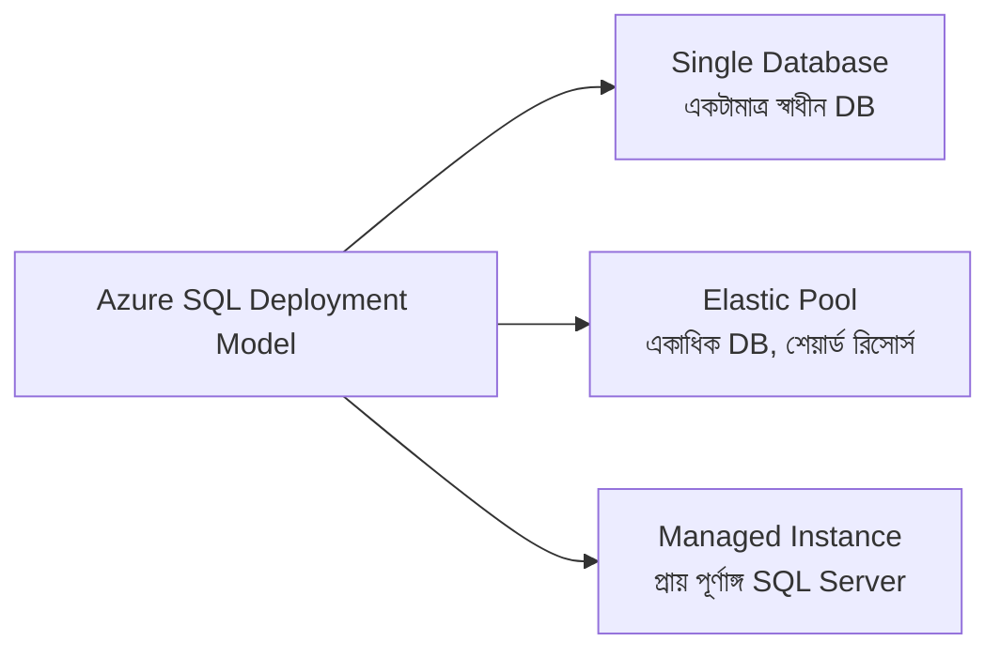

# ২১.২০. Azure SQL Database Basics

গত দুই লেসনে আমরা Firebase-এর NoSQL জগতে ঘুরে এসেছি। এখন আমরা ফিরে আসছি পরিচিত ভূমিতে — SQL, টেবিল, রো, রিলেশনশিপ (Module 16-19-এ যা আমরা গভীরভাবে শিখেছি) — কিন্তু এবার নিজের কম্পিউটারে না, ক্লাউডে। এই লেসনে আমরা পরিচিত হবো **Azure SQL Database**-এর সাথে, Microsoft-এর ম্যানেজড রিলেশনাল ডাটাবেস সার্ভিসের সাথে।

Azure SQL Database মূলত সেই একই **SQL Server** ইঞ্জিন, যা মাইক্রোসফট বহু বছর ধরে বানিয়ে আসছে, শুধু এবার এটাকে "সার্ভিস হিসেবে" (Database as a Service, বা DBaaS) দেওয়া হয়। আগের লেসনে (২১.১৭) আমরা যে বিদ্যুৎ কোম্পানির উপমা দিয়েছিলাম, সেটা এখানে একদম নির্দিষ্টভাবে প্রযোজ্য — তুমি নিজে Windows Server ইনস্টল করছো না, নিজে SQL Server সেটআপ করছো না, নিজে প্যাচ আপডেট করছো না। তুমি শুধু Azure পোর্টালে গিয়ে "আমার একটা ডাটাবেস দরকার" বলবে, আর কিছুক্ষণের মধ্যে একটা পুরোপুরি কার্যকরী, সুরক্ষিত, ব্যাকআপ-সহ SQL ডাটাবেস প্রস্তুত হয়ে যাবে।



Azure SQL Database-এ আমাদের এই পুরো মডিউলে শেখা প্রতিটা জিনিসই কাজ করে — ঠিক সেই একই SQL সিনট্যাক্স:

```sql
-- Azure SQL Database-এ টেবিল তৈরি, ইনডেক্স বসানো — সবকিছু চেনা
CREATE TABLE products (
    id INT IDENTITY(1,1) PRIMARY KEY,
    name NVARCHAR(200) NOT NULL,
    price DECIMAL(10,2),
    stock INT DEFAULT 0
);

CREATE INDEX idx_products_name ON products(name);

SELECT TOP 10 name, price FROM products ORDER BY price DESC;
```

Azure SQL Database কয়েকটা ভিন্ন **Deployment Model** বা "কেনার ধরন"-এ পাওয়া যায়, যা বোঝা গুরুত্বপূর্ণ। **Single Database** — সবচেয়ে সরল রূপ, একটামাত্র স্বাধীন ডাটাবেস, তার নিজস্ব রিসোর্স বরাদ্দ (CPU, মেমরি)। **Elastic Pool** — একাধিক ডাটাবেস একসাথে একটা "পুল"-এ রিসোর্স শেয়ার করে, উপযোগী যখন তোমার অনেকগুলো ছোট ডাটাবেস আছে (যেমন প্রতিটা ক্লায়েন্টের জন্য আলাদা ডাটাবেস) যাদের সবার একসাথে পিক লোড হয় না। **Managed Instance** — প্রায় পুরোপুরি একটা ঐতিহ্যবাহী SQL Server-এর মতো আচরণ করে, কিন্তু ম্যানেজড, বড় প্রতিষ্ঠানের জন্য যাদের আরও নিয়ন্ত্রণ দরকার।

রিসোর্স বরাদ্দের ক্ষেত্রেও Azure দুটো মডেল দেয় — **DTU-based (Database Transaction Unit)**, যেখানে CPU-মেমরি-IO একসাথে একটা "প্যাকেজ" হিসেবে কেনা হয় (সহজ, শুরুর জন্য ভালো), আর **vCore-based**, যেখানে CPU কোর সংখ্যা আর মেমরি আলাদাভাবে ঠিক করা যায় (বেশি নিয়ন্ত্রণ, বড় অ্যাপ্লিকেশনের জন্য উপযুক্ত)।



একটা গুরুত্বপূর্ণ প্রশ্ন এই মুহূর্তে মনে আসা উচিত — কেন Azure SQL Database বেছে নেবো, PostgreSQL বা MySQL (যা Module 16-20-এ ব্যবহার করেছি) নিজে হোস্ট করার বদলে? উত্তরটা এই মডিউলে আমরা যা শিখেছি তার সবকিছুর সমন্বয়ে — Backup & Disaster Recovery (২১.১৬) স্বয়ংক্রিয়ভাবে হয়ে যায়, Encryption at Rest (২১.১৪) ডিফল্টভাবেই চালু থাকে, স্কেলিং একটা স্লাইডার টানার মতো সহজ, আর তুমি নিজে সার্ভার নিরাপত্তা নিয়ে মাথা ঘামানোর বদলে সরাসরি অ্যাপ্লিকেশন লজিকে মনোযোগ দিতে পারো। এই সবকিছুই সেই একই মূল্য পরিশোধ করে — কিছুটা বেশি খরচ, আর ক্লাউড প্রোভাইডারের উপর নির্ভরতা।

এই লেসনে আমরা Azure SQL Database কী, কেন, আর কোন কোন রূপে পাওয়া যায় তা বুঝলাম। পরের লেসনে আমরা হাতে-কলমে দেখবো কীভাবে সত্যিকারের একটা Azure SQL Database সেটআপ করতে হয় — Setting up Azure SQL Database।
