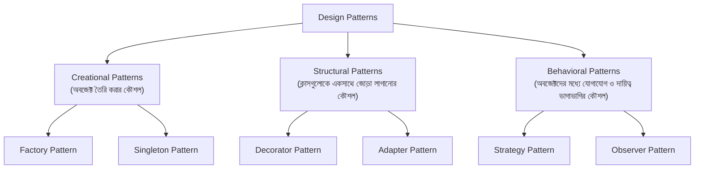

# ২২.০১. Software Design Patterns

Module 13 আর Module 14-তে আমরা অনেক পথ পাড়ি দিয়েছি — Class কী, Object কী, Encapsulation কীভাবে ডেটা লুকিয়ে রাখে, Inheritance কীভাবে কোড পুনঃব্যবহার করায়, আর Interface/Polymorphism কীভাবে একই নামের ফাংশনকে ভিন্ন ভিন্ন ক্লাসে ভিন্নভাবে আচরণ করতে দেয়। এই সবগুলো আসলে ভাষার "ব্যাকরণ" — ঠিক যেমন বাংলা ভাষা শেখার সময় তুমি প্রথমে বর্ণমালা, শব্দ, বাক্য গঠন শেখো। কিন্তু শুধু ব্যাকরণ জানলেই একজন ভালো লেখক হওয়া যায় না — একজন ভালো লেখক জানে কোন পরিস্থিতিতে কোন বাক্যরীতি ব্যবহার করতে হয়, কীভাবে একটা গল্পকে সুন্দরভাবে সাজাতে হয়। Software Design Pattern ঠিক সেই জায়গাটা পূরণ করে — এটা OOP-এর ব্যাকরণ দিয়ে "ভালো গল্প" লেখার প্রমাণিত কৌশল।

একটা জিনিস প্রথমেই পরিষ্কার করে নেয়া দরকার — Design Pattern কোনো কোড লাইব্রেরি না, কোনো `npm install` করে বসিয়ে দেয়ার মতো জিনিস না। এটা একটা **সমাধানের কাঠামো** (template of a solution) — বহু বছর ধরে হাজার হাজার ডেভেলপার একই ধরনের সমস্যায় বারবার পড়েছে, আর সময়ের সাথে সাথে সেই সমস্যাগুলোর একটা "সাধারণ, প্রমাণিত সমাধান" তৈরি হয়েছে। ১৯৯৪ সালে চারজন লেখক (যাদেরকে একসাথে বলা হয় "Gang of Four" বা GoF) একটা বই লিখেছিলেন — *Design Patterns: Elements of Reusable Object-Oriented Software* — যেখানে তারা ২৩টা এমন সাধারণ প্যাটার্ন লিপিবদ্ধ করেছিলেন। আজ, প্রায় তিন দশক পরেও, প্রায় প্রতিটা বড় সফটওয়্যার সিস্টেমে — তুমি চাও বা না চাও — এই প্যাটার্নগুলোর কোনো না কোনো রূপ খুঁজে পাবে।

কেন এই প্যাটার্নগুলো এত গুরুত্বপূর্ণ, সেটা বোঝার জন্য একটা উপমা দিই। ধরো তুমি একজন স্থপতি (architect), আর তোমাকে একটা বাড়ি বানাতে হবে। তুমি কি প্রতিবার শূন্য থেকে চিন্তা করবে — "দরজা কোথায় বসাবো, জানালার আকার কী হবে, সিঁড়ির কোণ কত ডিগ্রি হলে নিরাপদ"? না। স্থাপত্যবিদ্যায় শত শত বছরের অভিজ্ঞতা থেকে তৈরি হয়েছে standard blueprint — যেমন "লোড-বেয়ারিং দেয়াল কীভাবে বসাতে হয়", "ভেন্টিলেশনের জন্য জানালার আদর্শ অনুপাত কী"। স্থপতিরা এই ব্লুপ্রিন্টগুলো শেখে, তারপর নিজের প্রজেক্টের প্রয়োজন অনুযায়ী প্রয়োগ করে। Design Pattern হলো ঠিক সেই ব্লুপ্রিন্ট, কিন্তু সফটওয়্যারের জন্য।

এখন প্রশ্ন হতে পারে — প্যাটার্ন ছাড়া কোড লিখলে ঠিক কী সমস্যা হয়? চলো একটা বাস্তব দৃশ্যকল্প কল্পনা করি। Module 6 এবং Module 7-এ আমরা FastAPI দিয়ে API বানিয়েছিলাম, যেখানে আমরা ধীরে ধীরে Router আর Service আলাদা করেছিলাম — মনে করে দেখো কেন সেটা করেছিলাম। প্রথম দিকে হয়তো একটা রুট হ্যান্ডলারের ভেতরেই আমরা ডেটাবেজ কল, ভ্যালিডেশন, বিজনেস লজিক, রেসপন্স ফরম্যাটিং — সব একসাথে লিখে ফেলেছিলাম। কাজ চলছিলো ঠিকই, কিন্তু যখনই প্রজেক্ট একটু বড় হলো, একটা ফাংশন খুঁজে বের করে বাগ ঠিক করতে গিয়ে ঘন্টার পর ঘন্টা লেগে যেত, কারণ সব লজিক একসাথে জট পাকিয়ে ছিল। Router আর Service আলাদা করাটা আসলে একটা ছোট design pattern-এরই প্রয়োগ ছিলো — যদিও তখন আমরা নাম দিয়ে বলিনি।

Design Pattern মূলত তিনটা বড় পরিবারে ভাগ করা হয়, প্রতিটা পরিবার একটা নির্দিষ্ট ধরনের সমস্যার সমাধান করে:

**Creational Pattern** সমাধান করে "একটা অবজেক্ট কীভাবে তৈরি করবো" প্রশ্নটা। মনে করো Module 13-এ আমরা `new` কীওয়ার্ড দিয়ে সরাসরি একটা ক্লাসের instance বানাতাম। কিন্তু বাস্তব সিস্টেমে অনেক সময় কোন ক্লাসের instance বানাতে হবে সেটা রানটাইমে সিদ্ধান্ত নিতে হয় — যেমন পেমেন্ট মেথড অনুযায়ী `CreditCardPayment` না `BkashPayment` বানানো। এই মডিউলে আমরা এই পরিবারের সবচেয়ে বহুল ব্যবহৃত সদস্য, **Factory Pattern**, নিয়ে বিস্তারিত আলোচনা করবো।

**Structural Pattern** সমাধান করে "একাধিক ক্লাস বা অবজেক্টকে কীভাবে একসাথে গঠন করবো, যাতে তারা মিলেমিশে কাজ করে কিন্তু একে অপরের উপর অতিরিক্ত নির্ভরশীল না হয়ে যায়"। এই পরিবার থেকে আমরা শিখবো **Decorator Pattern**, যা কোনো অবজেক্টের মূল কাঠামো না বদলে তার উপর নতুন ক্ষমতা "মুড়িয়ে" (wrap) দেয়ার কৌশল শেখায়।

**Behavioral Pattern** সমাধান করে অবজেক্টদের মধ্যে "যোগাযোগ" আর "দায়িত্ব ভাগাভাগি"র প্রশ্ন। এখান থেকে আমরা শিখবো **Strategy Pattern**, যা রানটাইমে অ্যালগরিদম বদলানোর একটা সুন্দর উপায় দেখায়।

এই তিনটার পাশাপাশি একটা চতুর্থ ধারণাও আমরা এই মডিউলে গভীরভাবে দেখবো, যা কঠোরভাবে GoF-এর ২৩টা প্যাটার্নের তালিকায় না থাকলেও আধুনিক ব্যাকএন্ড ডেভেলপমেন্টে (বিশেষত FastAPI-এর `Depends()` সিস্টেমে) একেবারে কেন্দ্রীয় ভূমিকা পালন করে — **Dependency Injection**। এটা এতটাই গুরুত্বপূর্ণ যে Module 23-এ পুরো FastAPI-এর সার্ভিস-লেয়ার ডিজাইনটাই এই একটা ধারণার উপর দাঁড়িয়ে আছে।

একটা কথা মনে রাখা জরুরি — Design Pattern কোনো "বাধ্যতামূলক নিয়ম" না। এগুলো টুল, আর প্রতিটা টুলের নিজস্ব প্রেক্ষাপট আছে। একজন অভিজ্ঞ ডেভেলপার আর একজন নতুন ডেভেলপারের মধ্যে পার্থক্য এখানেই — নতুন ডেভেলপার হয়তো প্রতিটা সমস্যায় জোর করে একটা প্যাটার্ন গুঁজে দেয়ার চেষ্টা করে ("over-engineering"), আর অভিজ্ঞ ডেভেলপার বোঝে ঠিক কোন মুহূর্তে একটা প্যাটার্ন সমস্যাটা সহজ করবে, আর কখন সেটা অপ্রয়োজনীয় জটিলতা যোগ করবে মাত্র। এই বিচার-বুদ্ধি (judgment) তৈরি হয় অভিজ্ঞতা থেকে, আর সেই অভিজ্ঞতার প্রথম ধাপ হলো প্রতিটা প্যাটার্ন ঠিক কোন সমস্যার জবাবে জন্ম নিয়েছিলো, সেটা বোঝা।

পরের লেসনে আমরা সরাসরি ঢুকবো Dependency Injection-এর জগতে — একটা এমন ধারণা, যা প্রথম শুনলে বিমূর্ত মনে হতে পারে, কিন্তু একবার বুঝে গেলে তুমি প্রতিটা ভালো লেখা কোডে এর ছায়া দেখতে পাবে।
