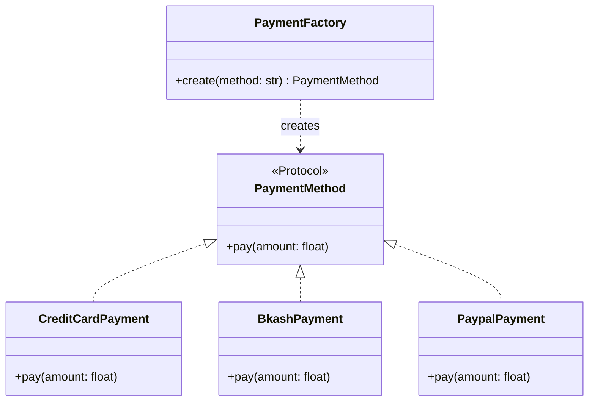

# ২২.০৩. Factory Design Pattern

আগের লেসনে আমরা দেখেছিলাম Dependency Injection কীভাবে একটা ক্লাসকে তার dependency নিজে তৈরি করার দায়িত্ব থেকে মুক্তি দেয়। কিন্তু একটা প্রশ্ন তখনও অমীমাংসিত রয়ে গিয়েছিলো — dependency-টা যদি নিজে তৈরি করতে না হয়, তাহলে সেটা তৈরি হবে **কোথায়**, আর **কীভাবে** সিদ্ধান্ত হবে কোন নির্দিষ্ট ক্লাসের instance বানাতে হবে? এই প্রশ্নের একটা সুন্দর উত্তর হলো Factory Pattern।

চলো একটা বাস্তব সমস্যা দিয়ে শুরু করি। ধরো তুমি একটা ই-কমার্স সিস্টেম বানাচ্ছো (Module 8-এ আমরা যে e-commerce product API নিয়ে কাজ করেছিলাম, সেটার কথা মনে করো), আর তোমার সিস্টেমে একাধিক পেমেন্ট মেথড সাপোর্ট করতে হবে — Credit Card, bKash, PayPal। Module 14-এ আমরা শিখেছিলাম Protocol আর Polymorphism দিয়ে কীভাবে একই নামের মেথড ভিন্ন ভিন্ন ক্লাসে ভিন্নভাবে কাজ করতে পারে। এখানেও আমরা একটা কমন চুক্তি বানাবো:

```python
from typing import Protocol


class PaymentMethod(Protocol):
    def pay(self, amount: float) -> None: ...


class CreditCardPayment:
    def pay(self, amount: float) -> None:
        print(f"Charging ৳{amount} to Credit Card")


class BkashPayment:
    def pay(self, amount: float) -> None:
        print(f"Charging ৳{amount} via bKash")


class PaypalPayment:
    def pay(self, amount: float) -> None:
        print(f"Charging ৳{amount} via PayPal")
```

এখন সমস্যাটা হলো — ইউজার যখন চেকআউট করে, সে একটা স্ট্রিং পাঠায় (যেমন `"bkash"`), আর আমাদের সেই স্ট্রিং দেখে ঠিক করতে হয় কোন ক্লাসের instance বানাবো। যদি আমরা এই সিদ্ধান্ত নেয়ার লজিকটা আমাদের রুট হ্যান্ডলারের ভেতরে সরাসরি লিখে ফেলি, তাহলে কী হবে দেখা যাক:

```python
# খারাপ পদ্ধতি — রুট হ্যান্ডলারের ভেতরেই সিদ্ধান্ত নেয়া হচ্ছে
def checkout_handler(method: str, amount: float) -> None:
    if method == "credit_card":
        payment: PaymentMethod = CreditCardPayment()
    elif method == "bkash":
        payment = BkashPayment()
    elif method == "paypal":
        payment = PaypalPayment()
    else:
        raise ValueError("Unsupported payment method")

    payment.pay(amount)
```

এই কোড কাজ করবে, কিন্তু এখানে দুইটা সমস্যা লুকিয়ে আছে। প্রথমত, এই `if-elif` চেইনটা যদি আরও দশটা রুট বা ফাইলে দরকার হয় (যেমন রিফান্ড প্রসেসিং-এও পেমেন্ট মেথড অনুযায়ী সিদ্ধান্ত লাগবে), তাহলে এই একই কোড বারবার কপি-পেস্ট হবে। দ্বিতীয়ত, ভবিষ্যতে নতুন একটা পেমেন্ট মেথড (ধরো `Nagad`) যোগ করতে হলে, তোমাকে প্রতিটা জায়গায় গিয়ে এই `if-elif` চেইন খুঁজে খুঁজে আপডেট করতে হবে — এটা ভুলের সম্ভাবনা বাড়ায়।

Factory Pattern এই সমস্যাটার সমাধান দেয় একটা সহজ নিয়মে — **"অবজেক্ট তৈরি করার সিদ্ধান্ত-নেয়ার লজিকটাকে একটা আলাদা, কেন্দ্রীভূত জায়গায় সরিয়ে নাও"**। এই কেন্দ্রীয় জায়গাটাকেই বলে **Factory**। Python-এ এটা করার সবচেয়ে সহজ উপায় হলো একটা module-level ফাংশন বা একটা ক্লাসের `classmethod` — জাভা/টাইপস্ক্রিপ্টের মতো আলাদা "Factory ক্লাস" বাধ্যতামূলক না, কারণ Python-এ ফাংশন নিজেই একটা প্রথম-শ্রেণীর (first-class) নাগরিক:

```python
def create_payment_method(method: str) -> PaymentMethod:
    factories: dict[str, type[PaymentMethod]] = {
        "credit_card": CreditCardPayment,
        "bkash": BkashPayment,
        "paypal": PaypalPayment,
    }
    payment_class = factories.get(method)
    if payment_class is None:
        raise ValueError(f"Unsupported payment method: {method}")
    return payment_class()


# এখন ব্যবহার একেবারে পরিষ্কার এবং সহজ
def checkout_handler(method: str, amount: float) -> None:
    payment = create_payment_method(method)
    payment.pay(amount)
```

লক্ষ্য করো, এখানে `dict`-ভিত্তিক লুকআপ ব্যবহার করা হয়েছে — এটা Python-এ `if-elif` চেইনের চেয়ে বেশি প্রচলিত ও পরিষ্কার একটা রীতি, কারণ Python-এ ক্লাস নিজেই একটা ভ্যালু (first-class object), তাই সরাসরি ডিকশনারিতে রাখা যায়। যদি চাও, একটা ক্লাসের ভেতরেও `classmethod` দিয়ে একই কাজ করা যায়:

```python
class PaymentFactory:
    _registry: dict[str, type[PaymentMethod]] = {
        "credit_card": CreditCardPayment,
        "bkash": BkashPayment,
        "paypal": PaypalPayment,
    }

    @classmethod
    def create(cls, method: str) -> PaymentMethod:
        payment_class = cls._registry.get(method)
        if payment_class is None:
            raise ValueError(f"Unsupported payment method: {method}")
        return payment_class()


payment = PaymentFactory.create("bkash")
payment.pay(500)
```

দুটো পদ্ধতিই সমতুল্য — একটা module-level ফাংশন, আরেকটা ক্লাসের `classmethod`। বাস্তব প্রজেক্টে কোনটা বেছে নেবে তা নির্ভর করে দলের কনভেনশনের উপর; module-level ফাংশন সাধারণত সহজ ও Pythonic, আর `classmethod` তখনই দরকার যখন Factory-টার নিজের কিছু state বা একাধিক related creation-মেথড লাগে। এখন রুট হ্যান্ডলার শুধু জানে "আমার একটা `PaymentMethod` দরকার, ঠিক কীভাবে সেটা তৈরি হয় সেটা আমার জানার দরকার নেই — Factory-কে জিজ্ঞেস করলেই হবে।" এটাই Factory Pattern-এর মূল কথা — অবজেক্ট তৈরির দায়িত্ব একটা নির্দিষ্ট, বিশেষায়িত জায়গার হাতে সঁপে দেয়া। নতুন `Nagad` payment method যোগ করতে হলে এখন তোমাকে শুধু `_registry` ডিকশনারিতে একটা এন্ট্রি যোগ করতে হবে — বাকি সব কোড অক্ষত থাকে।

ক্লাস ডায়াগ্রামে দেখলে সম্পর্কটা আরও স্পষ্ট হয়:



লক্ষ্য করো তীরের দিক — `PaymentFactory` জানে `PaymentMethod` চুক্তি সম্পর্কে, কিন্তু বাকি সিস্টেম শুধু জানে `PaymentFactory`-কে ডাকতে হয়। "কোন কংক্রিট ক্লাস তৈরি হচ্ছে" এই জ্ঞানটা একটা মাত্র জায়গায় বন্দী থাকে — এই নীতিকে সফটওয়্যার ডিজাইনের ভাষায় বলে **encapsulation of object creation**, আর এটা মূলত Module 13-এ শেখা encapsulation-এরই একটা প্রয়োগ, শুধু এবার এটা ডেটা লুকানোর বদলে "সিদ্ধান্ত-নেয়ার লজিক" লুকাচ্ছে।

Factory Pattern-এর সাথে আগের লেসনের Dependency Injection-এর সম্পর্কটাও গুরুত্বপূর্ণ বোঝা। DI বলে "dependency নিজে তৈরি কোরো না, বাইরে থেকে নাও"। কিন্তু কেউ তো একটা জায়গায় সেই dependency তৈরি করবেই — সেই "কেউ"টাই প্রায়শই একটা Factory। তাই বাস্তব সিস্টেমে DI আর Factory প্রায়ই একসাথে কাজ করে — Factory অবজেক্ট তৈরি করে, DI সেই তৈরি অবজেক্টটাকে সঠিক জায়গায় পৌঁছে দেয়। FastAPI-এ (Module 23) আমরা দেখবো `Depends()`-এর ভেতরে যে "provider function" পাঠানো হয়, সেটা আসলে প্রায়শই একটা ছোট Factory ফাংশনই — `get_order_service()`-এর মতো একটা ফাংশন যেটা ঠিক করে দেয় কীভাবে instance তৈরি বা পাওয়া হবে।

**একটা প্রোডাকশন নুয়ান্স:** উপরের `_registry` ডিকশনারি-ভিত্তিক Factory-তে একটা সাধারণ ভুল হলো প্রতিবার `create()` কল হলে নতুন instance বানানো, এমনকি এমন ক্লাসের জন্যও যার state-less বা expensive-to-construct (যেমন একটা payment gateway client যেটা তৈরি হওয়ার সময় নেটওয়ার্ক কানেকশন সেটআপ করে)। যদি `CreditCardPayment.__init__()`-এর ভেতরে ভারী কাজ থাকে (যেমন API ক্লায়েন্ট ইনিশিয়ালাইজ করা), তাহলে প্রতিটা রিকোয়েস্টে নতুন instance বানানো প্রোডাকশনে পারফরম্যান্স সমস্যা তৈরি করতে পারে। এই ক্ষেত্রে Factory-কে instance-cache করে রাখতে হয় (একটা module-level dict-এ, বা `functools.lru_cache` দিয়ে), যাতে একই ক্লাসের জন্য একবারই ভারী ইনিশিয়ালাইজেশন হয় — কিন্তু তখন সতর্ক থাকতে হবে instance-টা আসলেই thread-safe/stateless কিনা, কারণ ক্যাশ করা instance একাধিক রিকোয়েস্টের মধ্যে শেয়ার হবে।

একটা বাস্তব-জীবনের উপমা দিয়ে শেষ করা যাক। ধরো তুমি একটা গাড়ির শোরুমে গেছো। তুমি শোরুমের কর্মীকে বলো "আমার একটা SUV দরকার", তুমি জানতে চাও না ঠিক কোন কারখানায়, কোন মেশিনে, কোন প্রক্রিয়ায় গাড়িটা তৈরি হয়েছে। শোরুমের কর্মী (Factory) তোমার চাহিদা (parameter) শুনে সঠিক গাড়িটা (object) বের করে দেয়। তুমি শুধু ফলাফলটা নিয়ে চলে যাও — সৃষ্টি প্রক্রিয়ার জটিলতা তোমার কাছে সম্পূর্ণ আড়ালে থেকে যায়।

পরের লেসনে আমরা Behavioral pattern-এর জগতে যাবো, আর দেখবো Strategy Pattern কীভাবে "কোন অ্যালগরিদম দিয়ে কাজ করা হবে" — এই সিদ্ধান্তটা রানটাইমে, নমনীয়ভাবে পাল্টানোর সুযোগ দেয়।
