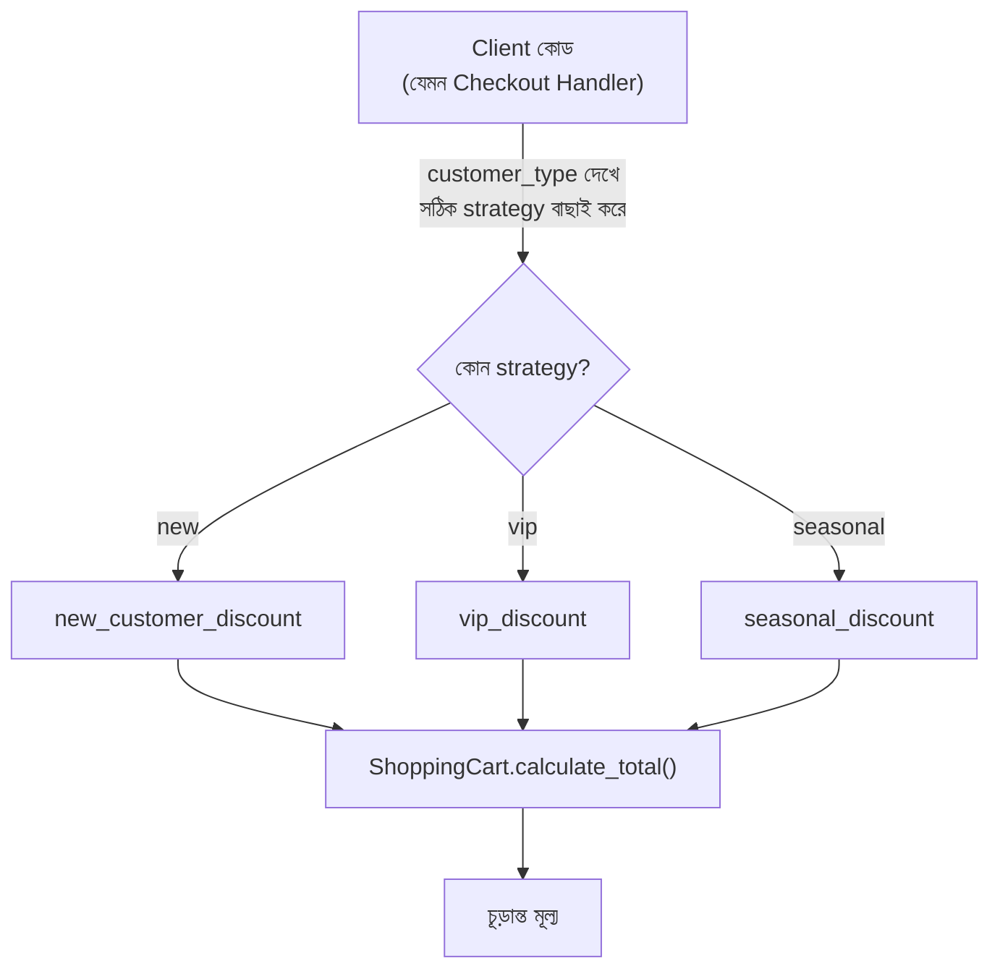

# ২২.০৪. Strategy Design Pattern

আগের লেসনে Factory Pattern আমাদের শিখিয়েছে "কোন ক্লাসের instance তৈরি হবে" সেই সিদ্ধান্তটাকে কীভাবে কেন্দ্রীভূত করা যায়। এবার আমরা একটা সম্পর্কিত কিন্তু ভিন্ন প্রশ্নের মুখোমুখি হবো — অবজেক্ট তো তৈরি হয়ে গেলো, কিন্তু সেই অবজেক্ট যদি রানটাইমে তার **আচরণ** (behavior) বা **অ্যালগরিদম** বদলাতে চায়, তখন কী হবে?

একটা বাস্তব সমস্যা দিয়ে শুরু করি। ধরো তুমি একটা শপিং কার্ট সিস্টেম বানাচ্ছো, যেখানে অর্ডারের মোট মূল্যের উপর ডিসকাউন্ট প্রয়োগ করতে হবে। কিন্তু ডিসকাউন্টের নিয়ম একরকম না — নতুন কাস্টমারদের জন্য ফ্ল্যাট ১০% ছাড়, পুরনো VIP কাস্টমারদের জন্য পয়েন্ট-ভিত্তিক ছাড়, আবার উৎসবের সময় সিজনাল ছাড়। প্রথম যে সমাধানটা মাথায় আসে, সেটা হলো একটা বিশাল `if-elif`:

```python
class ShoppingCart:
    def calculate_total(self, amount: float, customer_type: str) -> float:
        if customer_type == "new":
            return amount * 0.9  # ১০% ছাড়
        elif customer_type == "vip":
            return amount * 0.7  # ৩০% ছাড়
        elif customer_type == "seasonal":
            return amount - 100  # ফ্ল্যাট ১০০ টাকা ছাড়
        return amount
```

এই কোডে ঠিক Factory Pattern লেসনে যে সমস্যাটা দেখেছিলাম, সেই একই ধরনের সমস্যা — `ShoppingCart` ক্লাসটা নিজে একগাদা ডিসকাউন্ট-লজিক সম্পর্কে জেনে বসে আছে, যেটা আসলে তার মূল দায়িত্ব (কার্ট ম্যানেজ করা) না। প্রতিবার নতুন একটা ডিসকাউন্ট নিয়ম আসলে এই ক্লাসের ভেতরেই ঢুকে কোড বদলাতে হবে, আর পুরনো নিয়মগুলো ভেঙে যাওয়ার ঝুঁকি থাকে।

Strategy Pattern বলে — "একটা কাজ করার একাধিক উপায় (algorithm) থাকতে পারে, প্রতিটা উপায়কে আলাদা করে ফেলো, তারপর যাকে সেই কাজটা করতে হবে তাকে শুধু বলো 'তুমি যেকোনো একটা উপায় (strategy) ব্যবহার করতে পারবে, ঠিক কোনটা সেটা রানটাইমে ঠিক হবে'।" এটা আসলে Module 14-এর Protocol/Polymorphism-এরই একটা সরাসরি প্রয়োগ, শুধু এবার আমরা এটাকে ডেটার বদলে "আচরণ" অদলবদল করার জন্য ব্যবহার করছি। Python-এ Strategy Pattern প্রয়োগ করার দুইটা পথ আছে, আর দুটোই সমান বৈধ — চলো প্রথমে ক্লাস-ভিত্তিক পথটা দেখি, যা অন্য OOP ভাষার সাথে সবচেয়ে বেশি মেলে।

## পথ ১: Protocol/ক্লাস দিয়ে Strategy

```python
from typing import Protocol


class DiscountStrategy(Protocol):
    def apply(self, amount: float) -> float: ...


class NewCustomerDiscount:
    def apply(self, amount: float) -> float:
        return amount * 0.9


class VipDiscount:
    def apply(self, amount: float) -> float:
        return amount * 0.7


class SeasonalDiscount:
    def apply(self, amount: float) -> float:
        return amount - 100


class NoDiscount:
    def apply(self, amount: float) -> float:
        return amount


class ShoppingCart:
    # ShoppingCart এখন dependency injection-এর মাধ্যমে strategy গ্রহণ করছে
    def __init__(self, discount_strategy: DiscountStrategy):
        self.discount_strategy = discount_strategy

    def calculate_total(self, amount: float) -> float:
        return self.discount_strategy.apply(amount)


# ব্যবহার — রানটাইমে ভিন্ন ভিন্ন strategy বসিয়ে দেয়া যাচ্ছে
vip_cart = ShoppingCart(VipDiscount())
print(vip_cart.calculate_total(1000))  # 700.0

new_cart = ShoppingCart(NewCustomerDiscount())
print(new_cart.calculate_total(1000))  # 900.0
```

## পথ ২: First-class ফাংশন দিয়ে Strategy — Python-এর নিজস্ব শক্তি

এখানেই Python একটা বাড়তি সুবিধা দেয় যা জাভা বা পুরনো C#-এর মতো ভাষায় সরাসরি নেই। Python-এ ফাংশন নিজেই একটা প্রথম-শ্রেণীর অবজেক্ট — মানে একটা ফাংশনকে ভ্যারিয়েবলে রাখা, প্যারামিটার হিসেবে পাঠানো, বা রিটার্ন করা যায় ঠিক অন্য কোনো ভ্যালুর মতোই। তাই যখন প্রতিটা "strategy"-র শুধু **একটাই** মেথড থাকে (যেমন উপরের `apply()`), তখন পুরো ক্লাস না বানিয়ে সরাসরি একটা ফাংশনই একটা strategy হয়ে যেতে পারে — এতে বয়লারপ্লেট কোড অনেকটাই কমে যায়:

```python
from typing import Callable

DiscountFn = Callable[[float], float]


def new_customer_discount(amount: float) -> float:
    return amount * 0.9


def vip_discount(amount: float) -> float:
    return amount * 0.7


def seasonal_discount(amount: float) -> float:
    return amount - 100


def no_discount(amount: float) -> float:
    return amount


class ShoppingCart:
    def __init__(self, discount_strategy: DiscountFn):
        self.discount_strategy = discount_strategy

    def calculate_total(self, amount: float) -> float:
        return self.discount_strategy(amount)


vip_cart = ShoppingCart(vip_discount)
print(vip_cart.calculate_total(1000))  # 700.0
```

দুটো পদ্ধতি কার্যত সমতুল্য, কিন্তু কখন কোনটা বাছবে? যখন প্রতিটা strategy-র শুধু একটাই আচরণ থাকে আর কোনো internal state লাগে না (যেমন উপরের ডিসকাউন্ট উদাহরণ), ফাংশন-ভিত্তিক পথ সহজ ও কম কোড। যখন একটা strategy-র একাধিক related মেথড লাগে, বা তার নিজের কনফিগারেশন/state ধরে রাখতে হয় (যেমন একটা `RateLimitedDiscount` যেটা নিজের ভেতরে rate-limit কাউন্টার রাখে), তখন ক্লাস-ভিত্তিক Protocol পথ বেশি স্বচ্ছ। এই বাছাইয়ের স্বাধীনতাটাই Python-এর একটা বাস্তব সুবিধা — জাভার মতো ভাষায় "শুধু একটা মেথডের জন্য একটা পুরো ক্লাস/ইন্টারফেস" বাধ্যতামূলক ছিলো (যদিও আধুনিক জাভাতেও lambda এসেছে), Python শুরু থেকেই এই দুই পথের মধ্যে বেছে নেয়ার সুযোগ দেয়।

পুরো প্রবাহটা ফ্লোচার্টে দেখা যাক:



একটা প্রশ্ন স্বাভাবিকভাবেই মাথায় আসতে পারে — Factory Pattern আর Strategy Pattern তো প্রায় একই রকম দেখতে, দুটোতেই একটা কমন চুক্তি আছে, একাধিক implementation আছে। পার্থক্যটা তাদের **উদ্দেশ্যে**। Factory Pattern-এর কাজ হলো "কোন অবজেক্ট তৈরি হবে" সেই সিদ্ধান্ত নেয়া — এটা creation নিয়ে চিন্তা করে। Strategy Pattern-এর কাজ হলো "একটা কাজ কোন পদ্ধতিতে সম্পন্ন হবে" সেটা বদলানো — এটা behavior নিয়ে চিন্তা করে, ধরে নেয় অবজেক্ট ইতিমধ্যেই তৈরি আছে। প্রায়ই এই দুটো একসাথে ব্যবহৃত হয়: একটা Factory ঠিক করে দেয় কোন Strategy ব্যবহার হবে, তারপর সেই Strategy রানটাইমে আচরণ নির্ধারণ করে।

এই প্যাটার্নটা বাস্তব জীবনে কোথায় দেখতে পাবে তার আরেকটা চমৎকার উদাহরণ হলো **sorting**। ধরো তোমার একটা লিস্ট সর্ট করার দরকার — কখনো নামের বর্ণানুক্রমে, কখনো তারিখ অনুযায়ী, কখনো মূল্য অনুযায়ী। Python-এর নিজের `sorted()` ফাংশন আসলে Strategy Pattern-এরই একটা built-in উদাহরণ — `sorted(items, key=lambda x: x.price)`-এ `key` প্যারামিটারে যে ফাংশন পাঠাচ্ছো, সেটাই একটা runtime-এ বদলানো strategy। প্রতিটা "সর্ট করার উপায়" একটা আলাদা `key` ফাংশন, আর `sorted()` শুধু জানে "আমাকে একটা key ফাংশন দাও, আমি সেটা প্রয়োগ করবো" — ঠিক কীভাবে তুলনা হচ্ছে তা নিয়ে মাথা ঘামায় না।

Strategy Pattern-এর একটা বড় সুবিধা হলো এটা **Open/Closed Principle**-কে সমুন্নত রাখে — একটা নীতি যেটা বলে "কোড নতুন ফিচারের জন্য open (সম্প্রসারণযোগ্য) থাকা উচিত, কিন্তু পুরনো কোড পরিবর্তনের জন্য closed (সুরক্ষিত) থাকা উচিত"। নতুন একটা ডিসকাউন্ট নিয়ম আনতে হলে আমরা শুধু একটা নতুন ফাংশন/ক্লাস যোগ করছি, পুরনো `ShoppingCart` ক্লাসের একটা লাইনও বদলাচ্ছি না।

**একটা প্রোডাকশন কমন মিসটেক:** ফাংশন-ভিত্তিক strategy ব্যবহার করার সময় একটা সাধারণ ভুল হলো ফাংশনের সিগনেচার নিয়ে অসতর্ক থাকা — যদি `vip_discount(amount, extra_param)`-এর মতো কোনো strategy ভুলে একটা বাড়তি প্যারামিটার নিয়ে ফেলে, আর `ShoppingCart.calculate_total()` শুধু `self.discount_strategy(amount)` কল করে, তাহলে Python রানটাইমে `TypeError` ছুঁড়বে, কিন্তু এই এররটা ধরা পড়বে শুধু তখনই যখন ওই নির্দিষ্ট strategy আসলে কল হবে — বাকি সব strategy ঠিকঠাক টেস্ট পাস করে যাবে, প্রোডাকশনে গিয়ে শুধু ওই একটা কাস্টমার-টাইপের ক্ষেত্রে ক্র্যাশ করবে। এই কারণে `Callable[[float], float]`-এর মতো টাইপ অ্যালিয়াস ব্যবহার করা আর `mypy` দিয়ে চেক করা জরুরি, নাহলে সিগনেচার-মিসম্যাচ শুধু রানটাইমেই ধরা পড়বে, ঠিক যেমন Module 14-এ Protocol নিয়ে আলোচনা করার সময় দেখেছিলাম।

এখন পর্যন্ত আমরা তিনটা গুরুত্বপূর্ণ প্যাটার্ন শিখেছি — DI, Factory, আর Strategy। পরের লেসনে আমরা একটু থেমে এই ধারণাগুলো নিয়ে সাধারণ ইন্টারভিউ প্রশ্নগুলো ঝালিয়ে নেবো, যাতে তাত্ত্বিক জ্ঞান বাস্তব প্রস্তুতিতে রূপান্তরিত হয়।
