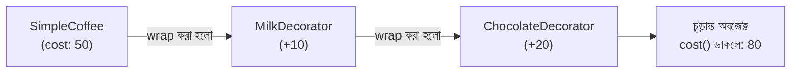

# ২২.০৬. Decorator Pattern

এই মডিউলের শেষ প্যাটার্নটা সবচেয়ে গুরুত্বপূর্ণ, কারণ এটা সরাসরি আমাদের পরের মডিউলের (Module 23, FastAPI) দরজা খুলে দেবে — আর এটাই সেই জায়গা যেখানে সবচেয়ে বেশি ভুল বোঝাবুঝি হয়। Decorator Pattern হলো Structural Pattern পরিবারের সদস্য — মনে আছে প্রথম লেসনে আমরা বলেছিলাম Structural Pattern সমাধান করে "একাধিক ক্লাস বা অবজেক্টকে কীভাবে একসাথে গঠন করবো" প্রশ্নটা।

শুরুতেই একটা কথা স্পষ্ট করে নেয়া দরকার, কারণ এই লেসনের পুরোটাই এই একটা বিভ্রান্তি এড়ানোর উপর দাঁড়িয়ে আছে। Python-এ `@` চিহ্ন দিয়ে যে সিনট্যাক্স তুমি লেখো (যেমন `@app.get("/orders")`), তাকে সাধারণত "decorator" বলা হয় — আর GoF-এর ২৩টা design pattern-এর একটার নামও **Decorator Pattern**। নাম একই, কিন্তু এই দুটো আসলে **দুটো সম্পূর্ণ ভিন্ন স্তরের ধারণা**:

- Python-এর `@` সিনট্যাক্স হলো একটা **ভাষা-স্তরের ফিচার** (language feature) — একটা ফাংশন বা মেথডকে সিনট্যাক্টিক শর্টকাট দিয়ে অন্য একটা ফাংশনের ভেতরে wrap করে দেয়া।
- GoF Decorator Pattern হলো একটা **OOP ডিজাইন-স্তরের কৌশল** (design technique) — একটা অবজেক্টকে আরেকটা অবজেক্টের ভেতরে wrap করা, যেখানে wrapper আর wrapped অবজেক্ট দুটোই একই ইন্টারফেস/চুক্তি মেনে চলে।

দুটোই "মূল কোড স্পর্শ না করে বাইরে থেকে অতিরিক্ত আচরণ যুক্त করা" এই একই দর্শনের উপর দাঁড়িয়ে, আর সেই কারণেই নামটা একই — কিন্তু একটা ভাষার ব্যাকরণ, আরেকটা একটা প্যাটার্ন যা তুমি যেকোনো OOP ভাষায় (এমনকি এমন ভাষায় যার `@` সিনট্যাক্স নেই) হাতে লিখে প্রয়োগ করতে পারো। চলো দুটোকেই আলাদা আলাদা কোড দিয়ে দেখি, যাতে পার্থক্যটা মাথায় স্থায়ীভাবে গেঁথে যায়।

## প্রথমে GoF Decorator Design Pattern — অবজেক্ট wrap করা

চলো একটা সমস্যা দিয়ে শুরু করি। ধরো তোমার একটা `Coffee` ক্লাস আছে, যেটার একটা `cost()` মেথড আছে যা দাম হিসাব করে।

```python
class Coffee:
    def cost(self) -> float:
        return 50

    def description(self) -> str:
        return "Coffee"
```

এখন কাস্টমার চাইলে কফির সাথে দুধ, চিনি, চকলেট যোগ করতে পারবে, প্রতিটার আলাদা দাম আছে। প্রথম যে ধারণাটা মাথায় আসতে পারে সেটা হলো Inheritance ব্যবহার করা (Module 13):

```python
class CoffeeWithMilk(Coffee):
    def cost(self) -> float:
        return super().cost() + 10


class CoffeeWithMilkAndSugar(CoffeeWithMilk):
    def cost(self) -> float:
        return super().cost() + 5


class CoffeeWithMilkAndSugarAndChocolate(CoffeeWithMilkAndSugar):
    def cost(self) -> float:
        return super().cost() + 20
```

এখানেই সমস্যাটা স্পষ্ট হয়ে ওঠে — প্রতিটা সম্ভাব্য কম্বিনেশনের জন্য (শুধু দুধ, শুধু চিনি, দুধ+চকলেট, চিনি+চকলেট...) আলাদা আলাদা ক্লাস লাগবে। কম্বিনেশনের সংখ্যা দ্রুত বিস্ফোরিত হয়ে যায় — একে বলে **class explosion**। Inheritance এখানে ভুল টুল, কারণ Inheritance ভালো কাজ করে যখন সম্পর্কটা "is-a" (একটা VIP কাস্টমার "is a" কাস্টমার), কিন্তু "কফির সাথে দুধ যোগ করা" আসলে "is-a" সম্পর্ক না, এটা "has additional feature" সম্পর্ক।

Decorator Pattern এই সমস্যার সমাধান দেয় একটা ভিন্ন কৌশলে — নতুন ক্লাসের স্তূপ বানানোর বদলে, প্রতিটা "যোগ-সংযোজন"-কে (add-on) একটা অবজেক্টের চারপাশে "মুড়িয়ে" (wrap) দেয়া হয়, প্রতিটা wrapper মূল অবজেক্টের কাজের উপর নিজের কিছু যোগ করে।

```python
from typing import Protocol


class CoffeeItem(Protocol):
    def cost(self) -> float: ...
    def description(self) -> str: ...


class SimpleCoffee:
    def cost(self) -> float:
        return 50

    def description(self) -> str:
        return "Coffee"


# Base Decorator — একই চুক্তি মেনে চলে, কিন্তু ভেতরে আরেকটা CoffeeItem রাখে (wrap করে)
class CoffeeDecorator:
    def __init__(self, wrapped: CoffeeItem):
        self.wrapped = wrapped

    def cost(self) -> float:
        return self.wrapped.cost()

    def description(self) -> str:
        return self.wrapped.description()


class MilkDecorator(CoffeeDecorator):
    def cost(self) -> float:
        return self.wrapped.cost() + 10

    def description(self) -> str:
        return self.wrapped.description() + " + Milk"


class SugarDecorator(CoffeeDecorator):
    def cost(self) -> float:
        return self.wrapped.cost() + 5

    def description(self) -> str:
        return self.wrapped.description() + " + Sugar"


class ChocolateDecorator(CoffeeDecorator):
    def cost(self) -> float:
        return self.wrapped.cost() + 20

    def description(self) -> str:
        return self.wrapped.description() + " + Chocolate"


# এখন যেকোনো কম্বিনেশন, রানটাইমে, নতুন ক্লাস ছাড়াই বানানো যাচ্ছে
order: CoffeeItem = SimpleCoffee()
order = MilkDecorator(order)
order = ChocolateDecorator(order)

print(order.description())  # Coffee + Milk + Chocolate
print(order.cost())  # 80
```

লক্ষ্য করো, প্রতিটা Decorator নিজেও `CoffeeItem` চুক্তি মেনে চলে, আর ভেতরে একটা `CoffeeItem`-কে ধরে রাখে (wrap করে)। এভাবে একটা Decorator-কে আরেকটা Decorator-এর ভেতরে বসানো যায়, স্তরে স্তরে (layer by layer), ঠিক যেমন পেঁয়াজের খোসা একটার পর একটা স্তর তৈরি করে। কোনো নতুন ক্লাস তৈরি না করেই আমরা যেকোনো কম্বিনেশন বানাতে পারছি — শুধু কোন কোন Decorator দিয়ে মুড়াবো (wrap) সেই সিদ্ধান্ত নিলেই হয়। এখানে **কোনো `@` সিনট্যাক্স ব্যবহার হয়নি** — এটা পুরোপুরি সাধারণ ক্লাস-কনস্ট্রাক্টর দিয়ে অবজেক্ট wrap করে তৈরি করা একটা ডিজাইন-প্যাটার্ন, তুমি চাইলে এই একই কৌশল C++ বা Java-তেও হুবহু লিখতে পারবে, যেখানে এরকম `@` সিনট্যাক্স নেই।



## এখন Python-এর `@` সিনট্যাক্স — ফাংশন wrap করা

Python ভাষাটা নিজেই একটা বিশেষ সিনট্যাক্স দেয় — `@` চিহ্ন দিয়ে শুরু হওয়া decorator — যা একই মূল নীতির উপর দাঁড়িয়ে (মূল কোড না বদলে চারপাশে অতিরিক্ত আচরণ "মুড়িয়ে" দেয়া), কিন্তু কাজ করে **ফাংশনের** উপর, ক্লাসের অবজেক্টের উপর নয়। একটা সহজ উদাহরণ দেখা যাক, যেখানে আমরা একটা ফাংশন কল হওয়ার আগে-পরে লগ করার আচরণ যোগ করছি, মূল ফাংশনের কোড স্পর্শ না করেই:

```python
import functools


def log_execution(func):
    @functools.wraps(func)
    def wrapper(*args, **kwargs):
        print(f"Calling {func.__name__} with {args}")
        result = func(*args, **kwargs)
        print(f"{func.__name__} returned {result}")
        return result
    return wrapper


class OrderService:
    @log_execution
    def place_order(self, item: str) -> str:
        return f"Order placed for {item}"


service = OrderService()
service.place_order("Laptop")
# Calling place_order with (<OrderService ...>, 'Laptop')
# place_order returned Order placed for Laptop
```

এখানে `@log_execution` হলো একটা ফাংশন-ভিত্তিক Python decorator, যেটা `place_order`-এর আসল কোড না বদলে, তাকে একটা "wrapper" ফাংশন দিয়ে মুড়িয়ে দিচ্ছে (ঠিক যেমন আমরা কফিকে wrap করেছিলাম উপরে) — কিন্তু এবার wrap হচ্ছে একটা **ফাংশন**, কোনো ক্লাসের অবজেক্ট না, আর `functools.wraps` ব্যবহার করা হয়েছে যাতে `wrapper`-টা মূল ফাংশনের নাম-ডকস্ট্রিং ধরে রাখে (এটা না করলে ডিবাগিং, introspection, আর FastAPI-এর মতো ফ্রেমওয়ার্কে সমস্যা হয়)। এটাই Decorator ধারণার সবচেয়ে আধুনিক, ভাষা-সমর্থিত রূপ, কিন্তু কাঠামোগতভাবে এটা GoF-এর Decorator Pattern থেকে আলাদা — এখানে কোনো "একই ইন্টারফেস মেনে চলা একাধিক অবজেক্ট" নেই, বরং একটা ফাংশনকে আরেকটা ফাংশনের ভেতরে ঢুকিয়ে ফেলা হচ্ছে, আর ভাষা নিজেই `@` সিনট্যাক্স দিয়ে সেই wrapping-টাকে সহজ করে দিয়েছে।

দুটো ধারণা পাশাপাশি রাখলে পার্থক্যটা আরও স্পষ্ট হয়:

| বিষয় | GoF Decorator Design Pattern | Python `@` Decorator Syntax |
|---|---|---|
| কী wrap হয় | একটা **অবজেক্ট** (instance) | একটা **ফাংশন/মেথড** |
| চুক্তি | wrapper আর wrapped একই ইন্টারফেস/Protocol মেনে চলে | কোনো বাধ্যতামূলক ইন্টারফেস নেই, শুধু একটা ফাংশন আরেকটা ফাংশন রিটার্ন করে |
| কম্পোজিশন | রানটাইমে একাধিক decorator স্তরে স্তরে wrap করা যায় (`MilkDecorator(SugarDecorator(coffee))`) | একাধিক `@decorator` একটার পর একটা বসানো যায়, উপর থেকে নিচে প্রয়োগ হয় |
| ভাষা-নির্ভরতা | কোনো ভাষা-নির্দিষ্ট সিনট্যাক্স লাগে না, হাতে লেখা যায় | Python-এর নিজস্ব সিনট্যাক্স ফিচার (`@`) |
| উদাহরণ | `CoffeeItem`, payment-processor wrapping, logging-wrapper অবজেক্ট | `@app.get()`, `@functools.lru_cache`, `@property` |

এখন Module 23-এর জন্য একটা গুরুত্বপূর্ণ প্রস্তুতি নিয়ে নিই। FastAPI ফ্রেমওয়ার্ক, যেটা আমরা পরের মডিউলে শিখবো, ব্যাপকভাবে এই Python `@` decorator সিনট্যাক্সের উপর দাঁড়িয়ে। যখন তুমি লিখবে:

```python
from fastapi import FastAPI

app = FastAPI()


@app.get("/orders")
def find_all():
    return "all orders"
```

তখন `@app.get("/orders")` আসলে `find_all` ফাংশনটাকে রেজিস্টার করে দিচ্ছে FastAPI-এর internal রুটিং টেবিলে — এটা ফ্রেমওয়ার্ককে বলে দিচ্ছে "এই ফাংশনটা `/orders`-এ আসা GET রিকোয়েস্ট হ্যান্ডেল করবে।" মূল ফাংশনের যুক্তি (logic) স্পর্শ না করেই, decorator দিয়ে আমরা তার উপর অতিরিক্ত মেটাডেটা আর আচরণ চাপিয়ে দিচ্ছি — এটা Python-এর ভাষা-স্তরের `@` সিনট্যাক্সের প্রয়োগ, GoF-এর Decorator Design Pattern না (এখানে কোনো "অবজেক্ট wrap করা" ঘটছে না, বরং একটা ফাংশনকে রেজিস্ট্রি-তে রেকর্ড করা হচ্ছে)। এই পার্থক্যটা ইন্টারভিউতে স্পষ্টভাবে বলতে পারলে বোঝা যায় তুমি শুধু সিনট্যাক্স চেনো না, ভেতরের ধারণাগুলোও বোঝো।

**একটা প্রোডাকশন কমন মিসটেক:** যখন তুমি নিজে একটা কাস্টম `@` decorator লিখবে (উপরের `log_execution`-এর মতো), সবচেয়ে সাধারণ ভুল হলো `functools.wraps` ব্যবহার করতে ভুলে যাওয়া। এটা ভুলে গেলে `wrapper` ফাংশনটা মূল ফাংশনের `__name__`, `__doc__`, আর সিগনেচার হারিয়ে ফেলে — ডিবাগারে, স্ট্যাক ট্রেসে সব জায়গায় ফাংশনের নাম দেখাবে `wrapper`, `place_order` না। আরও গুরুত্বপূর্ণ, FastAPI নিজেই রুট হ্যান্ডলারের প্যারামিটার সিগনেচার পড়ে dependency আর request body বুঝে নেয় (Module 23-এ যা দেখবো) — যদি তোমার কাস্টম decorator সিগনেচার আড়াল করে ফেলে, FastAPI ভুল ইনফরমেশন পাবে আর runtime-এ অদ্ভুত, খুঁজে বের করা কঠিন বাগ তৈরি হবে। তাই যেকোনো ফাংশন-wrapping decorator লিখলে `@functools.wraps(func)` লেখাটা কখনোই ঐচ্ছিক ভাবা উচিত না।

Decorator Pattern (দুই রূপেই) দিয়ে আমরা এই মডিউলের সব প্যাটার্ন এক সুতোয় গেঁথে ফেললাম — Dependency Injection বলে দেয় dependency বাইরে থেকে আসবে, Factory Pattern বলে দেয় সেই dependency কীভাবে তৈরি হবে, Strategy Pattern বলে দেয় আচরণ কীভাবে অদলবদল হবে, আর Decorator (design pattern এবং ভাষার সিনট্যাক্স, দুই রূপেই) বলে দেয় কীভাবে মূল কোড স্পর্শ না করে তার উপর অতিরিক্ত ক্ষমতা যোগ করা যায়। এই চারটা ধারণা একসাথে মিলেই তৈরি হয়েছে আধুনিক এন্টারপ্রাইজ ব্যাকএন্ড ফ্রেমওয়ার্কের ভিত্তি। পরের মডিউলে আমরা দেখবো কীভাবে FastAPI এই সব তত্ত্বকে একটা সুসংগঠিত, বাস্তব, প্রোডাকশন-রেডি ফ্রেমওয়ার্কে রূপান্তরিত করেছে।
