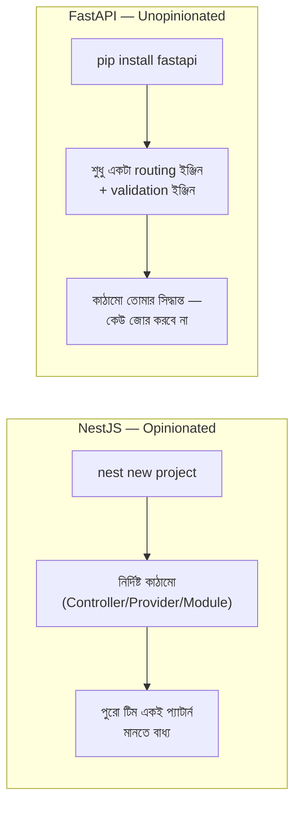

# ২৩.০১. FastAPI Intro — Enterprise Application-এর দৃষ্টিকোণ থেকে

Module 4-এ আমরা FastAPI-এর সাথে প্রথম পরিচিত হয়েছিলাম — একটা `@app.get("/")` decorator লিখেই একটা রুট চলে গিয়েছিল। কিন্তু সেই সময় আমরা প্রশ্নটা করিনি: যখন এই একই প্রজেক্টে পঞ্চাশটা রুট, দশটা ডেটাবেজ মডেল, আর পাঁচজন ডেভেলপার একসাথে কাজ করবে, তখন কী হবে? এই মডিউলে আমরা ঠিক সেই প্রশ্নের উত্তর খুঁজবো — কীভাবে FastAPI-কে একটা "enterprise-grade" অ্যাপ্লিকেশনের কাঠামোতে সাজানো যায়।

এই প্রশ্নের উত্তর দেয়ার আগে একটা জিনিস স্পষ্ট করে নেয়া জরুরি, কারণ এখানেই NestJS আর FastAPI-এর সবচেয়ে মৌলিক দার্শনিক পার্থক্য। NestJS হলো **opinionated** ফ্রেমওয়ার্ক — এটা তোমাকে বলে দেয় ফাইল কোথায় থাকবে, ক্লাসের নাম কী হবে, কোন decorator কোথায় লাগবে। `nest new` চালালেই একটা পূর্ণাঙ্গ, প্রমাণিত কাঠামো হাতে চলে আসে। FastAPI ঠিক তার বিপরীত মেরুতে দাঁড়িয়ে আছে — এটা **unopinionated**। FastAPI নিজে শুধু একটা জিনিসের নিশ্চয়তা দেয়: তুমি যদি একটা ফাংশনকে `@app.get()` দিয়ে সাজিয়ে দাও, সেটা HTTP রিকোয়েস্ট হ্যান্ডেল করবে, আর টাইপ হিন্ট থেকে অটোমেটিক ভ্যালিডেশন আর ডকুমেন্টেশন তৈরি হবে। এর বাইরে — ফোল্ডার কীভাবে সাজাবে, বিজনেস লজিক কোথায় রাখবে, ডেটাবেজ কল কীভাবে সংগঠিত করবে — এসবের কোনো "official" উত্তর FastAPI দেয় না। `fastapi new` নামের কোনো কমান্ডই নেই।

প্রথম শোনায় এটা FastAPI-এর একটা দুর্বলতা মনে হতে পারে — "কাঠামো নেই" মানে কি বিশৃঙ্খলা? বাস্তবে ব্যাপারটা একটা **trade-off**, ঠিক ভুল কোনোটাই নয়। NestJS-এর opinionated কাঠামোর সুবিধা হলো consistency — যেকোনো NestJS প্রজেক্টে ঢুকলে তুমি জানো কোথায় কী পাবে। কিন্তু এর দাম হলো flexibility-র ঘাটতি — যদি তোমার প্রজেক্টের প্রয়োজন NestJS-এর ধরে নেয়া প্যাটার্নের সাথে না মেলে (যেমন তুমি DI Container ছাড়া হালকা কিছু বানাতে চাও, বা একটা মাইক্রোসার্ভিস যেখানে মডিউল সিস্টেমের পুরো ওভারহেড অপ্রয়োজনীয়), তখন NestJS-এর কাঠামোর সাথে লড়াই করতে হয়। FastAPI ঠিক উল্টো ট্রেড-অফ দেয় — তুমি ঠিক যেই কাঠামো চাও, সেটাই বানাতে পারো, কোনো framework-imposed সীমাবদ্ধতা নেই, কিন্তু এই স্বাধীনতার দায়িত্বটাও তোমার টিমের ঘাড়ে এসে পড়ে।

এখানেই আসল **production nuance** — FastAPI-এর এই "কাঠামোহীনতা" একটা বাস্তব বিপদ তৈরি করে যেটা অনেক টিম শুরুতে বুঝতে পারে না। একটা তিন-চারজনের টিম যখন FastAPI-এ প্রথম প্রজেক্ট শুরু করে, প্রথম দুই সপ্তাহ সবকিছু সুন্দর চলে, কারণ কোড কম, সবাই সব ফাইল চেনে। কিন্তু ছয় মাস পরে, যখন কোডবেস বড় হয়ে যায়, দেখা যায় একজন ডেভেলপার ডেটাবেজ কল সরাসরি রুট ফাংশনের ভেতরে লিখেছে, আরেকজন `utils.py` নামের একটা ফাইলে সবকিছু জমা করেছে, তৃতীয়জন নিজের একটা `helpers/` ফোল্ডার বানিয়ে ফেলেছে — কারণ FastAPI কখনো বলেনি এসব "ভুল"। NestJS-এ এই সমস্যাটা framework নিজেই আটকে দিতো (কারণ `@Controller()` ছাড়া কোনো ফাইল "controller" হিসেবে গণ্যই হতো না), কিন্তু FastAPI-এ এই শৃঙ্খলা রক্ষা করার দায়িত্ব সম্পূর্ণভাবে টিমের — কনভেনশন ডকুমেন্ট, কোড রিভিউ, আর লিড ইঞ্জিনিয়ারের সিদ্ধান্তের উপর নির্ভর করে।

তাই এই পুরো মডিউলের মূল লক্ষ্য একটাই — যেহেতু FastAPI নিজে থেকে কোনো কাঠামো দেয় না, আমরা নিজেরাই এমন একটা কাঠামো তৈরি করবো যা NestJS-এর Controller-Provider-Module প্যাটার্নের সমান শৃঙ্খলা দেয়, কিন্তু Python-এর নিজস্ব ভাষায়। আমরা দেখবো কোন লাইব্রেরিগুলো NestJS-এর built-in সুবিধার জায়গা পূরণ করে (Lesson 2), কীভাবে একটা প্রোডাকশন-শেপড প্রজেক্ট স্ক্যাফোল্ড করতে হয় (Lesson 3), একটা নির্দিষ্ট, রিকমেন্ডেড ফোল্ডার কাঠামো (Lesson 4), আর তারপর NestJS-এর তিনটা মূল বিল্ডিং ব্লকের FastAPI-সমতুল্য — Router (Lesson 5), Dependency/Service (Lesson 6), আর Feature Module (Lesson 7)।

একটা কথা মনে রাখা জরুরি — এই কাঠামো FastAPI নিজে চাপিয়ে দেয়নি, এটা **community convention**। এর মানে হলো তুমি যে প্রজেক্টে গিয়ে কাজ করবে, সেখানে হয়তো একটু আলাদা নামকরণ বা সাজানো দেখতে পাবে — `routers/` কে কেউ `api/` বলে, `services/`-কে কেউ `logic/` বলে। কিন্তু অন্তর্নিহিত দর্শনটা একই থাকে — routing-এর দায়িত্ব, বিজনেস লজিকের দায়িত্ব, আর ডেটা-শেপের (schema) দায়িত্ব আলাদা রাখা। এই দর্শনটা বুঝে গেলে, তুমি যেকোনো FastAPI কোডবেসে দ্রুত মানিয়ে নিতে পারবে, ঠিক যেমন NestJS-এর কাঠামো জানা থাকলে যেকোনো NestJS প্রজেক্টে দ্রুত পথ খুঁজে নিতে পারো — শুধু পার্থক্য হলো, FastAPI-এ এই "মানানো"টা framework না করে টিমকেই করতে হয়।

পরের লেসনে আমরা FastAPI-এর চারপাশের ইকোসিস্টেম দেখবো — কোন লাইব্রেরিগুলো একসাথে মিলে সেই কাঠামোটা বাস্তবায়ন করার হাতিয়ার হয়ে দাঁড়ায়।
