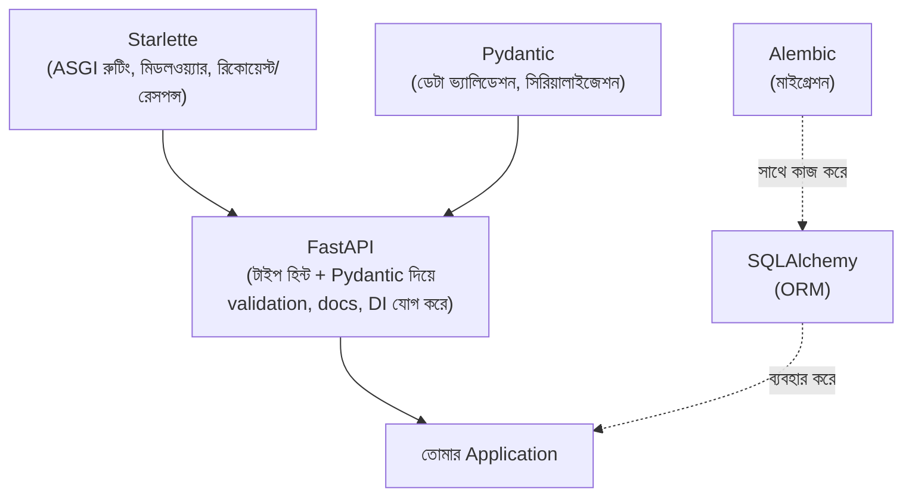

# ২৩.০২. Introduction to the FastAPI Ecosystem

আগের লেসনে আমরা বলেছিলাম FastAPI নিজে একটা হালকা, unopinionated framework — এটা শুধু routing আর validation ইঞ্জিন দেয়। কিন্তু একটা বাস্তব enterprise অ্যাপ্লিকেশনে দরকার হয় আরও অনেক কিছু — ডেটাবেজ সংযোগ, মাইগ্রেশন, কনফিগারেশন ম্যানেজমেন্ট, অথেন্টিকেশন। NestJS-এ এই সব সুবিধা `@nestjs/` প্রিফিক্স দিয়ে "অফিসিয়াল" প্যাকেজ হিসেবে আসে। FastAPI-এর দুনিয়ায় এই একই কাজগুলো করে ভিন্ন ভিন্ন, স্বতন্ত্র লাইব্রেরি, যাদের কেউই FastAPI-এর মালিকানায় নেই — এটাই সেই "unopinionated" দর্শনের সরাসরি ফলাফল।

চলো একটা ম্যাপিং টেবিল বানাই, যেন NestJS থেকে যারা আসছো তাদের জন্য এই ইকোসিস্টেমটা পরিচিত মনে হয়:

| কাজ | NestJS-এ | FastAPI-এ |
|---|---|---|
| Core framework | `@nestjs/core`, `@nestjs/common` | `fastapi` (যেটা ভেতরে **Starlette**-এর উপর তৈরি) |
| Request/Response ইঞ্জিন | Express.js বা Fastify (platform adapter) | **Starlette** (ASGI toolkit) |
| Data validation ও serialization | class-validator, class-transformer | **Pydantic** |
| Database ORM | TypeORM, Prisma, Mongoose | **SQLAlchemy** (relational), **Beanie**/Motor (MongoDB) |
| Migration | TypeORM migration, Prisma Migrate | **Alembic** |
| CLI/scaffolding | `@nestjs/cli` | কোনো অফিসিয়াল সমতুল্য নেই (community টেমপ্লেট, cookiecutter) |
| Config ম্যানেজমেন্ট | `@nestjs/config` | Pydantic-এর `BaseSettings` (pydantic-settings) |
| Auth | `@nestjs/passport`, `@nestjs/jwt` | `python-jose`, `passlib`, বা FastAPI-এর নিজস্ব `OAuth2PasswordBearer` |
| API ডকুমেন্টেশন | `@nestjs/swagger` | **বিল্ট-ইন** — স্বয়ংক্রিয় Swagger/OpenAPI |

প্রথমে **Starlette**-এর কথা বলি, কারণ এটা বোঝাটা গুরুত্বপূর্ণ — FastAPI আসলে Starlette-এর উপর তৈরি একটা "layer"। Starlette হলো একটা লো-লেভেল ASGI (Asynchronous Server Gateway Interface) টুলকিট, যা routing, middleware, WebSocket সাপোর্ট — এসব মৌলিক জিনিস দেয়। FastAPI নিজে এই সবকিছুর উপর টাইপ হিন্ট-ভিত্তিক validation আর automatic documentation যোগ করে। এটা ঠিক সেই সম্পর্কের মতো যেটা NestJS-এর `@nestjs/platform-express`-এর সাথে Express.js-এর — NestJS ভেতরে ভেতরে Express চালায়, নিজের উপরে একটা কাঠামো বসিয়ে দেয়। এখানেও তাই — FastAPI নিজে HTTP পার্সিং পুনরায় লেখেনি, Starlette-এর উপরেই একটা "ergonomic layer" বসিয়েছে।

দ্বিতীয় গুরুত্বপূর্ণ খেলোয়াড় **Pydantic** — এটা NestJS-এর `class-validator`/`class-transformer`-এর সমতুল্য, কিন্তু আসলে তার চেয়ে বেশি কেন্দ্রীয় ভূমিকা রাখে। FastAPI-এর পুরো "ম্যাজিক" — কেন একটা ফাংশনের প্যারামিটারে `item: OrderSchema` লিখলেই automatic validation আর automatic docs তৈরি হয়ে যায় — তার পেছনে সম্পূর্ণ কৃতিত্ব Pydantic-এর। এটা এতটাই কেন্দ্রীয় যে FastAPI-কে অনেকে "Starlette + Pydantic-এর একটা সুন্দর সমন্বয়" বলেও বর্ণনা করে।

**SQLAlchemy** আর **Alembic** নিয়ে একটা গুরুত্বপূর্ণ পার্থক্য মনে রাখা দরকার — NestJS-এ `@nestjs/typeorm` নিজে ORM-কে NestJS-এর DI সিস্টেমের সাথে "wrap" করে দেয়, ফলে `@InjectRepository()`-এর মতো decorator পাওয়া যায়। FastAPI-এ এমন কোনো অফিসিয়াল "wrapping" নেই — SQLAlchemy পুরোপুরি একটা স্বতন্ত্র লাইব্রেরি, যেটা তুমি নিজেই dependency injection সিস্টেমের (Lesson 6-এ যা দেখবো) সাথে জুড়ে দিতে হবে। এটাও সেই "unopinionated" দর্শনের প্রতিফলন — Python জগতে ORM বেছে নেয়ার স্বাধীনতা তোমার (SQLAlchemy, Tortoise ORM, বা SQLModel — যেটা FastAPI-এর স্রষ্টা নিজেই SQLAlchemy আর Pydantic মিলিয়ে বানিয়েছেন)।

এখানে একটা বাস্তব **common mistake** উল্লেখ করা জরুরি — অনেক নতুন FastAPI ডেভেলপার SQLAlchemy মডেল আর Pydantic schema-কে একই ক্লাস মনে করে গুলিয়ে ফেলে, কারণ দুটোই ক্লাস-ভিত্তিক আর দুটোতেই ফিল্ড ডিফাইন করা হয়। কিন্তু এই দুটো সম্পূর্ণ ভিন্ন উদ্দেশ্যে কাজ করে — SQLAlchemy মডেল ডেটাবেজ টেবিলের সাথে ম্যাপ হয় (এটা "persistence layer"), আর Pydantic schema API-এর ইনপুট/আউটপুট শেপ ডিফাইন করে (এটা "presentation layer")। এই দুটো এক করে ফেললে একটা বিপজ্জনক সমস্যা হয় — ডেটাবেজের সব কলাম (যেমন `hashed_password`) সরাসরি API রেসপন্সে চলে যাওয়ার ঝুঁকি থাকে, কারণ কোনো আলাদা "ফিল্টারিং লেয়ার" নেই। প্রোডাকশন কোডে তাই সবসময় দুটো আলাদা ক্লাস রাখা হয় — `models.py`-তে SQLAlchemy মডেল, `schemas.py`-তে Pydantic schema — আর দুটোর মধ্যে স্পষ্টভাবে কনভার্সন করা হয়। আমরা এটা Lesson 4-এ ফোল্ডার স্ট্রাকচারে বিস্তারিত দেখবো।

**CLI/scaffolding** সারিটাতে লক্ষ্য করো — এখানে ফাঁকা জায়গা আছে। NestJS-এর `@nestjs/cli` যেভাবে `nest generate controller` চালিয়ে ফাইল আর তার module-registration একসাথে করে দেয়, FastAPI-এর কোনো অফিসিয়াল সমতুল্য টুল নেই। এটা ছোট মনে হলেও এর একটা বাস্তব প্রভাব আছে — নতুন ফিচার শুরু করার সময় ফাইল বানানো, ফোল্ডার সাজানো, রাউটার রেজিস্টার করা — এই সবকিছু ম্যানুয়ালি করতে হয়, আর এখানেই টিমের কনভেনশন মেনে চলার শৃঙ্খলা সবচেয়ে বেশি পরীক্ষিত হয়। পরের লেসনে আমরা হাতে-কলমে এই স্ক্যাফোল্ডিং প্রক্রিয়াটা শুরু করবো।
