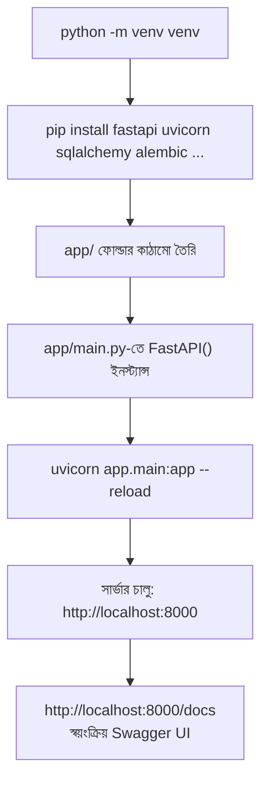

# ২৩.০৩. Running a Production-Shaped FastAPI Project

আগের লেসনে আমরা দেখলাম NestJS-এর মতো `nest new` কমান্ডের কোনো অফিসিয়াল সমতুল্য FastAPI-তে নেই। তাই এই লেসনে আমরা একটা প্রজেক্ট **ম্যানুয়ালি**, কিন্তু একটা প্রোডাকশন-শেপড কাঠামো মাথায় রেখে স্ক্যাফোল্ড করবো। মনে করো আমরা আগের মডিউলের `order-management-api`-এর FastAPI সংস্করণ বানাচ্ছি।

প্রথমে একটা virtual environment বানানো, যেটা Node.js-এর জগতে `node_modules`-এর ধারণার কাছাকাছি — প্রতিটা প্রজেক্টের নিজস্ব, আলাদা dependency জগত থাকা উচিত:

```bash
mkdir order-management-api && cd order-management-api
python -m venv venv
source venv/bin/activate   # Windows-এ: venv\Scripts\activate
```

এখন প্রয়োজনীয় প্যাকেজগুলো ইনস্টল করি — লক্ষ্য করো, এই প্রতিটা প্যাকেজ আগের লেসনের ইকোসিস্টেম টেবিলের একটা এন্ট্রি:

```bash
pip install fastapi uvicorn[standard] sqlalchemy alembic pydantic-settings python-dotenv
```

`fastapi` আর `sqlalchemy` কেন লাগবে সেটা আগের লেসনে বুঝেছি। কিন্তু **`uvicorn`** নামের নতুন জিনিসটা লক্ষ্য করো — এটা একটা ASGI সার্ভার, যেটা তোমার FastAPI অ্যাপ্লিকেশনটাকে আসলে "চালায়"। এটা অনেকটা Node.js-এর জগতে Express অ্যাপ চালানোর জন্য দরকারি `http` সার্ভারের মতো — পার্থক্য হলো Node.js-এ `http.createServer()` বিল্ট-ইন, কিন্তু Python-এর ASGI দুনিয়ায় FastAPI নিজে সার্ভার চালায় না, একটা আলাদা ASGI সার্ভার (uvicorn, বা প্রোডাকশনে gunicorn+uvicorn worker) এই কাজটা করে। এটাই একটা গুরুত্বপূর্ণ **production nuance** — ডেভেলপমেন্টে `uvicorn main:app --reload` দিয়ে সরাসরি চালানো যায়, কিন্তু বাস্তব প্রোডাকশনে সাধারণত `gunicorn` দিয়ে একাধিক `uvicorn` worker প্রসেস চালানো হয়, যাতে একাধিক CPU কোর ব্যবহার করা যায় — কারণ একটা একক uvicorn প্রসেস single-threaded event loop-এর মতো কাজ করে, এবং CPU-bound কাজে multi-core ব্যবহার না করলে পারফরম্যান্স ভুগবে।

`requirements.txt` ফাইলটা বানানো, যেটা NestJS-এর `package.json`-এর dependency তালিকার সমতুল্য:

```bash
pip freeze > requirements.txt
```

এখন প্রজেক্টের একটা প্রাথমিক কাঠামো বানাই (পরের লেসনে আমরা এটা আরও বিস্তারিত করবো):

```bash
mkdir -p app/routers app/services app/models app/schemas app/core
touch app/__init__.py app/main.py
```

`app/main.py`-তে একটা সাধারণ entry point লিখি, যেটা NestJS-এর `main.ts`-এর সমান্তরাল ভূমিকা রাখে:

```python
from fastapi import FastAPI

app = FastAPI(title="Order Management API")

@app.get("/")
def health_check():
    return {"status": "ok"}
```

সার্ভার চালাই:

```bash
uvicorn app.main:app --reload
```

`--reload` ফ্ল্যাগটা লক্ষ্য করো — এটাই NestJS-এর `start:dev`-এর সমতুল্য watch mode। কোড পরিবর্তন করে সেভ করলেই সার্ভার নিজে থেকে রিস্টার্ট হয়ে যাবে। এখানে একটা গুরুত্বপূর্ণ **production mistake** এড়িয়ে যাওয়া দরকার — অনেকে `--reload` ফ্ল্যাগটা প্রোডাকশন ডেপ্লয়মেন্ট স্ক্রিপ্টেও রেখে দেয়, "ভুলে" অথবা কপি-পেস্ট করার কারণে। এটা বিপজ্জনক, কারণ `--reload` মোড ফাইল সিস্টেম পর্যবেক্ষণ করার জন্য অতিরিক্ত রিসোর্স খরচ করে আর একাধিক worker প্রসেসের সাথে সঠিকভাবে কাজ করে না — প্রোডাকশনে সবসময় `--reload` ছাড়া, আর একাধিক worker সহ চালানো উচিত (`uvicorn app.main:app --workers 4`, বা gunicorn-এর মাধ্যমে)।



সার্ভার চালু হলে ব্রাউজারে `http://localhost:8000/docs`-এ গেলে একটা সম্পূর্ণ, ইন্টারেক্টিভ Swagger UI দেখা যাবে — এটা NestJS-এ পাওয়ার জন্য আলাদাভাবে `@nestjs/swagger` ইনস্টল আর কনফিগার করতে হতো, FastAPI-এ এটা সম্পূর্ণ বিল্ট-ইন, কোনো অতিরিক্ত কাজ ছাড়াই। এটা একটা জায়গা যেখানে FastAPI-এর "batteries included" সিদ্ধান্ত NestJS-এর চেয়ে এগিয়ে।

একটা প্রশ্ন হতে পারে — যদি FastAPI-এর কোনো অফিসিয়াল CLI না থাকে, তাহলে টিমে সবাই কীভাবে একই কাঠামো থেকে শুরু করবে? বাস্তব প্রোডাকশন টিমগুলো এই সমস্যার সমাধান করে একটা **কুকিকাটার টেমপ্লেট** (cookiecutter) বা একটা "প্রজেক্ট স্টার্টার রিপোজিটরি" রেখে দিয়ে — যেটা নিজেরা একবার বানিয়ে রাখে, আর প্রতিটা নতুন প্রজেক্ট শুরু হয় সেই টেমপ্লেট কপি করে। এটাই সেই দায়িত্ব, যা NestJS-এ ফ্রেমওয়ার্ক নিজে নিতো, কিন্তু FastAPI-এ টিমের নিজে তৈরি করে নিতে হয়। পরের লেসনে আমরা ঠিক সেই টেমপ্লেটের বিস্তারিত ফোল্ডার কাঠামো, আর প্রতিটা ফোল্ডারের যুক্তি নিয়ে আলোচনা করবো।
