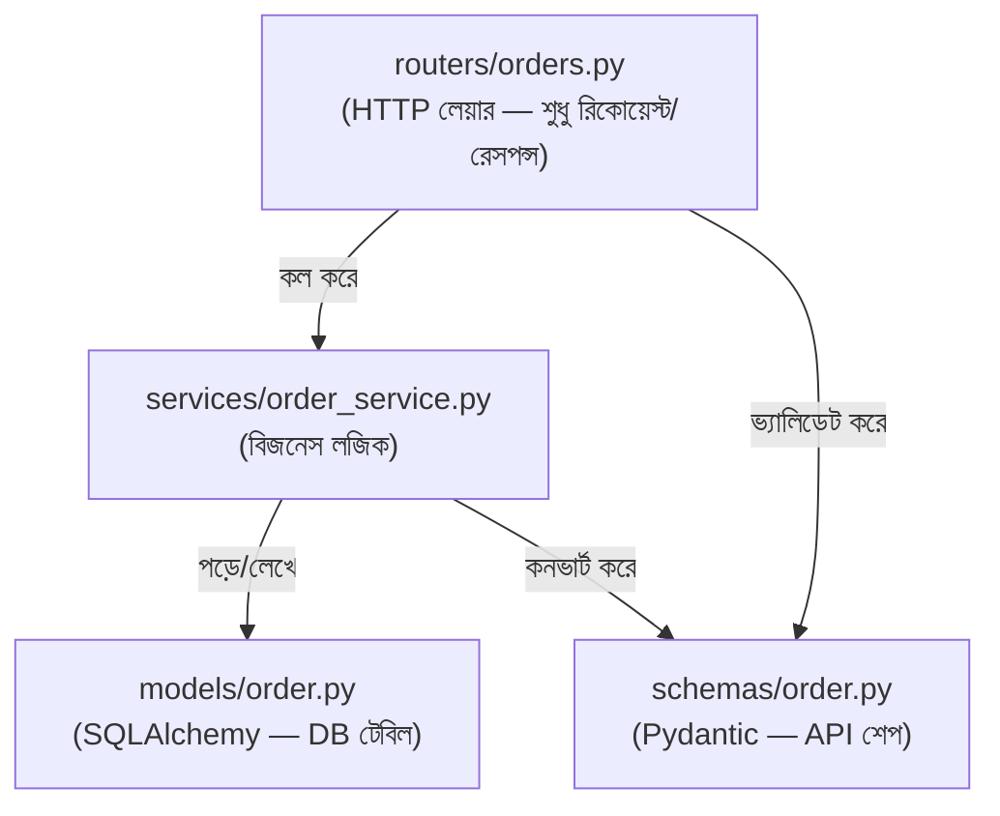

# ২৩.০৪. Files and Folder Structures

আগের লেসনে আমরা একটা খালি `app/` ফোল্ডার আর তার ভেতরে কয়েকটা সাব-ফোল্ডার বানিয়েছিলাম, কিন্তু কিছু ভরিনি। এই লেসনে আমরা একটা সম্পূর্ণ, রিকমেন্ডেড ফোল্ডার কাঠামো দেখবো, আর সবচেয়ে গুরুত্বপূর্ণ — প্রতিটা ফোল্ডার ঠিক **কেন** সেখানে আছে, তার যুক্তি।

মনে রাখা জরুরি — এই কাঠামো FastAPI নিজে চাপায়নি (যেমন আগের লেসনগুলোতে বলেছি), এটা community-তে বহু প্রোডাকশন প্রজেক্ট পরীক্ষা করে যে প্যাটার্নটা সবচেয়ে বেশি টিকে থাকে, তার একটা সংকলন। একটা সম্পূর্ণ কাঠামো দেখা যাক:

```
order-management-api/
├── app/
│   ├── __init__.py
│   ├── main.py                 # entry point (NestJS-এর main.ts)
│   ├── core/
│   │   ├── config.py           # settings/env ভ্যারিয়েবল
│   │   └── database.py         # DB engine, session তৈরি
│   ├── models/
│   │   ├── __init__.py
│   │   └── order.py             # SQLAlchemy মডেল (persistence layer)
│   ├── schemas/
│   │   ├── __init__.py
│   │   └── order.py             # Pydantic schema (API শেপ)
│   ├── routers/
│   │   ├── __init__.py
│   │   └── orders.py            # APIRouter — NestJS-এর Controller-সমতুল্য
│   ├── services/
│   │   ├── __init__.py
│   │   └── order_service.py     # বিজনেস লজিক — NestJS-এর Provider-সমতুল্য
│   └── dependencies.py          # Depends() ফাংশনগুলো
├── alembic/
│   └── versions/
├── tests/
│   └── test_orders.py
├── .env
├── requirements.txt
└── alembic.ini
```

প্রতিটা ফোল্ডারের দায়িত্ব একটু বিস্তারিত দেখি, কারণ এখানেই NestJS-এর সাথে সবচেয়ে স্পষ্ট মিল আর পার্থক্য দুটোই ধরা পড়ে।

**`core/`** — এখানে থাকে অ্যাপ্লিকেশনের "framework-level" কনফিগারেশন, যা কোনো নির্দিষ্ট ফিচারের সাথে সম্পর্কিত না। `config.py`-তে সাধারণত Pydantic-এর `BaseSettings` ব্যবহার করে environment variable পড়া হয় — এটা `@nestjs/config`-এর সরাসরি সমতুল্য। `database.py`-তে থাকে SQLAlchemy engine আর session factory তৈরির কোড।

**`models/`** আর **`schemas/`** — এই দুটো ফোল্ডার আলাদা রাখাটা সবচেয়ে গুরুত্বপূর্ণ সিদ্ধান্ত, আর এটা এমন একটা জায়গা যেখানে নতুন ডেভেলপাররা সবচেয়ে বেশি ভুল করে। `models/`-এর ক্লাসগুলো ডেটাবেজ টেবিলের সাথে সরাসরি ম্যাপ করা (persistence layer), আর `schemas/`-এর ক্লাসগুলো API-এর ইনপুট/আউটপুট শেপ ঘোষণা করে (presentation layer)। NestJS-এ TypeORM entity আর DTO (Data Transfer Object)-এর মধ্যে যেই বিভাজন থাকে, এটা ঠিক সেই একই বিভাজন — শুধু নাম আলাদা।

**`routers/`** — এখানে থাকে `APIRouter` ইনস্ট্যান্স, যা NestJS-এর `@Controller()`-এর সমতুল্য। এই ফোল্ডারের ফাইলগুলোতে কোনো বিজনেস লজিক থাকা উচিত না — শুধু HTTP-লেয়ারের কাজ: রিকোয়েস্ট গ্রহণ, প্যারামিটার/বডি এক্সট্র্যাক্ট, আর সঠিক সার্ভিস ফাংশন কল করা।

**`services/`** — এখানে থাকে আসল বিজনেস লজিক, ডেটাবেজ কোয়েরি, গণনা — যা NestJS-এর Provider/Service-এর সমতুল্য।

**`dependencies.py`** — এখানে থাকে সেই ফাংশনগুলো যেগুলো `Depends()`-এর মাধ্যমে router-এ inject হয় (যেমন ডেটাবেজ session পাওয়া, বা current user যাচাই করা) — এটা NestJS-এর DI সিস্টেমের একটা অংশের সমতুল্য, যা Lesson 6-এ বিস্তারিত দেখবো।



এখন সবচেয়ে গুরুত্বপূর্ণ **common mistake**-টা নিয়ে বিস্তারিত বলা দরকার, কারণ এটাই এই ফোল্ডার কাঠামোর আসল কারণ। FastAPI-এ কোনো বাধ্যতামূলক লেয়ার-বিভাজন নেই — তুমি চাইলে পুরো বিজনেস লজিক, ডেটাবেজ কোয়েরি, সব একসাথে সরাসরি router ফাংশনের ভেতরে লিখে ফেলতে পারো, আর কোড তখনও কাজ করবে। প্রথম দিকে এটা বেশ স্বাভাবিক মনে হয় — মাত্র একটা এন্ডপয়েন্ট, কেন আলাদা সার্ভিস ফাইল বানাবো? কিন্তু এই "সাময়িক সুবিধা"-র বিরাট দাম আছে **টেস্টিং**-এর সময়। যখন বিজনেস লজিক router ফাংশনের ভেতরে আটকা থাকে, সেটা টেস্ট করার একমাত্র উপায় হলো একটা আসল HTTP রিকোয়েস্ট সিমুলেট করা — `TestClient` ব্যবহার করে পুরো FastAPI অ্যাপ বুট করে, ডেটাবেজ কানেকশন লাগিয়ে, তারপর রিকোয়েস্ট পাঠাতে হয়। এটা ধীর, আর প্রতিটা ছোট বিজনেস-লজিক টেস্ট করতে গেলে পুরো HTTP স্ট্যাক ইনভলভ করা লাগে।

কিন্তু যদি সেই একই লজিক `services/order_service.py`-তে একটা প্লেইন Python ফাংশন হিসেবে থাকে, তাহলে সেটা টেস্ট করার জন্য কোনো HTTP, কোনো FastAPI app-এর দরকারই হয় না — সরাসরি ফাংশনটাকে ইমপোর্ট করে কল করে ফলাফল যাচাই করা যায়, ঠিক যেমন NestJS-এ `OrdersService`-এর unit test-এ কোনো আসল HTTP সার্ভার চালু করতে হয় না। এই পার্থক্যটা ছোট প্রজেক্টে চোখে পড়ে না, কিন্তু যখন কোডবেসে শত শত টেস্ট থাকে, router-embedded logic-এর টেস্ট স্যুট চালাতে কয়েক মিনিট লাগতে পারে, যেখানে সার্ভিস-লেয়ার-ভিত্তিক টেস্ট স্যুট চলে কয়েক সেকেন্ডে। CI/CD পাইপলাইনে এই পার্থক্যটা সরাসরি ডেভেলপার-প্রোডাক্টিভিটির উপর প্রভাব ফেলে।

পরের তিনটা লেসনে আমরা এই routers, services, আর একটা feature-based module structure — একটা একটা করে গভীরে গিয়ে বাস্তব কোড লিখে দেখবো।
