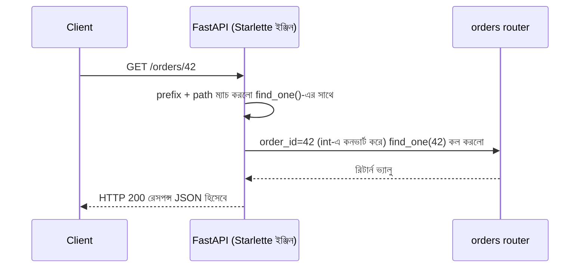

# ২৩.০৫. Routers in FastAPI (NestJS Controller-এর সমতুল্য)

আগের লেসনে আমরা দেখেছি `routers/` ফোল্ডারে থাকা প্রতিটা ফাইল HTTP লেয়ারের কাজ করে — ঠিক যেমন NestJS-এ `@Controller()` দিয়ে চিহ্নিত ক্লাস করে। এই লেসনে আমরা FastAPI-এর **`APIRouter`** নিয়ে গভীরে যাবো — কীভাবে রুট বানাবে, প্যারামিটার নেবে, বডি পড়বে।

প্রথমে `app/routers/orders.py` ফাইলে একটা `APIRouter` ইনস্ট্যান্স তৈরি করি:

```python
from fastapi import APIRouter, Query, Path, Body

router = APIRouter(
    prefix="/orders",
    tags=["orders"],
)

@router.get("")
def find_all(status: str | None = Query(default=None)):
    # GET /orders  অথবা  GET /orders?status=pending
    return f"Returning all orders, filtered by status: {status or 'none'}"

@router.get("/{order_id}")
def find_one(order_id: int = Path(...)):
    # GET /orders/42
    return f"Returning order with id: {order_id}"

@router.post("")
def create(item: str = Body(...), quantity: int = Body(...)):
    # POST /orders
    return f"Order created for {item}, quantity: {quantity}"
```

লক্ষ্য করো `APIRouter(prefix="/orders", tags=["orders"])`-এর দুটো প্যারামিটার। **`prefix`** হলো ঠিক NestJS-এর `@Controller('orders')`-এর সেই স্ট্রিং-এর সমতুল্য — এর ভেতরের সব রুট স্বয়ংক্রিয়ভাবে `/orders` দিয়ে শুরু হবে। **`tags`** একটা নতুন জিনিস, যেটার সরাসরি সমতুল্য NestJS-এ নেই — এটা স্বয়ংক্রিয় Swagger ডকুমেন্টেশনে এন্ডপয়েন্টগুলোকে গ্রুপ করে দেখায়, যাতে `/docs` পেজে "orders" নামের একটা আলাদা সেকশন দেখা যায়।

`@Query()`, `@Param()`, `@Body()` decorator-এর জায়গায় FastAPI-এ কোনো আলাদা decorator লাগে না — বরং **ফাংশন প্যারামিটারের ডিফল্ট ভ্যালু** দিয়েই FastAPI বুঝে নেয় ডেটা কোথা থেকে আসবে। `Query()` মানে এটা query string থেকে আসবে, `Path()` মানে URL path থেকে, `Body()` মানে request body থেকে। আসলে path parameter-এর জন্য `Path()` লেখাও বাধ্যতামূলক না — যদি ফাংশন সিগনেচারে প্যারামিটারের নাম URL path-এর `{order_id}`-এর সাথে মিলে যায়, FastAPI নিজেই বুঝে নেয় এটা path parameter। এই "স্বয়ংক্রিয় অনুমান" NestJS-এর তুলনায় বেশ আলাদা — NestJS-এ প্রতিটা সোর্স explicit decorator দিয়ে বলে দিতে হয়, FastAPI-এ টাইপ হিন্ট আর ডিফল্ট ভ্যালু থেকেই অনুমান হয়ে যায়।



এই ডায়াগ্রামে একটা গুরুত্বপূর্ণ বিষয় লক্ষ্য করো — `order_id: int` টাইপ হিন্ট দেয়াতেই FastAPI স্বয়ংক্রিয়ভাবে string `"42"`-কে integer `42`-এ কনভার্ট করে দিয়েছে, আর যদি কেউ `/orders/abc` পাঠায়, স্বয়ংক্রিয়ভাবে একটা 422 Validation Error ফিরে যাবে। এটা NestJS-এ `ParseIntPipe`-এর মাধ্যমে explicit করতে হতো, FastAPI-এ এটা টাইপ হিন্টের সাথেই বিল্ট-ইন।

Status code নিয়ন্ত্রণ করার পদ্ধতিও দেখা যাক:

```python
from fastapi import status

@router.post("", status_code=status.HTTP_201_CREATED)
def create(item: str = Body(...)):
    return {"message": f"Order created for {item}"}
```

এটা NestJS-এর `@HttpCode(HttpStatus.CREATED)`-এর সরাসরি সমতুল্য — decorator argument-এর বদলে এখানে route decorator-এর একটা keyword argument।

এখন Router-কে মূল অ্যাপ্লিকেশনে যুক্ত করি (`app/main.py`-তে):

```python
from fastapi import FastAPI
from app.routers import orders

app = FastAPI(title="Order Management API")
app.include_router(orders.router)
```

`app.include_router()`-টা NestJS-এ `AppModule`-এর `controllers: [OrdersController]` অ্যারেতে যুক্ত করার মতো কাজ করে, কিন্তু একটা গুরুত্বপূর্ণ পার্থক্য আছে — NestJS-এ CLI (`nest g co orders`) এই রেজিস্ট্রেশনটা স্বয়ংক্রিয়ভাবে করে দিতো, `app.module.ts`-এ নিজে গিয়ে লাইন যুক্ত করতো। FastAPI-এ এটা সম্পূর্ণ ম্যানুয়াল — নতুন router বানালে, `main.py`-তে গিয়ে নিজে হাতে `include_router()` লিখতে ভুলে গেলে, সেই router-এর কোনো এন্ডপয়েন্টই কাজ করবে না, কিন্তু কোনো এরর মেসেজও আসবে না — শুধু 404 পাওয়া যাবে। এটা একটা বাস্তব **common mistake** যা নতুন ডেভেলপাররা প্রায়ই করে — নতুন router ফাইল বানিয়ে ভেতরে সুন্দর কোড লিখে ফেলে, কিন্তু `include_router()` করতে ভুলে যায়, তারপর বিভ্রান্ত হয় কেন এন্ডপয়েন্ট "404 Not Found" দেখাচ্ছে। প্রোডাকশন টিমগুলো এই ভুল ঠেকাতে সাধারণত একটা কেন্দ্রীয় `app/routers/__init__.py`-তে সব router import আর register করার একটা তালিকা রাখে, যাতে নতুন router যুক্ত করার একটা মাত্র, স্পষ্ট জায়গা থাকে।

Router-এর কাজ এখানেও স্পষ্ট — এটা শুধু HTTP-র "দরজা" হিসেবে কাজ করে। পরের লেসনে আমরা দেখবো কীভাবে বিজনেস লজিককে router থেকে সরিয়ে সার্ভিস-লেয়ারে নিয়ে যাওয়া হয়, আর FastAPI-এর `Depends()` কীভাবে সেই সংযোগ তৈরি করে — NestJS-এর Constructor Injection-এর সমতুল্য, কিন্তু ভিন্নভাবে বাস্তবায়িত।
