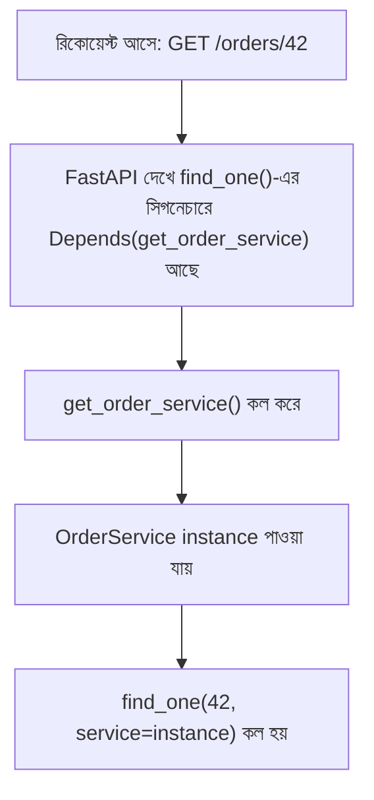

# ২৩.০৬. Dependencies/Services in FastAPI (NestJS Provider-এর সমতুল্য)

আগের লেসনে আমরা Router বানিয়েছিলাম, কিন্তু ইচ্ছাকৃতভাবে সরাসরি স্ট্রিং রিটার্ন করেছিলাম, কোনো আসল বিজনেস লজিক লিখিনি। এই লেসনে সেই ফাঁকটা পূরণ করবো — FastAPI-এর **`Depends()`** সিস্টেম দিয়ে, যেটা NestJS-এর Provider আর Dependency Injection-এর সমতুল্য ভূমিকা রাখে।

প্রথমে বলা দরকার — FastAPI-এর কোনো "built-in DI Container" নেই, যেমন NestJS-এ আছে। NestJS-এ `@Injectable()` দিয়ে চিহ্নিত করা ক্লাস কোথাও রেজিস্টার হয়ে যায় একটা কেন্দ্রীয় container-এ, আর সেটা constructor-এ automatic ভাবে inject হয়। FastAPI-এ ব্যাপারটা অনেক বেশি হালকা আর explicit — `Depends()` মূলত একটা মেকানিজম যেটা বলে "এই ফাংশনটা রান করো, তার রিটার্ন ভ্যালু এই প্যারামিটারে বসিয়ে দাও।" এটা কোনো গ্লোবাল রেজিস্ট্রি রাখে না, প্রতিটা রিকোয়েস্টে explicit ভাবে ফাংশন কল-চেইন তৈরি হয়।

চলো `app/services/order_service.py`-তে বিজনেস লজিক লিখি:

```python
from fastapi import HTTPException

class Order:
    def __init__(self, id: int, item: str, quantity: int):
        self.id = id
        self.item = item
        self.quantity = quantity

class OrderService:
    def __init__(self):
        self.orders: list[Order] = []
        self.next_id = 1

    def find_all(self, status: str | None = None) -> list[Order]:
        # বাস্তব অ্যাপে এখানে status অনুযায়ী DB কুয়েরি হতো
        return self.orders

    def find_one(self, order_id: int) -> Order:
        order = next((o for o in self.orders if o.id == order_id), None)
        if not order:
            raise HTTPException(status_code=404, detail=f"Order with id {order_id} not found")
        return order

    def create(self, item: str, quantity: int) -> Order:
        order = Order(id=self.next_id, item=item, quantity=quantity)
        self.next_id += 1
        self.orders.append(order)
        return order
```

এখন এই সার্ভিসকে router-এ যুক্ত করার জন্য `app/dependencies.py`-তে একটা "provider function" লিখি:

```python
from app.services.order_service import OrderService

_order_service_instance = OrderService()

def get_order_service() -> OrderService:
    return _order_service_instance
```

আর router-এ এটা `Depends()` দিয়ে inject করি:

```python
from fastapi import APIRouter, Depends
from app.services.order_service import OrderService
from app.dependencies import get_order_service

router = APIRouter(prefix="/orders", tags=["orders"])

@router.get("")
def find_all(
    status: str | None = None,
    service: OrderService = Depends(get_order_service),
):
    return service.find_all(status)

@router.get("/{order_id}")
def find_one(order_id: int, service: OrderService = Depends(get_order_service)):
    return service.find_one(order_id)

@router.post("")
def create(item: str, quantity: int, service: OrderService = Depends(get_order_service)):
    return service.create(item, quantity)
```

এখানে `service: OrderService = Depends(get_order_service)` লাইনটাই এই লেসনের মূল কথা। NestJS-এ `constructor(private readonly ordersService: OrdersService)` লিখলেই কাজ শেষ, কিন্তু FastAPI-এ তোমাকে **explicit ভাবে** একটা "provider function" লিখতে হয় (`get_order_service`) যেটা বলে দেয় ইনস্ট্যান্সটা কীভাবে বানানো/পাওয়া হবে। এটাই সেই দার্শনিক পার্থক্য যেটা লেসন ১-এ বলেছিলাম — NestJS "ম্যাজিক" দিয়ে DI করে, FastAPI "explicit function call" দিয়ে করে।



এখানে একটা গুরুত্বপূর্ণ **production nuance** আছে যা প্রথম দেখায় বোঝা যায় না — উপরের উদাহরণে `_order_service_instance` মডিউল-লেভেলে একবার তৈরি হয়ে চিরকাল একই থাকে (এটা কার্যত singleton)। কিন্তু ডেটাবেজ session-এর ক্ষেত্রে এটা ভয়ংকর ভুল হবে, কারণ একটা SQLAlchemy session একাধিক রিকোয়েস্টের মধ্যে শেয়ার করলে ডেটা করাপশন আর race condition তৈরি হতে পারে। তাই ডেটাবেজ session-এর জন্য প্রতিটা রিকোয়েস্টে **নতুন** instance তৈরি করে, রিকোয়েস্ট শেষে বন্ধ করে দেয়া হয় — এটা `yield`-ভিত্তিক dependency দিয়ে করা হয়:

```python
from app.core.database import SessionLocal

def get_db():
    db = SessionLocal()
    try:
        yield db
    finally:
        db.close()
```

`yield`-এর আগের অংশ রিকোয়েস্ট শুরুতে চলে (session তৈরি), `yield`-এর পরের অংশ রিকোয়েস্ট শেষে চলে (session বন্ধ) — এটা ঠিক Python-এর context manager-এর মতো আচরণ করে। এটাই FastAPI-তে "request-scoped" dependency তৈরির স্ট্যান্ডার্ড প্যাটার্ন, আর এর সরাসরি সমতুল্য NestJS-এ Request-scoped Provider (`{ scope: Scope.REQUEST }`)। **common mistake** হলো `get_db()`-এর মতো ফাংশনে `yield` ভুলে গিয়ে সরাসরি `return db` লিখে ফেলা — তখন session আর কখনো বন্ধ হয় না, আর প্রোডাকশনে অল্প কিছুদিন পরেই ডেটাবেজ কানেকশন পুল শেষ হয়ে যায়, নতুন রিকোয়েস্ট আর সার্ভিস করা যায় না। এই ধরনের "connection leak" বাগ ডেভেলপমেন্টে চোখে পড়ে না (কারণ ট্রাফিক কম), কিন্তু প্রোডাকশনে লোড বাড়ার সাথে সাথে সার্ভার হ্যাং করে যায়।

`Depends()`-এর একটা বড় সুবিধা টেস্টিং-এ — FastAPI-এর `app.dependency_overrides` ডিকশনারি ব্যবহার করে, টেস্টের সময় `get_order_service`-কে একটা fake/mock ভার্সনে বদলে দেয়া যায়, আসল ডেটাবেজ বা সার্ভিস ছুঁতে না হয়েই:

```python
def fake_order_service():
    return FakeOrderService()

app.dependency_overrides[get_order_service] = fake_order_service
```

এটা NestJS-এর টেস্টিং মডিউলে (`Test.createTestingModule().overrideProvider()`) যা করা হয়, তার সরাসরি সমতুল্য — দুটো ফ্রেমওয়ার্কই স্বীকার করে যে ভালো DI ডিজাইনের আসল প্রতিদান আসে টেস্টের সময়, প্রোডাকশন কোডে নয়।

এখন আমাদের একটা Router আছে যেটা HTTP-র সাথে কথা বলে, একটা Service আছে যেখানে আসল লজিক থাকে, আর দুটোর মধ্যে সংযোগ ঘটছে `Depends()` দিয়ে। কিন্তু প্রশ্ন থেকে যায় — যদি অ্যাপ্লিকেশনে অর্ডার, ইউজার, পেমেন্ট — অনেক ফিচার থাকে, তাহলে এই সবকিছু কীভাবে সংগঠিত রাখা হবে, NestJS-এর `@Module()`-এর মতো কোনো একটা মেকানিজম না থাকা সত্ত্বেও? এই প্রশ্নের উত্তর দেবে পরের লেসন।
