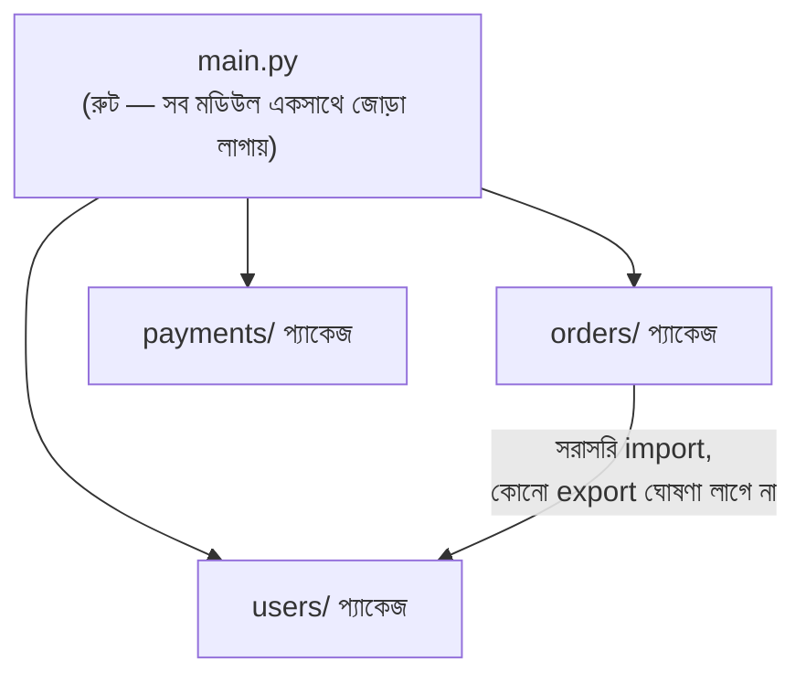

# ২৩.০৭. Structuring FastAPI Apps into Feature Modules (NestJS Module-এর সমতুল্য)

আমরা এখন পর্যন্ত Router আর Service দিয়ে একটা কাজ-করা `orders` ফিচার বানিয়েছি। বাস্তব অ্যাপ্লিকেশনে থাকবে ইউজার, পেমেন্ট, নোটিফিকেশন — এরকম আরও অনেক ফিচার। NestJS-এ এগুলো `@Module()` decorator দিয়ে আলাদা করা হয়, যেটা একটা ফরমাল, ফ্রেমওয়ার্ক-স্বীকৃত ইউনিট। এই লেসনে আমরা দেখবো, FastAPI-এ কোনো `@Module()`-এর সমতুল্য decorator না থাকা সত্ত্বেও, কীভাবে একই সংগঠন অর্জন করা যায় — শুধু **plain Python package** ব্যবহার করে।

এখানেই এই মডিউলের সবচেয়ে গুরুত্বপূর্ণ দার্শনিক পয়েন্টটা সবচেয়ে স্পষ্টভাবে দেখা যায়। NestJS-এ Module একটা রানটাইম concept — `@Module({ controllers, providers, imports, exports })` লিখলে NestJS-এর DI Container আসলে সেই তথ্য পড়ে, বুঝে, dependency গ্রাফ তৈরি করে। FastAPI-এ "module" ধারণাটা সম্পূর্ণভাবে **সাংগঠনিক**, রানটাইমে কোনো বিশেষ ভূমিকা নেই — এটা নিছক Python-এর ফোল্ডার/প্যাকেজ ব্যবহার করে ফাইল সাজানোর একটা কনভেনশন।

চলো ফিচার-ভিত্তিক (feature-based) কাঠামোয় প্রজেক্টটা পুনর্বিন্যাস করি — Lesson 4-এ আমরা "layer-based" কাঠামো দেখেছিলাম (সব router একসাথে, সব service একসাথে), কিন্তু বড় প্রজেক্টে অনেক টিম **feature-based** কাঠামো পছন্দ করে, যেটা NestJS-এর প্রতি-ফিচার-একটা-ফোল্ডার দর্শনের সাথে বেশি মেলে:

```
app/
├── main.py
├── core/
├── orders/                      # "OrdersModule"-এর সমতুল্য প্যাকেজ
│   ├── __init__.py
│   ├── router.py                # OrdersController-সমতুল্য
│   ├── service.py               # OrdersService-সমতুল্য
│   ├── models.py
│   └── schemas.py
├── users/                       # "UsersModule"-এর সমতুল্য
│   ├── __init__.py
│   ├── router.py
│   ├── service.py
│   ├── models.py
│   └── schemas.py
└── payments/
    ├── __init__.py
    ├── router.py
    ├── service.py
    ├── models.py
    └── schemas.py
```

লক্ষ্য করো — `orders/`, `users/`, `payments/` প্রতিটা একটা স্বয়ংসম্পূর্ণ Python প্যাকেজ (কারণ ভেতরে `__init__.py` আছে), আর প্রতিটার নিজস্ব router, service, model, schema আছে। এটাই "feature-based organization" — ঠিক NestJS-এর `OrdersModule`, `UsersModule`-এর মতো ধারণাগত বিভাজন, কিন্তু কোনো decorator ছাড়াই, শুধু ফোল্ডার-নেমস্পেসিং দিয়ে।

`main.py`-তে এই সব মডিউল একসাথে জোড়া লাগানো হয় — এটাই NestJS-এর `AppModule`-এর `imports: [OrdersModule, UsersModule]`-এর সমতুল্য কাজ:

```python
from fastapi import FastAPI
from app.orders.router import router as orders_router
from app.users.router import router as users_router
from app.payments.router import router as payments_router

app = FastAPI(title="Order Management API")

app.include_router(orders_router)
app.include_router(users_router)
app.include_router(payments_router)
```

একটা ফিচার আরেকটা ফিচারের উপর নির্ভরশীল হলে কী হয় — যেমন `orders`-এর জন্য যদি `users`-এর তথ্য দরকার হয়? NestJS-এ এটা `OrdersModule`-এর `imports: [UsersModule]` আর `UsersModule`-এর `exports: [UsersService]` দিয়ে explicit ভাবে ঘোষণা করতে হয়, আর যদি export না করা হয়, DI Container রানটাইমে এরর দেয়। FastAPI-এ এমন কোনো এনফোর্সমেন্ট নেই — `orders/service.py` থেকে সরাসরি `from app.users.service import UserService` লিখে ইমপোর্ট করে ফেলা যায়, কোনো "visibility boundary" নেই যা এটা আটকাবে।



এখানেই সবচেয়ে গুরুত্বপূর্ণ **production nuance/common mistake** — NestJS-এ যেহেতু ফ্রেমওয়ার্ক নিজে module boundary এনফোর্স করে, একজন ডেভেলপার ভুলবশত কখনো অন্য মডিউলের internal implementation-এ হাত দিতে পারে না, `exports` না করা কিছু ব্যবহারই করা যায় না। FastAPI-এ এই সুরক্ষা না থাকায়, সময়ের সাথে সাথে ফিচার-প্যাকেজগুলোর মধ্যে **cross-import spaghetti** তৈরি হওয়ার ঝুঁকি বাস্তব — `orders/service.py` `users/models.py`-এর ভেতরের একটা প্রাইভেট হেল্পার ফাংশন সরাসরি ইমপোর্ট করে ব্যবহার করা শুরু করলো, তারপর `users` টিম যখন সেই হেল্পার রিফ্যাক্টর করলো, `orders` অজান্তেই ভেঙে গেলো — আর কোনো কম্পাইল-টাইম বা framework-level সতর্কতা পাওয়া যাবে না।

প্রোডাকশন টিমগুলো এই সমস্যা ঠেকাতে দুটো disciplined কনভেনশন মেনে চলে, যেগুলো FastAPI নিজে বাধ্য করে না, কিন্তু টিমকেই মেনে চলতে হয়:

১. প্রতিটা ফিচার-প্যাকেজের `__init__.py`-তে স্পষ্টভাবে বলে দেয়া হয় কোন জিনিসগুলো "public" (অন্য মডিউল ব্যবহার করতে পারবে) — বাকিসব "private" ধরে নিয়ে সরাসরি ইমপোর্ট না করার নিয়ম মেনে চলা হয়, যা কোড রিভিউতে এনফোর্স করা হয়।

২. মডিউল-টু-মডিউল যোগাযোগ সবসময় service ফাংশন কল করে হয় (যেমন `users.service.get_user_by_id()`), কখনো সরাসরি অন্য মডিউলের `models.py` বা internal query টাচ করে না — এটা ঠিক সেই একই "শুধু exported interface দিয়ে যোগাযোগ" দর্শন যা NestJS `exports`-এর মাধ্যমে জোর করে চাপায়, এখানে শুধু এটা মানার দায়িত্ব disciplined convention আর code review-এর।

এই পুরো লেসনের মূল শিক্ষা — FastAPI-এ "Module" বলে কিছু ফাইলে খুঁজে পাবে না, কিন্তু ধারণাটা মরে যায়নি, এটা শুধু রানটাইম এনফোর্সমেন্ট থেকে সরে গিয়ে টিম-কনভেনশনে পরিণত হয়েছে। NestJS তোমাকে সুরক্ষা দেয়, FastAPI তোমাকে বিশ্বাস করে — আর এই বিশ্বাসটা বজায় রাখাই একটা লিড ইঞ্জিনিয়ারের আসল দায়িত্ব। পরের এবং শেষ লেসনে আমরা পুরো মডিউলটা সংক্ষেপে রিক্যাপ করবো, আর একটা তুলনামূলক টেবিলে দেখবো কোন পরিস্থিতিতে NestJS-এর opinionated কাঠামো, আর কোন পরিস্থিতিতে FastAPI-এর flexibility সুবিধাজনক।
