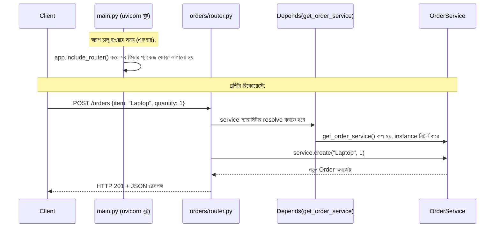

# ২৩.০৮. Module Summary

এই মডিউলের শুরুতে একটা প্রশ্ন নিয়ে বসেছিলাম — NestJS যা কিছু "ফ্রি"-তে দেয় (কাঠামো, DI Container, module boundary), FastAPI সেগুলোর কোনোটাই দেয় না, তাহলে কীভাবে একটা প্রোডাকশন-গ্রেড, শৃঙ্খলাবদ্ধ FastAPI অ্যাপ্লিকেশন বানানো যায়? আট লেসনের শেষে এখন আমরা সেই প্রশ্নের সম্পূর্ণ উত্তর দিতে পারি — উত্তরটা হলো, ফ্রেমওয়ার্কের বদলে **কনভেনশন আর disciplined টিম-প্র্যাকটিস** দিয়ে সেই একই শৃঙ্খলা তৈরি করা।

চলো একটা তুলনামূলক টেবিলে পুরো মডিউলটা এক নজরে দেখি:

| ধারণা | NestJS | FastAPI-এর সমতুল্য | মূল পার্থক্য |
|---|---|---|---|
| প্রজেক্ট কাঠামোর দর্শন | Opinionated — ফ্রেমওয়ার্ক চাপায় | Unopinionated — টিম নিজে ঠিক করে | NestJS-এ consistency ফ্রি, FastAPI-এ flexibility ফ্রি |
| প্রজেক্ট স্ক্যাফোল্ডিং | `nest new` (অফিসিয়াল CLI) | ম্যানুয়াল, বা community cookiecutter | FastAPI-এ কোনো অফিসিয়াল জেনারেটর নেই |
| HTTP রিকোয়েস্ট গ্রহণ | Controller (`@Controller()`) | Router (`APIRouter`) | ধারণাগতভাবে অভিন্ন, শুধু বাস্তবায়ন ভিন্ন |
| বিজনেস লজিক | Provider (`@Injectable()`) | Service (plain class/function) | FastAPI-এ কোনো decorator-based রেজিস্ট্রেশন নেই |
| Dependency Injection | রানটাইম DI Container, constructor injection | `Depends()`, explicit provider function | NestJS "ম্যাজিক", FastAPI explicit function call |
| ফিচার সংগঠন | Module (`@Module()`, রানটাইম এনফোর্সড) | Python package (কনভেনশনাল, এনফোর্সমেন্ট নেই) | NestJS-এ boundary ভাঙা অসম্ভব, FastAPI-এ discipline লাগে |
| Validation | class-validator | Pydantic (built-in core) | Pydantic FastAPI-এর কেন্দ্রে, class-validator NestJS-এ optional add-on |
| API ডকুমেন্টেশন | `@nestjs/swagger` (আলাদা সেটআপ) | বিল্ট-ইন, স্বয়ংক্রিয় | FastAPI এখানে এগিয়ে |

পুরো রিকোয়েস্টের যাত্রাটা একবার end-to-end দেখা যাক, এই মডিউলের সব ধারণা একসাথে কাজ করছে এমন একটা দৃশ্যে:

এখানে NestJS-এর সাথে একটা গুরুত্বপূর্ণ টাইমিং পার্থক্য আছে — NestJS-এ dependency graph পুরোপুরি **bootstrap time**-এই তৈরি হয়ে যায় (`NestFactory.create(AppModule)` কলে), request time-এ শুধু আগে-তৈরি instance ব্যবহৃত হয়। FastAPI-এ ডিফল্টভাবে `Depends()` ফাংশন প্রতিটা **রিকোয়েস্টেই** নতুন করে কল হয় (যদি না তুমি নিজে caching/singleton ম্যানেজ করো, যেমন Lesson 6-এ `_order_service_instance` দিয়ে দেখিয়েছি)। এটা প্রথম দেখায় ছোট পার্থক্য মনে হলেও, ভারী initialization-যুক্ত dependency-র (যেমন একটা ML মডেল লোড করা) ক্ষেত্রে বড় পারফরম্যান্স প্রভাব ফেলতে পারে — যদি সেটা প্রতি রিকোয়েস্টে re-run হয়, বরং FastAPI-এর `@lru_cache`-ভিত্তিক dependency pattern ব্যবহার করে একবারই লোড করা উচিত।

এখন সবচেয়ে গুরুত্বপূর্ণ প্রশ্নটার উত্তর দেয়া যাক — কখন NestJS-এর opinionated কাঠামো ভালো, আর কখন FastAPI-এর flexibility ভালো?

**NestJS বেছে নেয়া ভালো যখন:**
- টিম বড় (দশ-বিশ জনের বেশি), আর অনেক জুনিয়র ডেভেলপার নিয়মিত যুক্ত হচ্ছে-বেরিয়ে যাচ্ছে — এমন অবস্থায় ফ্রেমওয়ার্ক-এনফোর্সড কনভেনশন ভুল হওয়ার সুযোগ কমিয়ে দেয়।
- প্রজেক্টের আয়ুষ্কাল দীর্ঘ (কয়েক বছর), যেখানে ধারাবাহিকতা রক্ষা করাটা গতির চেয়ে বেশি গুরুত্বপূর্ণ।
- টিম আগে থেকেই Angular বা strongly-typed, decorator-heavy আর্কিটেকচারে অভ্যস্ত।

**FastAPI বেছে নেয়া ভালো যখন:**
- টিম ছোট, অভিজ্ঞ, আর নিজেরাই ভালো কনভেনশন মেনে চলতে সক্ষম।
- প্রজেক্টের প্রকৃতি ডেটা-সায়েন্স/ML-ঘনিষ্ঠ (Python ইকোসিস্টেমের সাথে সরাসরি ইন্টিগ্রেশন দরকার — pandas, PyTorch, scikit-learn ইত্যাদি, যেগুলো NestJS-এর জগতে সহজলভ্য না)।
- পারফরম্যান্স-ক্রিটিক্যাল, হালকা মাইক্রোসার্ভিস বানাতে হচ্ছে, যেখানে ফ্রেমওয়ার্কের ওভারহেড কমানো জরুরি।
- দ্রুত প্রোটোটাইপিং প্রয়োজন, যেখানে বিল্ট-ইন Swagger docs আর কম boilerplate গতি বাড়ায়।

এখন তুমি জানো:
- FastAPI কেন unopinionated, আর এই স্বাধীনতার সাথে আসা দায়িত্ব কী।
- FastAPI-এর ইকোসিস্টেম — Starlette, Pydantic, SQLAlchemy, Alembic — কোনটা কোন কাজ করে।
- কীভাবে একটা প্রোডাকশন-শেপড প্রজেক্ট স্ক্যাফোল্ড করতে হয়, uvicorn দিয়ে চালাতে হয়।
- একটা রিকমেন্ডেড ফোল্ডার কাঠামো, আর কেন `models`/`schemas` আলাদা রাখা জরুরি।
- `APIRouter` দিয়ে NestJS Controller-এর সমতুল্য রুট বানানো।
- `Depends()` দিয়ে NestJS Provider-এর সমতুল্য service injection, আর request-scoped dependency-র গুরুত্ব।
- ফিচার-ভিত্তিক Python package দিয়ে NestJS Module-এর সমতুল্য সংগঠন, আর কেন এখানে discipline framework-এর বিকল্প।

কিন্তু এটা শুধু শুরু। আমরা এখনও আসল ডেটাবেজ সংযোগ, অথেন্টিকেশন, একাধিক ফিচার মডিউল মিলিয়ে একটা বাস্তব, জটিল প্রজেক্ট বানাইনি। পরের মডিউলে আমরা ঠিক এটাই করবো — Requirement Analysis থেকে শুরু করে, একটা সম্পূর্ণ ই-কমার্স প্রজেক্ট, যেখানে Product, Subscription, Store — একাধিক ফিচার-প্যাকেজ একসাথে মিলে একটা প্রোডাকশন-মানের FastAPI অ্যাপ্লিকেশনে রূপান্তরিত হবে।
