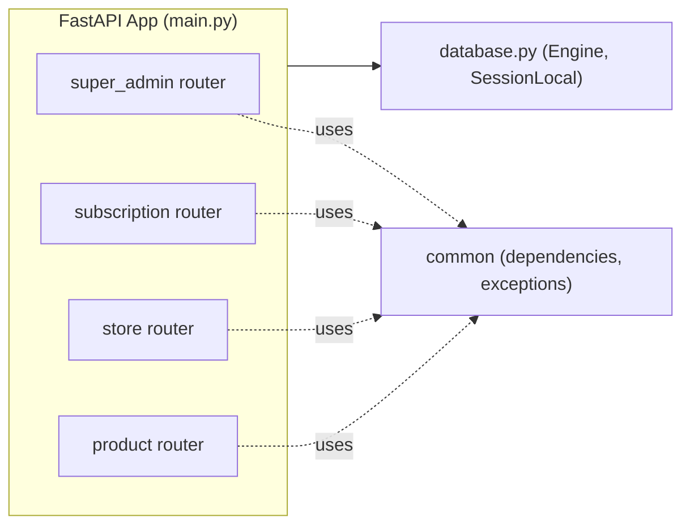

# ২৪.০৩. Technical Grooming And Project Bootstrap

গত লেসনে আমরা রিকোয়ারমেন্ট আর একটা রাফ ERD পর্যন্ত পৌঁছেছিলাম। এখন প্রশ্ন — এই ডিজাইনটা বাস্তবে কোন টুলস দিয়ে বানাবো? এই সিদ্ধান্তগুলো নেয়ার প্রক্রিয়াকে বলে **technical grooming** — বিজনেস রিকোয়ারমেন্টকে টেকনিক্যাল সিদ্ধান্তে রূপান্তর করা।

**ফ্রেমওয়ার্ক:** FastAPI — কারণ ShopKori-এর মতো একটা প্রজেক্টে একাধিক ডোমেইন (super-admin, subscription, store, product) থাকবে, প্রতিটার নিজস্ব রুটার, নিজস্ব সার্ভিস, নিজস্ব মডেল — এই ধরনের "অনেকগুলো স্বয়ংসম্পূর্ণ মডিউল একসাথে কাজ করা" পরিস্থিতিতে FastAPI-এর `APIRouter` আর dependency-injection (`Depends`) সিস্টেম একদম উপযুক্ত। এখানে NestJS-এর মতো কোনো heavyweight IoC container নেই — FastAPI-এর dependency system তুলনামূলক সহজ, ফাংশন-বেজড, কিন্তু ঠিক একই মূল লক্ষ্য পূরণ করে — একটা সার্ভিসের নির্ভরতা (ডেটাবেজ session, অন্য সার্ভিস) সে নিজে তৈরি করবে না, `Depends()` দিয়ে ইনজেক্ট হয়ে আসবে।

**ডেটাবেজ ও ORM:** আমরা ব্যবহার করবো **PostgreSQL** (রিলেশনাল ডেটা, ফরেন কী কনস্ট্রেইন্ট) আর **SQLAlchemy 2.0** — কারণ এটা Python ইকোসিস্টেমের সবচেয়ে matured ORM, declarative class-বেজড মডেল ডিফাইন করতে দেয়, আর **Alembic** নামের একটা আলাদা কিন্তু SQLAlchemy-র সাথে টাইট-ইন্টিগ্রেটেড মাইগ্রেশন টুল সাপোর্ট করে, যা প্রোডাকশন-গ্রেড স্কিমা ম্যানেজমেন্টের জন্য দরকার।

**ভ্যালিডেশন লেয়ার:** **Pydantic v2** — FastAPI নিজেই Pydantic-ফার্স্ট ফ্রেমওয়ার্ক। রিকোয়েস্ট বডি, রেসপন্স শেপ, এমনকি এনভায়রনমেন্ট কনফিগারেশন — সবকিছু Pydantic `BaseModel` দিয়ে টাইপ-চেক হবে। এটা আমাদের NestJS-এর DTO + `class-validator`-এর সমতুল্য, কিন্তু আরও integrated — FastAPI নিজেই OpenAPI ডকুমেন্টেশন এই স্কিমা থেকে অটো-জেনারেট করে দেয়।

**প্যাকেজ ম্যানেজার:** `pip` + `venv` (বা `uv`, যদি দ্রুততর ইনস্টলেশন চাও), কারণ এটা সবচেয়ে সহজলভ্য এবং কোর্সের আগের মডিউলগুলোর সাথে সামঞ্জস্যপূর্ণ।

এই সিদ্ধান্তগুলো নেয়ার পর এখন আসল কাজ — প্রজেক্ট বুটস্ট্র্যাপ করা। প্রথমে একটা virtual environment তৈরি করি:

```bash
mkdir shopkori-backend && cd shopkori-backend
python -m venv .venv
source .venv/bin/activate    # Windows-এ: .venv\Scripts\activate
```

এরপর প্রয়োজনীয় ডিপেন্ডেন্সি ইনস্টল করি:

```bash
pip install fastapi "uvicorn[standard]" sqlalchemy alembic psycopg2-binary
pip install pydantic-settings python-dotenv
pip install passlib[bcrypt] python-jose[cryptography]
pip install pytest pytest-asyncio httpx
```

`sqlalchemy` আর `alembic` আমাদের ORM আর মাইগ্রেশন লেয়ারের জন্য, `psycopg2-binary` হলো PostgreSQL-এর Python ড্রাইভার (sync), `pydantic-settings` দিয়ে `.env` ফাইল থেকে এনভায়রনমেন্ট ভেরিয়েবল পড়বো, `passlib`/`python-jose` অথেন্টিকেশনের জন্য (পাসওয়ার্ড হ্যাশিং, JWT), আর `pytest`/`httpx` টেস্টিংয়ের জন্য।

এখন `pip freeze > requirements.txt` চালিয়ে ডিপেন্ডেন্সি লিস্ট লক করে রাখি — এটা টিমের সবার এনভায়রনমেন্ট একই রাখার একটা মৌলিক অভ্যাস।

শুধু `main.py`-তে সব কোড রাখাটা একটা মাল্টি-মডিউল প্রজেক্টের জন্য যথেষ্ট না। আমরা একটা ডোমেইন-বেজড ফোল্ডার কাঠামো তৈরি করবো, যেখানে প্রতিটা বিজনেস ডোমেইন নিজের ফোল্ডারে থাকবে:

```
shopkori-backend/
├── app/
│   ├── __init__.py
│   ├── main.py
│   ├── database.py            # SQLAlchemy engine/session setup
│   ├── config.py              # Pydantic Settings
│   ├── modules/
│   │   ├── user/
│   │   ├── super_admin/
│   │   ├── subscription/
│   │   ├── store/
│   │   └── product/
│   └── common/
│       ├── dependencies.py    # get_current_user, require_role ইত্যাদি
│       └── exceptions.py
├── alembic/
│   ├── versions/
│   └── env.py
├── alembic.ini
├── tests/
├── requirements.txt
└── .env
```

এই কাঠামোর পেছনের চিন্তাটা হলো **Separation of Concerns**। `modules/` ফোল্ডারের প্রতিটা সাব-ফোল্ডার একটা স্বয়ংসম্পূর্ণ ফিচার-মডিউল হবে — নিজস্ব `models.py` (SQLAlchemy মডেল), `schemas.py` (Pydantic স্কিমা), `repository.py`, `service.py`, `router.py` সহ। `common/` ফোল্ডারে থাকবে এমন জিনিস যা একাধিক মডিউল শেয়ার করবে — যেমন `get_current_user` ডিপেন্ডেন্সি, রোল-চেক ফাংশন। এই লেয়ারিং প্যাটার্নটা (router → service → repository → model) আমরা প্রতিটা মডিউলে হুবহু পুনরাবৃত্তি করবো, যাতে কোডবেসের যেকোনো জায়গায় গেলে একই মেন্টাল মডেল কাজ করে।



আপাতত এই ফোল্ডারগুলো ফাঁকা `__init__.py` দিয়ে তৈরি করে রাখবো — শুধু কাঠামোটা দাঁড় করানো, যাতে সামনের প্রতিটা লেসনে আমরা জানি ঠিক কোথায় নতুন ফাইল বসবে।

একটা কমন ভুল এখানে উল্লেখ করা জরুরি — অনেকে ছোট প্রজেক্টে সব রুট একটা `main.py`-তে রেখে দেয়, "পরে ভাগ করে নেবো" ভেবে। বাস্তবে প্রজেক্ট বড় হওয়ার সাথে সাথে এই "পরে ভাগ করা" আর কখনো হয় না, কারণ প্রতিদিনের ডেডলাইনের চাপে রিফ্যাক্টরিং সবসময় পিছিয়ে যায়। শুরু থেকেই ডোমেইন-বেজড স্ট্রাকচার রাখলে এই টেকনিকাল ডেট (technical debt) তৈরিই হয় না।

কাঠামো দাঁড় হয়ে গেছে, ডিপেন্ডেন্সি ইনস্টল হয়ে গেছে। কিন্তু এখনো একটা লাইন কোডও লেখা হয়নি বাস্তব ফিচারের জন্য। পরের লেসনে আমরা এই বড় প্রজেক্টটাকে ছোট ছোট কাজে ভাঙবো, আর ঠিক করবো প্রথমে কোনটা বানানো সবচেয়ে জরুরি — এই প্রায়োরিটাইজেশনকে বলে P0 টাস্ক খুঁজে বের করা।
