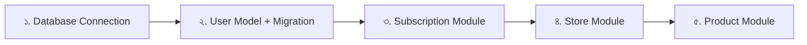

# ২৪.০৪. Finding P0 Task And Hands On Details

গত লেসনে আমরা প্রজেক্ট বুটস্ট্র্যাপ করেছি — ফোল্ডার কাঠামো দাঁড় করিয়েছি, দরকারি প্যাকেজ ইনস্টল করেছি। কিন্তু ShopKori-এর পুরো স্কোপ অনেক বড় — সুপার অ্যাডমিন, সাবস্ক্রিপশন, স্টোর, প্রোডাক্ট — চারটা মডিউল, প্রতিটার ভেতরে একাধিক ফিচার। যদি আমরা একসাথে সবকিছু বানাতে শুরু করি, কাজ কখনোই শেষ হবে না, আর টেস্ট করাও অসম্ভব হয়ে যাবে। এখানেই দরকার **প্রায়োরিটাইজেশন** — কোন কাজটা আগে করলে সবচেয়ে বেশি মূল্য তৈরি হবে।

সফটওয়্যার প্রোডাক্ট ম্যানেজমেন্টে একটা কমন প্র্যাকটিস হলো টাস্কগুলোকে P0, P1, P2 — এভাবে প্রায়োরিটি লেভেলে ভাগ করা:

- **P0 (Must have, blocking)** — এটা ছাড়া প্রোডাক্টই কাজ করবে না। অন্য সব কাজ এর উপর নির্ভরশীল।
- **P1 (Important, not blocking)** — গুরুত্বপূর্ণ, কিন্তু P0 না থাকলেও সিস্টেম চলবে (অসম্পূর্ণভাবে হলেও)।
- **P2 (Nice to have)** — ভবিষ্যতে যোগ করা যায়, এখন না থাকলেও সমস্যা নেই।

ShopKori-এর জন্য এই লেন্সে চিন্তা করলে চিত্রটা এরকম দাঁড়ায়:

| টাস্ক | প্রায়োরিটি | কারণ |
|---|---|---|
| ডেটাবেজ কানেকশন (Engine/Session) সেটআপ | P0 | এটা ছাড়া কোনো রেকর্ড সেভ করাই যাবে না |
| User মডেল + Alembic migration | P0 | সব রোল (সুপার অ্যাডমিন, স্টোর ওউনার) এর ভিত্তি |
| Subscription Plan মডিউল | P0 | স্টোর তৈরির পূর্বশর্ত — গত লেসনের নির্ভরতার শৃঙ্খল অনুযায়ী |
| Store মডিউল | P0 | প্রোডাক্টের পূর্বশর্ত |
| Product মডিউল | P0 | মূল বিজনেস ভ্যালু — যা বিক্রি হবে |
| Super Admin ড্যাশবোর্ড অ্যানালিটিক্স | P1 | দরকারি কিন্তু কোর ফ্লো ব্লক করে না |
| প্রোডাক্ট রিভিউ/রেটিং | P2 | ভবিষ্যতে যোগ করা যাবে |
| ইমেইল নোটিফিকেশন | P2 | কোর ফাংশনালিটির অংশ না |

লক্ষ্য করো — এই টেবিলে চারটা কোর মডিউলই P0 হয়ে গেছে। এটা স্বাভাবিক, কারণ গত লেসনের ERD দেখায় এই চারটা একে অপরের উপর নির্ভরশীল একটা চেইনে বাঁধা (User → Subscription → Store → Product)। তাই আসল প্রায়োরিটাইজেশনের প্রশ্নটা হলো "কোন মডিউল বানাবো" না, বরং "**কোন ক্রমে** বানাবো" — কারণ নির্ভরতার চেইন অনুযায়ী একটা ছাড়া আরেকটা শুরুই করা যাবে না।

এই ক্রমটাই এখন থেকে আমাদের রোডম্যাপ, আর এই মডিউলের বাকি সব লেসন হুবহু এই ক্রম মেনে চলবে। এটা একটা গুরুত্বপূর্ণ শিক্ষা — বাস্তব প্রজেক্টে "কোড লেখা শুরু করা" মানে সরাসরি ফিচার লেখা শুরু করা নয়, বরং প্রথমে নির্ভরতার গ্রাফ আঁকা, তারপর সেই গ্রাফের টপোলজিক্যাল অর্ডার অনুসরণ করে কাজ করা।

আরেকটা বাস্তব-জগতের অভ্যাস হলো প্রতিটা টাস্ককে আরও ছোট, "hands-on" করা যায় এমন সাব-টাস্কে ভাঙা। যেমন "Subscription Module" P0 টাস্কটাকে ভাঙলে দাঁড়ায়:

1. `SubscriptionPlan` মডেল ডিজাইন
2. `StoreSubscription` মডেল ডিজাইন (association entity)
3. Pydantic স্কিমা তৈরি (Create, Read, Update)
4. Repository লেয়ার
5. Service লজিক
6. Router এন্ডপয়েন্ট
7. ম্যানুয়াল টেস্টিং

এই সাব-টাস্ক ব্রেকডাউনটা ঠিক Agile/Scrum-এ যাকে বলে "story breakdown" বা "task decomposition"। প্রতিটা সাব-টাস্ক এমনভাবে ছোট হওয়া উচিত যাতে একজন ডেভেলপার এক বসাতেই সেটা শেষ করতে পারে, আর কাজ শেষে বলতে পারে — "হ্যাঁ, এটা done।" এই মডিউলের লেসন ৫ থেকে ২০ পর্যন্ত, আমরা ঠিক এই তালিকা মেনেই এগোবো — একটা একটা করে, ঠিক এই ক্রমে।

একটা প্রোডাকশন-লেভেল নোট — বাস্তব দলে প্রায়ই একটা ভুল হয়: "P0 টাস্ক" মানে ভাবা হয় "সবচেয়ে জটিল ফিচার আগে বানাও।" আসলে P0 মানে "সবচেয়ে বেশি ব্লকিং", জটিলতা না। ডেটাবেজ কানেকশন সবচেয়ে সহজ কাজ, কিন্তু সেটাই সবচেয়ে বড় P0 — কারণ বাকি সব এর উপর দাঁড়িয়ে। এই পার্থক্যটা গুলিয়ে গেলে টিম প্রায়ই "ইমপ্রেসিভ" ফিচার আগে বানানোর দিকে ঝুঁকে যায়, যেটা আসলে একটা এন্টি-প্যাটার্ন।

এখন যেহেতু আমাদের হাতে একটা পরিষ্কার রোডম্যাপ আছে, প্রথম P0 টাস্কে হাত দেয়ার সময় হয়েছে — ডেটাবেজ কানেকশন। পরের লেসনে আমরা PostgreSQL সেটআপ করবো আর SQLAlchemy দিয়ে সেটার প্রথম কানেকশন তৈরি করবো।
