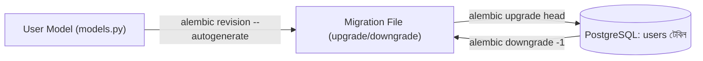

# ২৪.০৬. Connecting Entity With SQLAlchemy And Running Migration

গত লেসনে আমরা ডেটাবেজের সাথে কানেকশন তৈরি করেছি, কিন্তু ডেটাবেজটা এখনো খালি — কোনো টেবিল নেই। এই লেসনে আমরা প্রথম মডেল ডিফাইন করবো — `User` — আর তারপর সেটাকে একটা বাস্তব টেবিলে রূপান্তর করবো Alembic মাইগ্রেশনের মাধ্যমে।

SQLAlchemy-তে একটা মডেল আসলে একটা সাধারণ Python ক্লাস, যা `Base` (গত লেসনে `database.py`-তে বানানো `declarative_base()`) থেকে ইনহেরিট করে, আর প্রতিটা attribute-কে `Mapped`/`mapped_column()` দিয়ে বলে দেয়া হয় এগুলো ডেটাবেজ কলামের সাথে কীভাবে ম্যাপ হবে। `app/modules/user/models.py`:

```python
import enum
import uuid
from datetime import datetime

from sqlalchemy import String, Enum, DateTime, func
from sqlalchemy.orm import Mapped, mapped_column

from app.database import Base


class UserRole(str, enum.Enum):
    SUPER_ADMIN = "SUPER_ADMIN"
    STORE_OWNER = "STORE_OWNER"
    CUSTOMER = "CUSTOMER"


class User(Base):
    __tablename__ = "users"

    id: Mapped[uuid.UUID] = mapped_column(
        primary_key=True, default=uuid.uuid4
    )
    email: Mapped[str] = mapped_column(String(255), unique=True, index=True)
    hashed_password: Mapped[str] = mapped_column(String(255))
    role: Mapped[UserRole] = mapped_column(
        Enum(UserRole, name="user_role_enum"), default=UserRole.CUSTOMER
    )
    full_name: Mapped[str | None] = mapped_column(String(150), nullable=True)
    created_at: Mapped[datetime] = mapped_column(
        DateTime(timezone=True), server_default=func.now()
    )
    updated_at: Mapped[datetime] = mapped_column(
        DateTime(timezone=True), server_default=func.now(), onupdate=func.now()
    )
```

`id`-এর জন্য UUID ব্যবহার করছি অটো-ইনক্রিমেন্ট ইন্টিজারের বদলে, কারণ একটা মাল্টি-টেন্যান্ট সিস্টেমে UUID ব্যবহার করা ভালো অভ্যাস — এতে আইডি অনুমানযোগ্য (guessable) হয় না, যা একটা নিরাপত্তাগত সুবিধা (কেউ `/users/1`, `/users/2` — এভাবে ক্রম অনুমান করে ডেটা স্ক্র্যাপ করতে পারবে না)। `UserRole` enum-টা গত দুই লেসনের রিকোয়ারমেন্ট অ্যানালাইসিসের সরাসরি ফসল। `created_at`/`updated_at`-এ `DateTime(timezone=True)` ব্যবহার করেছি, ঠিক Module 24.02-এ উল্লেখ করা timezone-সতর্কতা মাথায় রেখে — `server_default=func.now()` মানে ডেটাবেজ নিজেই টাইমস্ট্যাম্প বসাবে (অ্যাপ্লিকেশন সার্ভারের ক্লক নির্ভর না করে), যা একাধিক সার্ভার ইনস্ট্যান্স চালানোর সময় consistency নিশ্চিত করে।

মডেল ডিফাইন হলো, কিন্তু SQLAlchemy নিজে থেকে টেবিল বানাবে না, কারণ আমরা প্রোডাকশন-গ্রেড ওয়ার্কফ্লো অনুসরণ করবো। `Base.metadata.create_all()` দিয়ে সরাসরি টেবিল বানানো একটা কমন শুরুর-দিকের শর্টকাট, কিন্তু এটাতে দুটো বড় সমস্যা — এক, এটা স্কিমা পরিবর্তনের কোনো ইতিহাস রাখে না; দুই, এটা existing টেবিলে কলাম যোগ/বাদ দিতে পারে না, শুধু নতুন টেবিল বানাতে পারে। তাই আমরা শুরু থেকেই **Alembic** ব্যবহার করবো, যা Git-এর মতোই ভার্সন-কন্ট্রোলড, ধাপে ধাপে স্কিমা পরিবর্তনের ইতিহাস রাখে।

প্রথমে Alembic ইনিশিয়ালাইজ করি প্রজেক্টের রুটে:

```bash
alembic init alembic
```

এটা `alembic/` ফোল্ডার আর `alembic.ini` ফাইল তৈরি করবে। এখন `alembic.ini`-তে ডেটাবেজ URL সেট করার বদলে, আমরা `alembic/env.py`-তে আমাদের `.env`-নির্ভর `settings` থেকে URL টানবো, যাতে সংবেদনশীল তথ্য দুই জায়গায় ডুপ্লিকেট না হয়। `alembic/env.py`-তে পরিবর্তন:

```python
from app.config import settings
from app.database import Base

# app-এর সব মডেল ইমপোর্ট করে নিতে হবে, যাতে Base.metadata এদের চেনে
from app.modules.user.models import User  # noqa: F401

config.set_main_option("sqlalchemy.url", settings.database_url)
target_metadata = Base.metadata
```

এখন প্রথম মাইগ্রেশন **generate** করা যাক — Alembic-এর `--autogenerate` ফ্ল্যাগ SQLAlchemy মডেল আর ডেটাবেজের বর্তমান অবস্থা তুলনা করে পার্থক্যটা একটা ফাইলে লিখে দেয়:

```bash
alembic revision --autogenerate -m "create users table"
```

এটা `alembic/versions/` ফোল্ডারে একটা ফাইল তৈরি করবে, মোটামুটি এরকম দেখতে:

```python
"""create users table

Revision ID: a1b2c3d4e5f6
Revises:
Create Date: 2026-08-12 10:00:00.000000
"""
from alembic import op
import sqlalchemy as sa

revision = "a1b2c3d4e5f6"
down_revision = None


def upgrade() -> None:
    op.create_table(
        "users",
        sa.Column("id", sa.Uuid(), nullable=False),
        sa.Column("email", sa.String(length=255), nullable=False),
        sa.Column("hashed_password", sa.String(length=255), nullable=False),
        sa.Column(
            "role",
            sa.Enum("SUPER_ADMIN", "STORE_OWNER", "CUSTOMER", name="user_role_enum"),
            nullable=False,
        ),
        sa.Column("full_name", sa.String(length=150), nullable=True),
        sa.Column("created_at", sa.DateTime(timezone=True), server_default=sa.text("now()"), nullable=False),
        sa.Column("updated_at", sa.DateTime(timezone=True), server_default=sa.text("now()"), nullable=False),
        sa.PrimaryKeyConstraint("id"),
        sa.UniqueConstraint("email"),
    )
    op.create_index(op.f("ix_users_email"), "users", ["email"])


def downgrade() -> None:
    op.drop_index(op.f("ix_users_email"), table_name="users")
    op.drop_table("users")
    sa.Enum(name="user_role_enum").drop(op.get_bind(), checkfirst=True)
```

লক্ষ্য করো — `upgrade()` মেথড বলে দেয় পরিবর্তনটা কীভাবে প্রয়োগ হবে, আর `downgrade()` মেথড বলে দেয় সেটা কীভাবে ফিরিয়ে নেয়া (rollback) যাবে। এই সিমেট্রি খুব গুরুত্বপূর্ণ — যদি কোনো মাইগ্রেশন প্রোডাকশনে সমস্যা তৈরি করে, `downgrade()` থাকলে দ্রুত আগের অবস্থায় ফিরে যাওয়া যায়।

**একটা গুরুত্বপূর্ণ প্রোডাকশন-অভ্যাস** — `--autogenerate` কখনোই ১০০% নির্ভরযোগ্য নয়। এটা এনাম টাইপ ঠিকভাবে ধরতে পারে না অনেক সময়, index নাম ভুল করতে পারে, বা ডেটা-মাইগ্রেশন (existing রো-তে ডিফল্ট ভ্যালু ভরা) বুঝতে পারে না। তাই generate করা প্রতিটা ফাইল **অবশ্যই ম্যানুয়ালি রিভিউ করতে হবে** commit করার আগে — এটা একটা অভ্যাস যা বাস্তব টিমে বাধ্যতামূলক, "autogenerate করলাম, তাই ঠিকই আছে" ভেবে ব্লাইন্ডলি মার্জ করলে প্রোডাকশনে ভুল স্কিমা চলে যাওয়ার ঝুঁকি থাকে।

এখন মাইগ্রেশন বাস্তবে চালানো যাক:

```bash
alembic upgrade head
```

এটা ডেটাবেজে `users` টেবিল তৈরি করবে, আর সাথে একটা `alembic_version` নামের মেটাডেটা টেবিলও তৈরি করবে, যেখানে Alembic ট্র্যাক রাখে কোন revision পর্যন্ত ডেটাবেজ আপডেট করা হয়েছে — যাতে একই মাইগ্রেশন দুইবার না চলে।

যদি কখনো একটা মাইগ্রেশন রোলব্যাক করতে হয়:

```bash
alembic downgrade -1
```

আর বর্তমান ডেটাবেজ কোন revision-এ আছে, সেটা দেখতে:

```bash
alembic current
```



এই ওয়ার্কফ্লোটাই এখন থেকে আমাদের স্ট্যান্ডার্ড অভ্যাস হবে — যখনই নতুন মডেল যোগ হবে বা পুরনো মডেল বদলাবে, আমরা `alembic revision --autogenerate` চালাবো, ফাইলটা রিভিউ করবো, তারপর `alembic upgrade head` করবো। এই প্যাটার্নটা আমরা `SubscriptionPlan`, `Store`, `Product` মডেলের জন্যও পুনরাবৃত্তি করবো সামনের লেসনগুলোতে।

`User` মডেল আর মাইগ্রেশন রেডি হয়ে গেছে — এখন আমাদের ভিত্তি প্রস্তুত। পরের লেসনে আমরা সুপার অ্যাডমিন মডিউলের রিকোয়ারমেন্ট নিয়ে বসবো — কারণ গত লেসনের রোডম্যাপ অনুযায়ী এরপর দরকার সুপার অ্যাডমিনের API, যিনি সাবস্ক্রিপশন প্ল্যান নিয়ন্ত্রণ করবেন।
