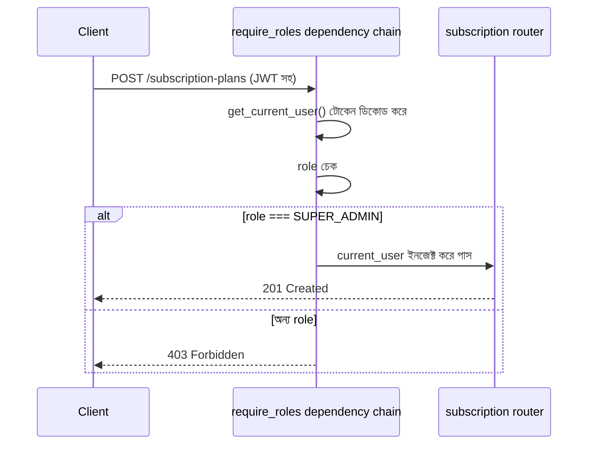

# ২৪.০৭. API For Super Admins — Project Requirement

গত লেসনে আমরা `User` মডেল বানিয়ে ফেলেছি, আর সেটাকে ডেটাবেজে মাইগ্রেট করেছি। এখন `users` টেবিলে তিন ধরনের রোল রাখার ব্যবস্থা আছে — কিন্তু বাস্তবে এখনো কোনো ইউজার নেই, আর কোনো API-ও নেই যা দিয়ে ইউজার তৈরি করা যায়। রোডম্যাপ অনুযায়ী পরবর্তী ধাপ হলো সুপার অ্যাডমিনের জন্য API — কারণ Module 24.02-এর নির্ভরতার চেইন অনুযায়ী, সাবস্ক্রিপশন প্ল্যান তৈরি করার ক্ষমতা একমাত্র সুপার অ্যাডমিনের থাকা উচিত।

কোড লেখার আগে, চলো আরেকবার Module 24.01-এর মতো একটা ছোট PRD লিখি — এবার সুপার অ্যাডমিন মডিউলের জন্য। এটা অভ্যাসের অংশ করে ফেলা ভালো: **প্রতিটা নতুন মডিউলের আগে একটা সংক্ষিপ্ত রিকোয়ারমেন্ট ডকুমেন্ট**, তারপর কোড।

**সুপার অ্যাডমিন মডিউলের স্কোপ:**

1. সুপার অ্যাডমিন সিস্টেমে লগইন করতে পারবে (JWT-বেজড অথেন্টিকেশন — পরবর্তী মডিউলে বিস্তারিত শেখা হবে, কিন্তু এখানে আমরা প্রাথমিক টোকেন যাচাই আর রোল-চেক মেকানিজম বানিয়ে ফেলবো)।
2. সুপার অ্যাডমিন সাবস্ক্রিপশন প্ল্যান তৈরি, আপডেট, তালিকাভুক্ত করতে পারবে।
3. সুপার অ্যাডমিন সব স্টোরের তালিকা দেখতে পারবে, এবং প্রয়োজনে একটা স্টোর সাসপেন্ড করতে পারবে।
4. সুপার অ্যাডমিন নিজে **রেজিস্টার** করতে পারবে না — এই অ্যাকাউন্ট শুধু seed script দিয়ে তৈরি হবে (Module 24.02-এ যে সিদ্ধান্ত নিয়েছিলাম)।

চতুর্থ পয়েন্টটা বাস্তবায়ন করা যাক এই লেসনেই, কারণ এটা ছোট কিন্তু গুরুত্বপূর্ণ। একটা seed script তৈরি করবো, `app/scripts/seed_super_admin.py`:

```python
from passlib.context import CryptContext

from app.database import SessionLocal
from app.modules.user.models import User, UserRole

pwd_context = CryptContext(schemes=["bcrypt"], deprecated="auto")


def seed_super_admin() -> None:
    db = SessionLocal()
    try:
        existing = db.query(User).filter(User.email == "admin@shopkori.com").first()
        if existing:
            print("Super admin already exists, skipping.")
            return

        admin = User(
            email="admin@shopkori.com",
            hashed_password=pwd_context.hash("ChangeMe123!"),
            role=UserRole.SUPER_ADMIN,
            full_name="ShopKori Super Admin",
        )
        db.add(admin)
        db.commit()
        print("Super admin created successfully.")
    finally:
        db.close()


if __name__ == "__main__":
    seed_super_admin()
```

স্ক্রিপ্টটা চালানো যাবে সরাসরি:

```bash
python -m app.scripts.seed_super_admin
```

খেয়াল করো, আমরা `pwd_context.hash()` দিয়ে পাসওয়ার্ড হ্যাশ করছি — কখনোই প্লেইন টেক্সট পাসওয়ার্ড ডেটাবেজে রাখা যাবে না। এখানে একটা প্রোডাকশন সতর্কতা যোগ করা দরকার — `bcrypt` অ্যালগরিদম intentionally ধীর (এটা একটা ফিচার, বাগ না — brute-force আক্রমণ কঠিন করার জন্য), কিন্তু এই ধীরগতিটাই লগইন এন্ডপয়েন্টে সরাসরি `await` না করে sync কল করলে event loop ব্লক করে দিতে পারে। এটা মাথায় রেখে, বাস্তব প্রোডাকশন FastAPI অ্যাপে পাসওয়ার্ড হ্যাশিং-এর মতো CPU-বাউন্ড কাজ `run_in_threadpool` বা Celery worker-এ সরিয়ে দেয়া হয়, বিশেষ করে যদি সাইট হাই-ট্রাফিক হয়। আমাদের এই প্রজেক্টের স্কেলে আমরা সরাসরি sync কল রাখবো, কিন্তু এই ট্রেড-অফ সম্পর্কে সচেতন থাকা জরুরি — ছোট প্রজেক্টে কাজ করে, বড় স্কেলে গিয়ে সমস্যা হয়।

এখন authentication এর দিকে তাকাই। সুপার অ্যাডমিন এন্ডপয়েন্ট রক্ষা করতে আমাদের একটা **role-checking dependency** দরকার — একটা মেকানিজম যা প্রতিটা রিকোয়েস্টে চেক করবে, লগইন করা ইউজারের রোল কি `SUPER_ADMIN`। FastAPI-তে এটা NestJS-এর Guard-এর মতো ক্লাস-ভিত্তিক না, বরং সাধারণ ফাংশন যা `Depends()` চেইনে বসে। আমরা এটা `app/common/dependencies.py`-তে রাখবো, যাতে পরে `SubscriptionModule` আর `StoreModule`-ও এটা পুনঃব্যবহার করতে পারে:

```python
from fastapi import Depends, HTTPException, status
from fastapi.security import OAuth2PasswordBearer
from jose import JWTError, jwt
from sqlalchemy.orm import Session

from app.config import settings
from app.database import get_db
from app.modules.user.models import User, UserRole

oauth2_scheme = OAuth2PasswordBearer(tokenUrl="/auth/login")


def get_current_user(
    token: str = Depends(oauth2_scheme), db: Session = Depends(get_db)
) -> User:
    credentials_exception = HTTPException(
        status_code=status.HTTP_401_UNAUTHORIZED,
        detail="টোকেন অবৈধ বা মেয়াদ শেষ।",
        headers={"WWW-Authenticate": "Bearer"},
    )
    try:
        payload = jwt.decode(
            token, settings.jwt_secret_key, algorithms=[settings.jwt_algorithm]
        )
        user_id: str | None = payload.get("sub")
        if user_id is None:
            raise credentials_exception
    except JWTError:
        raise credentials_exception

    user = db.query(User).filter(User.id == user_id).first()
    if user is None:
        raise credentials_exception
    return user


def require_roles(*allowed_roles: UserRole):
    def role_checker(current_user: User = Depends(get_current_user)) -> User:
        if current_user.role not in allowed_roles:
            raise HTTPException(
                status_code=status.HTTP_403_FORBIDDEN,
                detail="এই কাজটি করার অনুমতি তোমার নেই।",
            )
        return current_user

    return role_checker
```

এই প্যাটার্নটা — `require_roles(...)` একটা **dependency factory**, যা কল হলে একটা নতুন dependency ফাংশন রিটার্ন করে — FastAPI-তে খুব কমন একটা কৌশল। এটা লজিক্যালি ঠিক NestJS-এর `Roles` ডেকোরেটর + `RolesGuard` জোড়ার সমতুল্য, কিন্তু বাস্তবায়ন সম্পূর্ণ ভিন্ন — এখানে কোনো মেটাডেটা রিফ্লেকশন নেই, বরং সাধারণ ক্লোজার আর function composition। রুট হ্যান্ডলারে ব্যবহার হবে এভাবে:

```python
@router.post("/subscription-plans")
def create_plan(
    current_user: User = Depends(require_roles(UserRole.SUPER_ADMIN)),
):
    ...
```



**একটা কমন ভুল যা এখানে উল্লেখ করা জরুরি** — অনেকে `get_current_user` লেখার সময় `db.query(User).filter(User.id == user_id).first()` কল করে, কিন্তু ভুলে যায় যে এই dependency **প্রতিটা প্রোটেক্টেড রিকোয়েস্টে** কল হবে। এর মানে প্রতি রিকোয়েস্টে একটা এক্সট্রা ডেটাবেজ কোয়েরি হচ্ছে, JWT পেলোডে ইতিমধ্যে `user_id`, `role`, `email` থাকা সত্ত্বেও। ছোট স্কেলে এটা সমস্যা না, কিন্তু হাই-ট্রাফিক প্রোডাকশনে এই এক্সট্রা কোয়েরি অপ্রয়োজনীয় ডেটাবেজ লোড তৈরি করে। একটা common অপ্টিমাইজেশন হলো JWT পেলোডেই role রেখে দেয়া আর শুধু sensitive অপারেশনের জন্য fresh ডেটাবেজ লুকআপ করা — কিন্তু তখন রোল পরিবর্তন হলে (যেমন সুপার অ্যাডমিন কাউকে ব্যান করলে) পুরনো টোকেন স্টেল হয়ে যাওয়ার একটা ট্রেড-অফ তৈরি হয়। আমরা এই মডিউলে সরলতার জন্য প্রতিবার ডেটাবেজ লুকআপ করবো, কিন্তু এই ট্রেড-অফ সম্পর্কে জানা থাকা জরুরি।

এই লেসনে আমরা মূলত ভিত্তি তৈরি করলাম — seed script দিয়ে সুপার অ্যাডমিন, আর `require_roles()` দিয়ে অনুমতি নিয়ন্ত্রণের কাঠামো। JWT টোকেন ইস্যু করার সম্পূর্ণ `/auth/login` এন্ডপয়েন্ট আমরা বিস্তারিতভাবে দেখবো পরের মডিউলে, কিন্তু এখানে যে `get_current_user`/`require_roles` বানালাম, সেটা ঠিক তেমনই থেকে যাবে।

এখন যেহেতু সুপার অ্যাডমিনের অনুমতি-কাঠামো প্রস্তুত, পরের লেসনে আমরা আসল কাজে যাবো — সাবস্ক্রিপশন মডিউলের PRD লেখা এবং সেটার বুটস্ট্র্যাপ শুরু করা।
