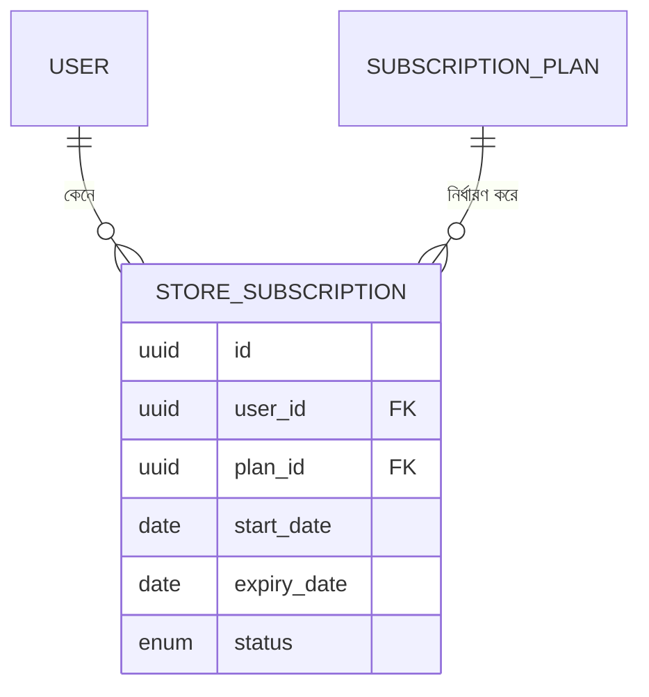

# ২৪.০৮. Bootstrapping Subscription Module With PRD

গত লেসনে সুপার অ্যাডমিনের অনুমতি-কাঠামো তৈরি হয়ে গেছে — `require_roles()` dependency, আর একজন seed করা সুপার অ্যাডমিন ইউজার। রোডম্যাপ অনুযায়ী এখন সময় সাবস্ক্রিপশন মডিউলে হাত দেয়ার — কারণ Module 24.02-এর ERD অনুযায়ী, একজন স্টোর ওউনার স্টোর খোলার আগে তাকে একটা সাবস্ক্রিপশন প্ল্যান কিনতে হবে।

আগের প্যাটার্ন অনুসরণ করে, প্রথমে একটা মিনি-PRD লিখি। এবার আরেকটু বিস্তারিতভাবে, কারণ সাবস্ক্রিপশন লজিক আসলে বেশ কিছু বিজনেস রুল বহন করে:

**Subscription মডিউলের স্কোপ:**

1. সুপার অ্যাডমিন একাধিক `SubscriptionPlan` তৈরি করতে পারবে — যেমন Free, Basic, Pro। প্রতিটা প্ল্যানের থাকবে নাম, দাম, মেয়াদ (দিনে), আর কতগুলো স্টোর খোলা যাবে তার সীমা (`max_store_limit`)।
2. স্টোর ওউনার একটা প্ল্যান বেছে নিয়ে সাবস্ক্রাইব করবে — এই কাজটা তৈরি করবে একটা `StoreSubscription` রেকর্ড, যার একটা শুরুর তারিখ, শেষের তারিখ, আর স্ট্যাটাস (ACTIVE, EXPIRED, CANCELLED) থাকবে।
3. একজন স্টোর ওউনারের একসাথে সর্বোচ্চ একটা ACTIVE সাবস্ক্রিপশন থাকতে পারবে।
4. সাবস্ক্রিপশনের মেয়াদ শেষ হয়ে গেলে (`expiry_date` অতীত), সেটা স্বয়ংক্রিয়ভাবে EXPIRED হিসেবে গণ্য হবে — এই লজিকটা আমরা সার্ভিস লেয়ারে চেক করবো।

**বিজনেস রুল যা মনে রাখা জরুরি:**
- সাবস্ক্রিপশন প্ল্যান তৈরি/এডিট শুধু `SUPER_ADMIN` করতে পারবে — গত লেসনের `require_roles()` এখানে সরাসরি ব্যবহার হবে।
- সাবস্ক্রিপশন প্ল্যান দেখা (list) সবাই পারবে, কারণ কাস্টমার-facing প্রাইসিং পেজেও এটা লাগবে।
- একটা প্ল্যানে স্টোর ওউনার সাবস্ক্রাইব করলে, প্ল্যানের `max_store_limit` পরবর্তীতে Store মডিউলে গিয়ে চেক হবে (Module 24.16-এ আমরা এই কানেকশনটা বাস্তবায়ন করবো)।

এখন প্রজেক্ট কাঠামোতে মডিউলের ফোল্ডার তৈরি করি:

```
app/modules/subscription/
├── __init__.py
├── models.py
├── schemas.py
├── repository.py
├── service.py
└── router.py
```

প্রথমে দুইটা মডেল ডিফাইন করি, যা Module 24.02-এর ERD-এর সরাসরি বাস্তবায়ন। `app/modules/subscription/models.py`:

```python
import enum
import uuid
from datetime import date, datetime

from sqlalchemy import String, Numeric, Integer, Enum, Date, DateTime, ForeignKey, func
from sqlalchemy.orm import Mapped, mapped_column, relationship

from app.database import Base


class SubscriptionStatus(str, enum.Enum):
    ACTIVE = "ACTIVE"
    EXPIRED = "EXPIRED"
    CANCELLED = "CANCELLED"


class SubscriptionPlan(Base):
    __tablename__ = "subscription_plans"

    id: Mapped[uuid.UUID] = mapped_column(primary_key=True, default=uuid.uuid4)
    name: Mapped[str] = mapped_column(String(50), unique=True)
    price: Mapped[float] = mapped_column(Numeric(10, 2))
    duration_in_days: Mapped[int] = mapped_column(Integer)
    max_store_limit: Mapped[int] = mapped_column(Integer)

    subscriptions: Mapped[list["StoreSubscription"]] = relationship(
        back_populates="plan"
    )


class StoreSubscription(Base):
    __tablename__ = "store_subscriptions"

    id: Mapped[uuid.UUID] = mapped_column(primary_key=True, default=uuid.uuid4)
    user_id: Mapped[uuid.UUID] = mapped_column(
        ForeignKey("users.id", ondelete="CASCADE")
    )
    plan_id: Mapped[uuid.UUID] = mapped_column(ForeignKey("subscription_plans.id"))
    start_date: Mapped[date] = mapped_column(Date)
    expiry_date: Mapped[date] = mapped_column(Date)
    status: Mapped[SubscriptionStatus] = mapped_column(
        Enum(SubscriptionStatus, name="subscription_status_enum"),
        default=SubscriptionStatus.ACTIVE,
    )
    created_at: Mapped[datetime] = mapped_column(
        DateTime(timezone=True), server_default=func.now()
    )

    plan: Mapped["SubscriptionPlan"] = relationship(back_populates="subscriptions")
```

লক্ষ্য করো `StoreSubscription`-এ আমরা `ForeignKey` ব্যবহার করেছি দুইবার — একবার `users.id`-এর সাথে, একবার `subscription_plans.id`-এর সাথে। এটাই Module 24.02-এ বলা **association entity** প্যাটার্নের বাস্তবায়ন — `StoreSubscription` নিজেই একটা সম্পূর্ণ মডেল, যার নিজস্ব প্রাইমারি কী আছে, শুধু দুইটা ফরেন কী রাখা টেবিল না। এভাবে আমরা প্রতিটা সাবস্ক্রিপশন ইতিহাস আলাদা রেকর্ড হিসেবে রাখতে পারি — একজন ইউজার সময়ের সাথে একাধিকবার সাবস্ক্রাইব করলে প্রতিটা তার নিজের সারিতে থাকবে।



**একটা edge case যা এখনই ভাবা দরকার, না হলে পরে সমস্যা হবে** — `ondelete="CASCADE"` আমরা `user_id`-এ রেখেছি, মানে একজন ইউজার ডিলিট হলে তার সব সাবস্ক্রিপশন হিস্ট্রিও মুছে যাবে। কিন্তু বাস্তব বিজনেসে, একাউন্টিং বা অডিট-এর জন্য সাবস্ক্রিপশন হিস্ট্রি (কে কবে কী কিনেছিল) প্রায়ই রাখতে হয়, এমনকি ইউজার ডিলিট হলেও। তাই বাস্তব প্রোডাকশন সিস্টেমে প্রায়ই ইউজার "hard delete" না করে "soft delete" (একটা `deleted_at` ফ্লাগ) করা হয়, ঠিক এই কারণেই — যাতে `CASCADE` দিয়ে গুরুত্বপূর্ণ history হারিয়ে না যায়। আমরা এই প্রজেক্টে সরলতার জন্য hard delete + CASCADE রাখছি, কিন্তু বাস্তব প্রোডাক্টে এই সিদ্ধান্তটা আরেকটু গভীরভাবে ভাবা উচিত।

মডেলগুলো এখন প্রস্তুত। `alembic/env.py`-তে ইমপোর্ট যুক্ত করে দিতে হবে, যাতে Alembic নতুন মডেল দুটো চিনতে পারে:

```python
from app.modules.subscription.models import SubscriptionPlan, StoreSubscription  # noqa: F401
```

কিন্তু মাইগ্রেশন জেনারেট করার আগে, পরের লেসনে আমরা এই মডিউলের API এন্ডপয়েন্টগুলো পরিকল্পনা করবো — কোন এন্ডপয়েন্ট কী নেবে, কী রিটার্ন করবে — যাতে ইমপ্লিমেন্টেশনের সময় কোনো দ্বিধা না থাকে।
