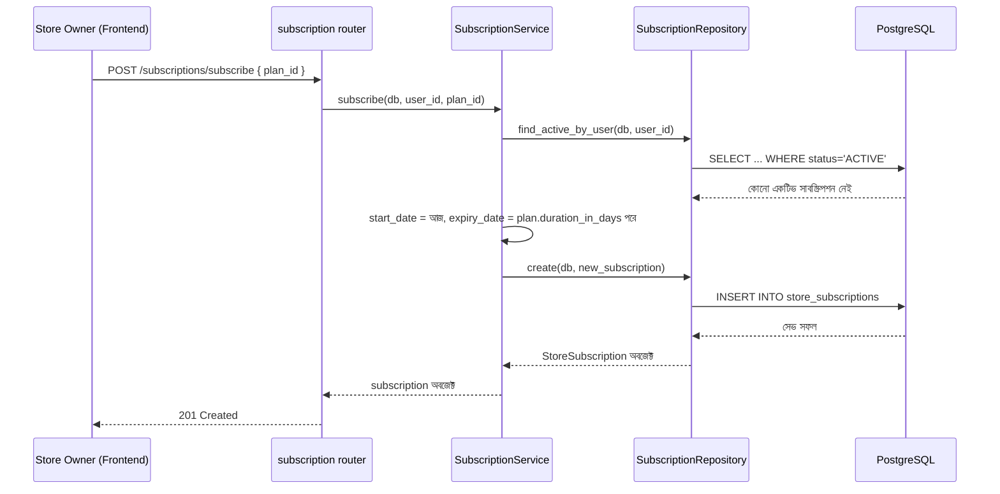

# ২৪.০৯. Subscription Module UI Planning And API Hands-On

গত লেসনে আমরা `SubscriptionPlan` আর `StoreSubscription` মডেল ডিজাইন করেছি। কোড আরও গভীরে যাওয়ার আগে, একটা গুরুত্বপূর্ণ অভ্যাস চর্চা করা দরকার — **API contract planning**। ব্যাকএন্ড ডেভেলপার হলেও, ফ্রন্টএন্ড দলের সাথে কাজ করার সময় তোমাকেই ঠিক করে দিতে হয় কোন এন্ডপয়েন্টে কী ডেটা যাবে, কী ফিরে আসবে। এটা না করলে ফ্রন্টএন্ড আর ব্যাকএন্ড আলাদা আলাদা কল্পনায় কাজ করে, আর ইন্টিগ্রেশনের সময় বিশৃঙ্খলা তৈরি হয়।

চলো কল্পনা করি ফ্রন্টএন্ডে দুইটা মূল স্ক্রিন লাগবে সাবস্ক্রিপশনের জন্য — একটা "Pricing Page" (সব প্ল্যান দেখানোর জন্য, পাবলিক), আর একটা "Subscribe" ফ্লো (স্টোর ওউনার লগইন করে একটা প্ল্যান বেছে নেবে)। এই দুইটা UI চিন্তা থেকেই আমরা এন্ডপয়েন্ট তালিকা বের করতে পারি:

| মেথড | এন্ডপয়েন্ট | কে অ্যাক্সেস করবে | কাজ |
|---|---|---|---|
| POST | `/subscription-plans` | SUPER_ADMIN | নতুন প্ল্যান তৈরি |
| GET | `/subscription-plans` | Public | সব প্ল্যানের তালিকা |
| GET | `/subscription-plans/{id}` | Public | একটা নির্দিষ্ট প্ল্যানের বিস্তারিত |
| PATCH | `/subscription-plans/{id}` | SUPER_ADMIN | প্ল্যান আপডেট |
| POST | `/subscriptions/subscribe` | STORE_OWNER | একটা প্ল্যানে সাবস্ক্রাইব করা |
| GET | `/subscriptions/my-subscription` | STORE_OWNER | নিজের বর্তমান সাবস্ক্রিপশন দেখা |

প্রতিটা এন্ডপয়েন্টের জন্য আমরা এখন রিকোয়েস্ট/রেসপন্স শেপ চূড়ান্ত করবো — এটাই পরের লেসনে Pydantic স্কিমা লেখার ভিত্তি হবে। যেমন `POST /subscriptions/subscribe`:

**Request body:**
```json
{
  "plan_id": "a3f1c2e0-1234-4a5b-9c8d-abc123456789"
}
```

**Success response (201):**
```json
{
  "id": "f9e8d7c6-...",
  "user_id": "u1u1u1u1-...",
  "plan_id": "a3f1c2e0-...",
  "start_date": "2026-08-12",
  "expiry_date": "2026-09-11",
  "status": "ACTIVE"
}
```

**Error response — যদি আগে থেকে একটা ACTIVE সাবস্ক্রিপশন থাকে (409 Conflict):**
```json
{
  "detail": "তোমার ইতিমধ্যে একটা সক্রিয় সাবস্ক্রিপশন আছে।"
}
```

এই এরর কেসটা গুরুত্বপূর্ণ — গত লেসনের বিজনেস রুল #৩ ("সর্বোচ্চ একটা ACTIVE সাবস্ক্রিপশন") এখানে একটা কংক্রিট এরর রেসপন্সে রূপান্তরিত হলো। এই ধরনের এজ কেস আগে থেকে লিখে রাখলে সার্ভিস লজিক লেখার সময় ভুলে যাওয়ার সম্ভাবনা কমে যায়। FastAPI-তে `HTTPException`-এর ডিফল্ট JSON শেপ `{"detail": "..."}` — এটা NestJS-এর `{"statusCode": ..., "message": "..."}`-এর চেয়ে সরল, তাই ফ্রন্টএন্ড টিমকে এই পার্থক্যটা আগে থেকে জানিয়ে রাখা ভালো, নাহলে তারা `error.response.message` খুঁজে পাবে না।

পুরো ফ্লোটা একটা সিকোয়েন্স ডায়াগ্রামে দেখা যাক — একজন স্টোর ওউনার কীভাবে সাবস্ক্রাইব করে, ধাপে ধাপে সিস্টেমের ভেতরে কী ঘটে:



এই ডায়াগ্রামটা লক্ষ করলে দেখবে, Router কখনো সরাসরি Repository বা ডেটাবেজ স্পর্শ করছে না — সবকিছু Service-এর মধ্য দিয়ে যাচ্ছে। এটা **layered architecture**-এর মূল নিয়ম, যেটা Separation of Concerns-এর একটা প্রয়োগ: Router শুধু HTTP-সংক্রান্ত জিনিস (রুট, স্ট্যাটাস কোড, ডিপেন্ডেন্সি ইনজেকশন) নিয়ে ভাবে, Service বিজনেস লজিক নিয়ে ভাবে, আর Repository শুধু ডেটাবেজ কোয়েরি নিয়ে ভাবে। প্রতিটা স্তর শুধু তার ঠিক নিচের স্তরকে চেনে, উপরেরটাকে না — এতে করে যেকোনো একটা স্তর বদলালে (যেমন REST থেকে GraphQL-এ যাওয়া) বাকি স্তরগুলো অক্ষত থাকে।

FastAPI-তে একটা সূক্ষ্ম কিন্তু গুরুত্বপূর্ণ পার্থক্য হলো — Repository ফাংশনগুলো এখানে সাধারণত ক্লাস-মেথড না, বরং প্লেইন ফাংশন যা একটা `Session` অবজেক্ট প্যারামিটার হিসেবে নেয় (`def find_active_by_user(db: Session, user_id: UUID)`), কারণ SQLAlchemy-এর `Session` নিজেই স্টেটফুল এবং request-scoped — এটা `Depends(get_db)` দিয়ে প্রতিটা রিকোয়েস্টে নতুন করে তৈরি হয়। এটা মনে রাখা জরুরি, কারণ NestJS/TypeORM-এ Repository নিজেই একটা `@Injectable()` ক্লাস হয়ে DI কন্টেইনারে থাকে, কিন্তু FastAPI-এর জগতে সাধারণ অভ্যাস হলো ফাংশন-বেজড মডিউল, ক্লাস-বেজড সার্ভিস কম দেখা যায় (যদিও চাইলে ক্লাস-বেজডও করা যায়, উভয়ই বৈধ)।

এই এন্ডপয়েন্ট তালিকা আর সিকোয়েন্স ডায়াগ্রামই এখন আমাদের ইমপ্লিমেন্টেশনের রোডম্যাপ। পরের লেসনে আমরা প্রথমবারের মতো এই মডিউলের ভেতরের বাস্তব FastAPI কোড লিখতে বসবো — router wiring আর প্রাথমিক প্রজেক্ট রেজিস্ট্রেশন দিয়ে শুরু করে।
