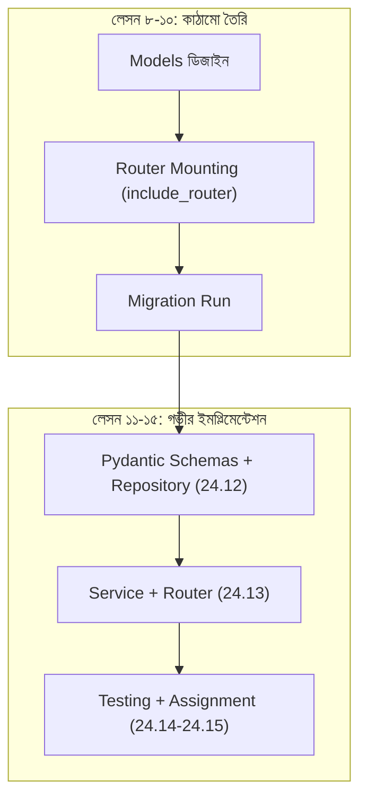

# ২৪.১০. Subscription Module Implementation — FastAPI Router And Service

গত লেসনে আমরা সাবস্ক্রিপশন মডিউলের API কন্ট্র্যাক্ট আর ডেটা ফ্লো পরিকল্পনা করেছি একটা সিকোয়েন্স ডায়াগ্রাম দিয়ে। এখন সময় এসেছে সেই পরিকল্পনার প্রথম বাস্তব বাস্তবায়নের — `router.py`-তে একটা `APIRouter` তৈরি করা, আর সেটাকে `main.py`-তে অ্যাপ্লিকেশনে যুক্ত করা।

`app/modules/subscription/router.py` (এই পর্যায়ে শুধু কাঠামো, পুরো লজিক না):

```python
from fastapi import APIRouter, Depends
from sqlalchemy.orm import Session

from app.database import get_db

router = APIRouter(tags=["subscriptions"])


@router.get("/subscription-plans")
def list_plans(db: Session = Depends(get_db)):
    # সার্ভিস লজিক পরের লেসনে আসবে
    return {"message": "not implemented yet"}
```

এখন `app/main.py`-তে এই রুটারটা `include_router()` দিয়ে যুক্ত করি:

```python
from fastapi import FastAPI

from app.modules.subscription.router import router as subscription_router

app = FastAPI(title="ShopKori API")

app.include_router(subscription_router)


@app.get("/health")
def health_check():
    return {"status": "ok"}
```

`include_router()`-এর এই একটা লাইন আসলে অনেক কিছু বলছে — FastAPI-কে বলছে, "এই রুটারের ভেতরের সব এন্ডপয়েন্ট মূল অ্যাপ্লিকেশনে মাউন্ট করে দাও।" এটা NestJS-এর `@Module({ controllers: [...] })`-এর ধারণাগত সমতুল্য, কিন্তু অনেক সরল — এখানে কোনো ক্লাস-বেজড মডিউল সিস্টেম নেই, `APIRouter` নিজেই একটা lightweight "sub-application" যাকে মূল অ্যাপে মার্জ করে দেয়া হয়। চাইলে `prefix="/subscription-plans"` আর্গুমেন্ট দিয়ে সব রুটের সামনে একটা কমন প্রিফিক্স বসানো যায়, যাতে প্রতিটা রুটে বারবার একই পাথ না লিখতে হয়:

```python
router = APIRouter(prefix="/subscription-plans", tags=["subscription-plans"])
```

এখন মডেলগুলোর জন্য মাইগ্রেশন জেনারেট আর রান করি, ঠিক Module 24.06-এ শেখা প্রক্রিয়া অনুসরণ করে:

```bash
alembic revision --autogenerate -m "create subscription tables"
alembic upgrade head
```

এটা `subscription_plans` আর `store_subscriptions` — দুইটা নতুন টেবিল তৈরি করবে ডেটাবেজে, যেখানে `store_subscriptions`-এর দুইটা ফরেন কী কনস্ট্রেইন্ট থাকবে — একটা `users` টেবিলের দিকে, একটা `subscription_plans` টেবিলের দিকে।

মডিউলটা এখন কাঠামোগতভাবে সম্পূর্ণ, কিন্তু `router.py`-এ এখনো আসল বিজনেস লজিক নেই — শুধু একটা প্লেসহোল্ডার এন্ডপয়েন্ট আছে। এটা ইচ্ছাকৃত। এই মডিউলে (Module 24) আমরা একটা গুরুত্বপূর্ণ শিক্ষাগত সিদ্ধান্ত নিয়েছি — সাবস্ক্রিপশন ফিচারটাকে দুই ধাপে দেখবো। এই লেসন পর্যন্ত আমরা শুধু **কাঠামো** (router mounting, model registration, migration) তৈরি করলাম। লেসন ১১ থেকে ১৫ পর্যন্ত আমরা আবার এই একই মডিউলে ফিরে আসবো, কিন্তু এবার আরও গভীরে গিয়ে — Pydantic স্কিমা, Repository প্যাটার্ন, Service লজিক, Router এন্ডপয়েন্ট, আর টেস্টিং — প্রতিটা স্তর আলাদা আলাদা লেসনে ভেঙে।



এই দুই-ধাপের পদ্ধতিটা বাস্তব সফটওয়্যার দলগুলোতেও দেখা যায় — প্রথমে একটা "স্কেলেটন PR" (শুধু কাঠামো, চলে, কিন্তু ফিচার অসম্পূর্ণ), তারপর একটা "ফিচার PR" (আসল লজিক)। এভাবে ভাঙলে কোড রিভিউ সহজ হয়, আর প্রতিটা ধাপে ভুল ধরা সহজ হয়।

কাঠামো দাঁড়িয়ে গেছে, মাইগ্রেশন চলে গেছে। এখন পরের লেসন থেকে আমরা এই একই মডিউলে "জুম ইন" করবো — প্রথমে Pydantic স্কিমা আর Repository লেয়ার দিয়ে শুরু করে, যাতে ইনপুট ভ্যালিডেশন আর ডেটাবেজ অ্যাক্সেস আলাদা, পরিষ্কার স্তরে ভাগ থাকে।
