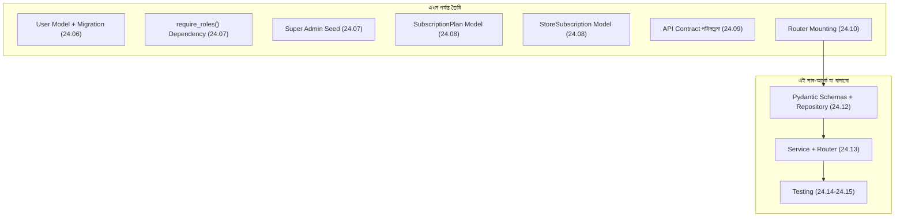

# ২৪.১১. Module Introduction

গত লেসনে আমরা সাবস্ক্রিপশন মডিউলের কাঠামোগত অংশ শেষ করেছি — মডেল, রুটার মাউন্টিং, মাইগ্রেশন। এখন থেকে পরবর্তী পাঁচটা লেসন (১১ থেকে ১৫) আমরা এই একই মডিউলের ভেতরে "জুম ইন" করবো, আসল বিজনেস লজিক বসানোর জন্য। এই লেসনটা একটা সংক্ষিপ্ত পুনরায়-পরিচিতি — যেন এই সাব-আর্কের শুরুতে সবাই একই পাতায় থাকি।

চলো একটু থেমে, এখন পর্যন্ত যা তৈরি হয়েছে সেটার একটা সম্পূর্ণ চিত্র দেখি — কারণ কোড লেখার সময় "বড় ছবি" ভুলে যাওয়া সহজ, বিশেষ করে যখন কাজ একাধিক লেসনে ভাগ হয়ে থাকে।

লক্ষ্য করার মতো — আমরা এখনো একটাও এন্ডপয়েন্ট বাস্তবে কল করতে পারিনি। `router.py`-তে এখনো শুধু একটা placeholder আছে। এই সাব-আর্কের লক্ষ্য হলো এই শেলটাকে বাস্তব, কল-করা-যায় এমন API-তে রূপান্তর করা।

আমরা যে ক্রমে এগোবো তার পেছনে একটা যুক্তি আছে, যেটা **layered architecture** থেকে সরাসরি আসে:

1. **Pydantic Schema (রিকোয়েস্ট/রেসপন্স ভ্যালিডেশন)** — প্রথমে ঠিক করবো, বাইরে থেকে কী ডেটা আসবে, আর সেই ডেটা কীভাবে ভ্যালিডেট হবে। এটা সবচেয়ে বাইরের স্তর, ক্লায়েন্টের সবচেয়ে কাছের।
2. **Repository** — তারপর ঠিক করবো, ডেটাবেজের সাথে কীভাবে কথা বলবো, প্লেইন SQLAlchemy কোয়েরির উপর কাস্টম ফাংশন বসিয়ে (যেমন `find_active_by_user`)। এটা সবচেয়ে ভেতরের স্তর, ডেটাবেজের সবচেয়ে কাছের।
3. **Service** — এই দুইয়ের মাঝে বসে বিজনেস লজিক প্রয়োগ করবো — "একজনের একটাই ACTIVE সাবস্ক্রিপশন থাকতে পারবে" এই নিয়মটা এখানেই প্রয়োগ হবে।
4. **Router** — সবশেষে HTTP লেয়ার যোগ করবো, যা রিকোয়েস্ট গ্রহণ করে, Service-কে ডাকে, রেসপন্স ফরম্যাট করে ফেরত পাঠায়।

এই ক্রমটা — বাইরে থেকে ভেতরে না গিয়ে, বরং **নির্ভরতার দিক অনুযায়ী** (Schema ও Repository যাদের কোনো নির্ভরতা নেই, তারপর Service যেটা দুটোর উপর নির্ভর করে, শেষে Router যেটা Service-এর উপর নির্ভর করে) — ঠিক Module 24.04-এ শেখা প্রায়োরিটাইজেশনের নীতিরই আরেকটা প্রয়োগ, শুধু এবার পুরো মডিউলের বদলে একটা মডিউলের ভেতরের স্তরগুলোর জন্য প্রযোজ্য।

একটা প্রশ্ন উঠতে পারে — কেন আমরা Router আগে না লিখে Repository/Service আগে লিখছি, যেখানে বেশিরভাগ টিউটোরিয়াল উল্টো ক্রমে শেখায়? এর উত্তর হলো, Router আসলে একটা পাতলা "adapter" স্তর মাত্র — এর নিজের কোনো লজিক নেই, শুধু HTTP-কে Service কলে রূপান্তর করে। যদি Router আগে লেখা হয়, তখন Service না থাকায় Router-এর ভেতরে সাময়িকভাবে ভুয়া (mock/placeholder) কোড লিখতে হয়, যা পরে মুছে ফেলতে হয়। নিচ থেকে উপরে বানালে প্রতিটা স্তর তৈরি হওয়ার সাথে সাথেই বাস্তব, ব্যবহারযোগ্য হয়ে যায়।

এই সংক্ষিপ্ত পুনঃপরিচিতির পর, পরের লেসনে আমরা সরাসরি হাত দেব Pydantic Schema আর Repository লেয়ারে — যেখানে আমরা ইনপুট ভ্যালিডেশনের নিয়ম লিখবো, আর সাবস্ক্রিপশনের কাস্টম কোয়েরি ফাংশনগুলো ডিজাইন করবো।
