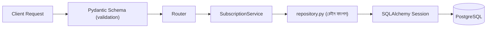

# ২৪.১২. Preparing Pydantic Schemas And Repository Layer

গত লেসনে আমরা ঠিক করেছিলাম, প্রথমে Pydantic Schema আর Repository লেয়ার বানাবো — নির্ভরতার দিক থেকে সবচেয়ে "নিচের" আর সবচেয়ে "উপরের" প্রান্তের দুইটা স্তর। এই লেসনে আমরা ঠিক সেটাই করবো।

**Pydantic Schema** হলো এমন একটা `BaseModel` ক্লাস, যা বলে দেয় একটা নির্দিষ্ট অপারেশনের জন্য ক্লায়েন্ট থেকে কী শেপের ডেটা আসা উচিত, আর সেই ডেটা কী কী নিয়ম মানতে হবে। `app/modules/subscription/schemas.py`:

```python
from datetime import date
from decimal import Decimal
from uuid import UUID

from pydantic import BaseModel, Field, ConfigDict

from app.modules.subscription.models import SubscriptionStatus


class CreateSubscriptionPlanSchema(BaseModel):
    name: str = Field(max_length=50)
    price: Decimal = Field(gt=0)
    duration_in_days: int = Field(ge=1)
    max_store_limit: int = Field(ge=1)


class UpdateSubscriptionPlanSchema(BaseModel):
    name: str | None = Field(default=None, max_length=50)
    price: Decimal | None = Field(default=None, gt=0)
    duration_in_days: int | None = Field(default=None, ge=1)
    max_store_limit: int | None = Field(default=None, ge=1)


class SubscriptionPlanReadSchema(BaseModel):
    model_config = ConfigDict(from_attributes=True)

    id: UUID
    name: str
    price: Decimal
    duration_in_days: int
    max_store_limit: int


class SubscribeSchema(BaseModel):
    plan_id: UUID


class StoreSubscriptionReadSchema(BaseModel):
    model_config = ConfigDict(from_attributes=True)

    id: UUID
    user_id: UUID
    plan_id: UUID
    start_date: date
    expiry_date: date
    status: SubscriptionStatus
```

কয়েকটা জিনিস এখানে লক্ষণীয়। প্রথমত, `Decimal` ব্যবহার করেছি `float`-এর বদলে দামের জন্য — এটা একটা গুরুত্বপূর্ণ প্রোডাকশন অভ্যাস, বাগ নয়। `float` বাইনারি floating-point representation-এ ছোট ছোট রাউন্ডিং ভুল তৈরি করে (যেমন `0.1 + 0.2 != 0.3` পাইথনে), যা টাকার হিসাবে জমতে জমতে বাস্তব আর্থিক গরমিল তৈরি করতে পারে। `Decimal` (আর ডেটাবেজে `Numeric`) সবসময় সঠিক দশমিক মান রাখে, তাই টাকা-পয়সার সব ফিল্ডে `Decimal` ব্যবহার করাটাই নিয়ম হওয়া উচিত।

দ্বিতীয়ত, `Read` স্কিমাগুলোতে `model_config = ConfigDict(from_attributes=True)` লেখা হয়েছে — এটা Pydantic v2-কে বলে দেয়, "SQLAlchemy অবজেক্টের attribute থেকে সরাসরি ডেটা পড়ে নাও" (আগে Pydantic v1-এ এটাকে `orm_mode = True` বলা হতো)। এটা না থাকলে `SubscriptionPlanReadSchema.model_validate(plan_orm_object)` কল করলে এরর আসবে, কারণ ডিফল্টভাবে Pydantic শুধু dict-জাতীয় ইনপুট আশা করে, ORM অবজেক্ট না।

তৃতীয়ত, `UpdateSubscriptionPlanSchema`-এর সব ফিল্ড `| None` আর ডিফল্ট `None` — এটাই FastAPI-এ "সব ফিল্ড ঐচ্ছিক" (partial update / PATCH সেমান্টিক্স) বাস্তবায়নের প্রচলিত উপায়। `class-validator`-এর `@IsOptional()` ডেকোরেটরের সমতুল্য কাজ এখানে টাইপ অ্যানোটেশন নিজেই করছে।

এই স্কিমাগুলো স্বয়ংক্রিয়ভাবে যাচাই করে দেবে — যদি কেউ `price` হিসেবে ০ বা নেগেটিভ সংখ্যা পাঠায়, বা `plan_id` হিসেবে UUID না এমন কিছু পাঠায়, তাহলে Router-এর ভেতরের কোডে পৌঁছানোর আগেই FastAPI স্বয়ংক্রিয়ভাবে একটা ৪২২ (Unprocessable Entity) এরর ফেরত দেবে, বিস্তারিত ফিল্ড-ভিত্তিক এরর মেসেজ সহ। এটাই স্কিমার আসল শক্তি — বিজনেস লজিক শুরু হওয়ার আগেই ইনপুটের মানসম্মততা নিশ্চিত করা।

এখন **Repository লেয়ার**। FastAPI/SQLAlchemy-তে "Repository" কোনো বিল্ট-ইন ক্লাস দেয় না (TypeORM যেমন দেয়) — আমরা নিজেরাই প্লেইন ফাংশনের একটা মডিউল বানাই, যা `Session` অবজেক্ট প্যারামিটার হিসেবে নেয়। এই ধরনের ডেটা-অ্যাক্সেস লজিক Service-এর ভেতরে ছড়িয়ে না রেখে একটা আলাদা `repository.py`-তে জড়ো করাটাই ভালো অভ্যাস — এটা **Repository Pattern**-এর হুবহু প্রয়োগ, যার মূল কথা হলো ডেটা অ্যাক্সেস লজিককে বিজনেস লজিক থেকে আলাদা করে ফেলা।

`app/modules/subscription/repository.py`:

```python
from datetime import date
from uuid import UUID

from sqlalchemy import select
from sqlalchemy.orm import Session

from app.modules.subscription.models import (
    SubscriptionPlan,
    StoreSubscription,
    SubscriptionStatus,
)
from app.modules.subscription.schemas import CreateSubscriptionPlanSchema


def create_plan(db: Session, data: CreateSubscriptionPlanSchema) -> SubscriptionPlan:
    plan = SubscriptionPlan(**data.model_dump())
    db.add(plan)
    db.commit()
    db.refresh(plan)
    return plan


def list_plans(db: Session) -> list[SubscriptionPlan]:
    return db.scalars(select(SubscriptionPlan)).all()


def get_plan_by_id(db: Session, plan_id: UUID) -> SubscriptionPlan | None:
    return db.get(SubscriptionPlan, plan_id)


def find_active_by_user(db: Session, user_id: UUID) -> StoreSubscription | None:
    stmt = select(StoreSubscription).where(
        StoreSubscription.user_id == user_id,
        StoreSubscription.status == SubscriptionStatus.ACTIVE,
    )
    return db.scalars(stmt).first()


def create_subscription(
    db: Session,
    user_id: UUID,
    plan_id: UUID,
    start_date: date,
    expiry_date: date,
) -> StoreSubscription:
    subscription = StoreSubscription(
        user_id=user_id,
        plan_id=plan_id,
        start_date=start_date,
        expiry_date=expiry_date,
        status=SubscriptionStatus.ACTIVE,
    )
    db.add(subscription)
    db.commit()
    db.refresh(subscription)
    return subscription


def find_by_user(db: Session, user_id: UUID) -> list[StoreSubscription]:
    stmt = select(StoreSubscription).where(StoreSubscription.user_id == user_id)
    return db.scalars(stmt).all()
```

`db.refresh(plan)` কলটা লক্ষ করার মতো — `db.commit()`-এর পর অবজেক্টটা "expired" অবস্থায় থাকে (SQLAlchemy পরের অ্যাক্সেসে আবার ডেটাবেজ থেকে পড়বে), আর `refresh()` জোর করে এখনই সার্ভার-জেনারেটেড ভ্যালু (যেমন `id`, `created_at`) মেমরিতে নিয়ে আসে, যাতে Router-এ রেসপন্স সাজানোর সময় সঠিক ডেটা পাওয়া যায়। এটা ভুলে গেলে একটা কমন বাগ হয় — নতুন তৈরি হওয়া রেকর্ডের `id` রেসপন্সে `None` দেখানো, কারণ ডেটাবেজ-জেনারেটেড ভ্যালু এখনো Python অবজেক্টে সিঙ্ক হয়নি।

**একটা গুরুত্বপূর্ণ ট্রানজেকশন-সংক্রান্ত নোট** — এখানে প্রতিটা ফাংশন নিজেই `db.commit()` কল করছে। ছোট, সিঙ্গেল-অপারেশন কেসে এটা ঠিক আছে, কিন্তু বাস্তব প্রোডাকশন কোডে প্রায়ই একটা Service-লেভেল অপারেশনে একাধিক টেবিলে একসাথে লিখতে হয় (যেমন পরে দেখবো, স্টোর তৈরির সময় সাবস্ক্রিপশন গণনা + স্টোর ইনসার্ট — দুটো একসাথে atomic হওয়া উচিত)। সেই ক্ষেত্রে প্রতিটা Repository ফাংশনে আলাদা `commit()` রাখলে, প্রথম কলটা সফল হয়ে কমিট হয়ে যাওয়ার পর দ্বিতীয় কলটা ফেল করলে ডেটাবেজ একটা **অসামঞ্জস্যপূর্ণ (inconsistent) অবস্থায়** থেকে যায় — অর্ধেক অপারেশন কমিট হয়ে গেছে, অর্ধেক হয়নি। এই সমস্যা এড়াতে বড় সার্ভিস অপারেশনে Repository ফাংশনগুলোকে `db.add()`/`db.flush()` পর্যন্ত সীমিত রেখে, চূড়ান্ত `db.commit()` Service লেয়ারে একবারই কল করা ভালো অভ্যাস — আমরা এই প্যাটার্নটা Module 24.18-এ Store তৈরির সময় প্রয়োগ করে দেখাবো।



Schema দিয়ে ইনপুটের দরজা পাহারা দেয়া হলো, আর Repository দিয়ে ডেটাবেজ অ্যাক্সেসের ভাষা পরিষ্কার করা হলো। এখন এই দুইয়ের মাঝের সেতু বানানোর পালা — পরের লেসনে আমরা `service.py` আর `router.py` লিখবো, যেখানে বিজনেস রুলগুলো (যেমন "একটাই ACTIVE সাবস্ক্রিপশন") বাস্তবে কার্যকর হবে।
