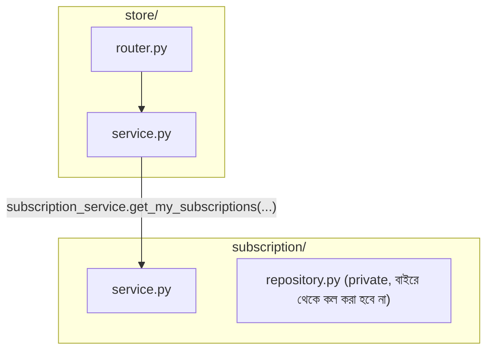
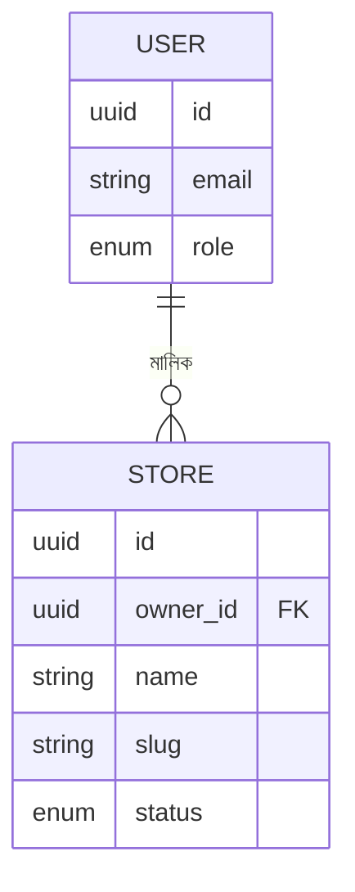

# ২৪.১৬. Store Setup Module Introduction

গত লেসনে সাবস্ক্রিপশন মডিউল সম্পূর্ণ হয়েছে — একজন স্টোর ওউনার এখন একটা প্ল্যানে সাবস্ক্রাইব করতে পারে। কিন্তু ShopKori-এর আসল উদ্দেশ্য তো দোকান খোলা আর প্রোডাক্ট বিক্রি করা — সাবস্ক্রিপশন শুধু সেই পথের একটা পূর্বশর্ত মাত্র। এখন রোডম্যাপের (Module 24.04) পরের ধাপ — **Store মডিউল**।

আগের প্যাটার্ন অনুসরণ করে, প্রথমে একটা মিনি-PRD লিখি।

**Store মডিউলের স্কোপ:**

1. একজন `STORE_OWNER` নিজের স্টোর তৈরি করতে পারবে — কিন্তু শুধুমাত্র যদি তার একটা ACTIVE সাবস্ক্রিপশন থাকে।
2. স্টোর তৈরির সময় সাবস্ক্রিপশন প্ল্যানের `max_store_limit` চেক হবে — একজন ওউনার তার প্ল্যানের সীমার বেশি স্টোর খুলতে পারবে না। এটা Module 24.02-এ চিহ্নিত করা সেই বিজনেস রুল, যা এখন বাস্তবায়িত হবে।
3. প্রতিটা স্টোরের একটা `slug` থাকবে (URL-friendly ইউনিক নাম, যেমন `rahims-electronics`), যা কাস্টমার-facing পেজের URL-এ ব্যবহার হবে।
4. স্টোরের একটা `status` থাকবে — `PENDING`, `ACTIVE`, `SUSPENDED`। নতুন স্টোর ডিফল্টভাবে `PENDING` অবস্থায় তৈরি হবে, আর সুপার অ্যাডমিন সেটা `ACTIVE` করবে — এটা একটা মডারেশন স্তর, যাতে যেকোনো স্টোর সরাসরি লাইভ হয়ে না যায়।
5. সুপার অ্যাডমিন যেকোনো স্টোর `SUSPENDED` করতে পারবে (Module 24.07-এর PRD-তে যা প্রতিশ্রুতি দেয়া হয়েছিল)।

এই রুলগুলো লক্ষ্য করলে দেখবে, `Store` মডেল দুইটা ভিন্ন মডিউলের সাথে সম্পর্কযুক্ত — `User` (মালিকানার সম্পর্ক) আর `SubscriptionPlan`/`StoreSubscription` (সীমা যাচাইয়ের জন্য)। এই আন্তঃমডিউল নির্ভরতাই এই লেসনের কেন্দ্রীয় স্থাপত্য প্রশ্ন তৈরি করে — **Store মডিউল কীভাবে Subscription মডিউলের ডেটা অ্যাক্সেস করবে, নিজের ভেতরের গঠন না ভেঙে?**

NestJS/TypeORM-এ এই প্রশ্নের উত্তর হতো `imports`/`exports` ব্যবহার করে মডিউল ওয়্যারিং। FastAPI-তে এই ধারণার কোনো ফরমাল ইকুইভ্যালেন্ট নেই — এখানে "মডিউল" আসলে শুধু একটা Python প্যাকেজ (ফোল্ডার), কোনো রানটাইম রেজিস্ট্রেশন সিস্টেম নেই। তাই এখানে সংযোগটা অনেক সরল, কিন্তু ঠিক এই সরলতাই একটা বিপদ তৈরি করতে পারে যদি সতর্ক না থাকি — **যেকোনো মডিউল যেকোনো মডিউলের ফাংশন সরাসরি ইমপোর্ট করতে পারে**, কোনো explicit বাধা ছাড়া। তাই আমাদের নিজেদের একটা ডিসিপ্লিন বজায় রাখতে হবে: `store/service.py` সরাসরি `subscription/repository.py`-এর প্রাইভেট ফাংশন কল করবে না, বরং শুধু `subscription/service.py`-এর পাবলিক ফাংশন কল করবে — ঠিক যেভাবে NestJS-এ `exports` না করা প্রোভাইডার বাইরে থেকে অ্যাক্সেস করা যায় না।

```python
# app/modules/store/service.py — এভাবে ইমপোর্ট করবো
from app.modules.subscription import service as subscription_service

# এভাবে করবো না — Repository সরাসরি অন্য মডিউল থেকে টানা
# from app.modules.subscription import repository as subscription_repository
```

এই কনভেনশনটা কোড রিভিউয়ে যাচাই করা উচিত, কারণ FastAPI নিজে এটা জোর করে না — এটা একটা "সামাজিক কনভেনশন" (team discipline), কম্পাইলার-এনফোর্সড না। এটা loose coupling বজায় রাখার একটা সচেতন অভ্যাস, যাতে `store` মডিউল জানে না `subscription`-এর ভেতরে ঠিক কীভাবে ডেটাবেজ কোয়েরি হচ্ছে, শুধু জানে একটা ফাংশন কল করলে কী পাওয়া যাবে।



চলো ERD-টাও আপডেট করে নেই, `Store` মডেল কীভাবে বাকি সবকিছুর সাথে যুক্ত হচ্ছে সেটা স্পষ্ট করার জন্য:



আরেকটা গুরুত্বপূর্ণ ডিজাইন সিদ্ধান্ত — `Store` মডেলে সরাসরি `subscription_id` ফরেন কী রাখবো না। কারণ সাবস্ক্রিপশন সময়ের সাথে বদলাতে পারে (মেয়াদ শেষ হলে নতুন সাবস্ক্রিপশন কেনা যাবে), কিন্তু স্টোর একবার তৈরি হলে সেটার পরিচয় স্থায়ী থাকা উচিত। তাই স্টোর তৈরির সময় শুধু "এই মুহূর্তে কি ইউজারের ACTIVE সাবস্ক্রিপশন আছে, আর সীমা পার হয়নি" — এই চেকটা করা হবে, স্টোর নিজে কোনো নির্দিষ্ট সাবস্ক্রিপশন রেকর্ডের সাথে স্থায়ীভাবে বাঁধা থাকবে না। এটা একটা সূক্ষ্ম কিন্তু গুরুত্বপূর্ণ ডেটা মডেলিং সিদ্ধান্ত, যা ভবিষ্যতে সমস্যা এড়াবে।

**একটা edge case যা এখনই আলোচনায় আনা দরকার** — "সাবস্ক্রিপশন আছে কিনা" আর "স্টোর তৈরি" — এই দুইটা অপারেশন যদি দুইটা আলাদা ডেটাবেজ ট্রানজেকশনে হয়, তাহলে একটা **race condition** সম্ভব: দুইটা রিকোয়েস্ট প্রায় একসাথে আসলে, দুটোই "সীমার মধ্যে আছে" দেখে পাস করে যেতে পারে, ফলে সীমার চেয়ে বেশি স্টোর তৈরি হয়ে যায়। এই ধরনের চেক-তারপর-অ্যাক্ট (check-then-act) প্যাটার্নে concurrency bug আসা খুবই সাধারণ, বিশেষ করে হাই-ট্রাফিক প্রোডাকশনে। এটা সমাধানের একটা উপায় হলো ডেটাবেজ-লেভেল কনস্ট্রেইন্ট বা `SELECT ... FOR UPDATE` দিয়ে row-level lock নেয়া, যাতে একই ইউজারের দুইটা concurrent রিকোয়েস্ট একে অপরকে ব্লক করে। আমরা এই মডিউলে সরল sequential চেক রাখবো (যা কম-ট্রাফিক অ্যাপে যথেষ্ট), কিন্তু এই সীমাবদ্ধতা সম্পর্কে সচেতন থাকা একজন lead-level ইঞ্জিনিয়ারের দায়িত্ব।

এই পরিকল্পনা হাতে নিয়ে, পরের লেসনে আমরা সরাসরি Store মডিউলের কোডিং-এ নেমে পড়বো — মডেল, Pydantic Schema, আর Repository লেয়ার দিয়ে শুরু করে।
