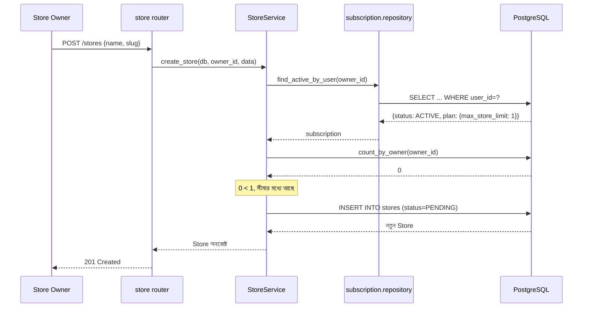

# ২৪.১৯. Testing The System

গত লেসনে Store মডিউলের Service আর Router সম্পূর্ণ হয়েছে। এবার পুরো সিস্টেমটা — User থেকে Subscription থেকে Store — একটানা টেস্ট করে দেখার সময়, ঠিক যেভাবে Module 24.14-15-এ সাবস্ক্রিপশন মডিউল টেস্ট করেছিলাম, কিন্তু এবার এন্ড-টু-এন্ড, একাধিক মডিউল জুড়ে।

এই ধরনের টেস্টিংকে বলে **integration testing** — শুধু একটা মডিউল আলাদাভাবে ঠিকভাবে কাজ করছে কিনা তা না, বরং একাধিক মডিউল একসাথে জোড়া লাগলে পুরো ফ্লো সঠিকভাবে কাজ করছে কিনা, সেটা যাচাই করা। `tests/test_store.py`:

```python
import pytest


@pytest.mark.anyio
async def test_store_creation_flow(client):
    admin_login = await client.post(
        "/auth/login",
        data={"username": "admin@shopkori.com", "password": "ChangeMe123!"},
    )
    admin_token = admin_login.json()["access_token"]

    plan_res = await client.post(
        "/subscription-plans",
        headers={"Authorization": f"Bearer {admin_token}"},
        json={"name": "Basic", "price": 499, "duration_in_days": 30, "max_store_limit": 1},
    )
    basic_plan_id = plan_res.json()["id"]

    owner_login = await client.post(
        "/auth/login",
        data={"username": "owner@shopkori.com", "password": "OwnerPass123!"},
    )
    owner_token = owner_login.json()["access_token"]

    # সাবস্ক্রিপশন ছাড়া স্টোর তৈরি করা যাবে না
    no_sub_res = await client.post(
        "/stores",
        headers={"Authorization": f"Bearer {owner_token}"},
        json={"name": "Rahim's Electronics", "slug": "rahims-electronics"},
    )
    assert no_sub_res.status_code == 403

    # সাবস্ক্রাইব করার পর স্টোর তৈরি করা যাবে
    await client.post(
        "/subscriptions/subscribe",
        headers={"Authorization": f"Bearer {owner_token}"},
        json={"plan_id": basic_plan_id},
    )
    store_res = await client.post(
        "/stores",
        headers={"Authorization": f"Bearer {owner_token}"},
        json={"name": "Rahim's Electronics", "slug": "rahims-electronics"},
    )
    assert store_res.status_code == 201
    assert store_res.json()["status"] == "PENDING"

    # Basic প্ল্যানের সীমা (১টা স্টোর) পার হলে 403 আসবে
    second_store_res = await client.post(
        "/stores",
        headers={"Authorization": f"Bearer {owner_token}"},
        json={"name": "Second Shop", "slug": "second-shop"},
    )
    assert second_store_res.status_code == 403

    # সুপার অ্যাডমিন স্টোর সাসপেন্ড করতে পারবে
    stores = await client.get(
        "/stores", headers={"Authorization": f"Bearer {admin_token}"}
    )
    store_id = stores.json()[0]["id"]

    suspend_res = await client.patch(
        f"/stores/{store_id}/suspend",
        headers={"Authorization": f"Bearer {admin_token}"},
    )
    assert suspend_res.status_code == 200
    assert suspend_res.json()["status"] == "SUSPENDED"
```

এই টেস্ট স্যুটটা লক্ষ্য করলে বোঝা যায় কেন Module 24.16-এর PRD-তে "max_store_limit ১" রাখা একটা ইচ্ছাকৃত টেস্ট-ফ্রেন্ডলি সিদ্ধান্ত ছিল — এতে করে "সীমা পার হওয়া" কেসটা মাত্র একটা স্টোর তৈরির পরেই টেস্ট করা যাচ্ছে, বড় সংখ্যা দিয়ে টেস্ট ডেটা তৈরির ঝামেলা ছাড়াই।

পুরো ফ্লোটাকে একটা সমন্বিত সিকোয়েন্স ডায়াগ্রামে দেখা যাক, যাতে User → Subscription → Store — তিনটা মডিউল কীভাবে একসাথে কাজ করছে সেটা এক নজরে বোঝা যায়:



এই ডায়াগ্রামটা দেখিয়ে দেয় কীভাবে একটা সিঙ্গেল API কল আসলে দুইটা ভিন্ন মডিউল, দুইটা ভিন্ন ডেটাবেজ টেবিলের সাথে কথা বলছে, কিন্তু Router-এর দৃষ্টিকোণ থেকে এটা একটাই সহজ কল — `service.create_store()`। এই জটিলতা লুকিয়ে রাখাটাই ভালো architecture-এর লক্ষণ — প্রতিটা স্তর তার ব্যবহারকারীর কাছে একটা সরল ইন্টারফেস দেখায়, ভেতরের জটিলতা এনক্যাপসুলেট করে রাখে।

**একটা প্রোডাকশন-লেভেল নোট N+1 কোয়েরি সমস্যা নিয়ে** — `find_active_by_user()`-এর ফলাফলে `subscription.plan.max_store_limit` অ্যাক্সেস করার সময়, যদি `plan` relationship লেজি-লোডেড হয় (SQLAlchemy-এর ডিফল্ট), তাহলে এটা একটা এক্সট্রা কোয়েরি ট্রিগার করবে `subscription_plans` টেবিলে। একটা রিকোয়েস্টে এটা তেমন সমস্যা না, কিন্তু যদি Module 24.18-এর `get_all_stores()`-এর মতো একটা লিস্ট এন্ডপয়েন্টে প্রতিটা স্টোরের জন্য আলাদা করে owner-এর subscription/plan লোড করতে হয়, তাহলে ১০০টা স্টোরের জন্য ১০০টা এক্সট্রা কোয়েরি চলে যায় — এটাই কুখ্যাত **N+1 query problem**। সমাধান হলো `select(...).options(joinedload(StoreSubscription.plan))` দিয়ে eager loading ব্যবহার করা, যা একটা মাত্র `JOIN` কোয়েরিতে সব ডেটা টেনে আনে। আমাদের এই মডিউলে ছোট স্কেলে এটা লক্ষ্যযোগ্য না, কিন্তু বাস্তব প্রোডাকশন সিস্টেমে ডেটাবেজ কোয়েরি লগ (`echo=True` ইঞ্জিন অপশন দিয়ে) নিয়মিত পরীক্ষা করে দেখা উচিত কোথাও অজান্তে N+1 প্যাটার্ন তৈরি হচ্ছে কিনা।

User, Subscription, আর Store — তিনটা মডিউল এখন একসাথে বাস্তবে কাজ করছে, টেস্ট দিয়ে প্রমাণিত। রোডম্যাপের শেষ ধাপ বাকি — Product মডিউল, যেখানে আসল বিজনেস ভ্যালু তৈরি হয় (যা বিক্রি হবে)। পরের ও শেষ লেসনে আমরা সেটাই বানাবো, আর এই পুরো মডিউলের যাত্রা সম্পূর্ণ করবো।
